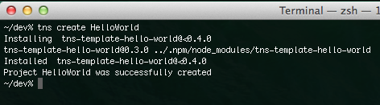
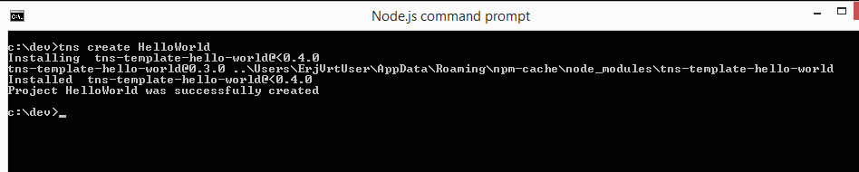
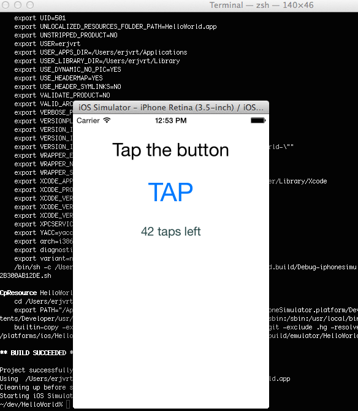

Using a command line interface (CLI) is a very productive and simple way to use a developer framework. That is why this is one of the first things we implemented as part of the NativeScript tools. By having a powerful CLI we also enable several key scenarios for you. One of them is that you now can use any IDE to edit the application code and use the CLI to build and deploy the application to an emulator or on a real device.

This article is about the use of the open source CLI which is not part of the Telerik Platform and thus it is not about using the AppBuilder goodies. The main difference is that by using this CLI everything is done on client machine and all the infrastructure for building native apps should be done by the developer. If you use Telerik platform all the infrastructure is already in the cloud and you will not need to install and setup anything on the client machine. To start with Telerik platform please read [this article](http://docs.telerik.com/platform/appbuilder/nativescript/getting-started-ns/get-started-cli).

One of the goals that we have with NativeScript is to create tools that are very similar to the existing tools, so that we can lower the learning curve. That is why If you are familiar with the [Cordova Command-line interface (Cordova CLI)](http://cordova.apache.org/docs/en/3.6.0/guide_cli_index.md.html), you're ready to build your cross-platform application with the NativeScript CLI.

#Prerequisites

The most important thing is to realize that we will be building applications for devices. Thus, to test and run our product, we need the respective Software Development Kits (SDKs) and build tools installed in accordance to their license terms. For example, on a MAC computer one can install Node.js, Xcode, Java, Android SDK and Apache Ant and then test their NativeScript project on both an iOS simulator and device(s) and Android emulator and device(s). On the other hand, there is no Xcode for Windows PC, hence only Android applications can be tested there, provided we have Java, the Android SDK and Apache Ant. The full requirements can be found in the [System Requirements section of the official NativeScript package readme file](https://www.npmjs.org/package/nativescript#system-requirements). For the sake of simplicity, a more detailed post on the easiest and most sustainable way to setup your development environment is on its way.

Without further ado, let's check the creation of your first project now:

#Install the NativeScript CLI

The [NativeScript CLI](https://www.npmjs.org/package/nativescript) is distributed as a Node.js NPM package. Thus, its installation is as simple as installing any other NPM package. It is recommended that you install it globally so that you can access it from any folder.

The command npm install -g nativescript will add the nativescript (or its synonym, tns, which I will use further for shortness) program available to your console.

Once NativeScript installed, you can now

#Create a project using the default template

Navigate to a preferred 'projects' folder of yours (I always use ~/dev or C:\dev) and type: tns create HelloWorld

A new folder will get created, named HelloWorld. It contains some sample code, available at [github](https://github.com/NativeScript/template-hello-world).

If you check the folder in Finder or Windows Explorer, you will notice it contains two folders: app and platforms.

The latter is empty for the time being. Once we start "enabling" our project with specific platforms (iOS and Android supported for the time being), the platforms folder will contain platform-specific versions of our project. Please note that this folder is automatically re-generated based on the cross-platform code changes, so please do not alter its content, because it will be replaced next time the app is build. Use this folder for debugging purposes only.

The app folder contains the actual cross-platform code, the resources of our application and some pre-packed JavaScript modules, representing the NativeScript framework. The most important content in it are the:

- app subfolder, which is our application code. Generally, any edits of the application logic go here. Please, check [the documentation](https://github.com/nativescript/docs) for the available APIs (cross-platform, android and iOS).

- App_Resources subfolder, which contains some platform-specific resources. The structure and the usage of resources is still to be finalized, hence for the time being do not delete, move or rename any files from that folder. Modification of the images to fit your brand is perfectly fine.

- tns_modules subfolder, containing cross-platform modules, pre-packed by Telerik. In the future, the CLI will allow modules to be added/updated via a special command in a plugin manner.

After the creation of the project, you would most probably want to run it on an emulator or a physical device. To do that, you would first need to

#"Enable" the project to a specific platform

First of all, navigate to the project-folder you just created (i.e. cd HelloWorld.

On a mac/windows/linux computer, type the command `tns platform add android`. Alternatively, on a mac computer type the command `tns platform add ios`.

These will download the android or ios runtimes for NativeScript and will unfold them using the contained platform-specific project to the platforms folder. A runtime package contains a platform-specific (Eclipse for Android or XCode for iOS) template project and a set of binaries, allowing the NativeScript javascript code to be executed on the target device.

We're almost there! Before running your application you need to

#prepare the platform-specific project.

The next step is running the command tns prepare android (alternatively, tns prepare ios).

In essence, this command copies the files in the app/app, app/App_Resources and app/tns_modules to the platforms/[SpecifiedPlatform] folder, following some logic.

The prepare command is not run automatically during an emulate command call on purpose. The reason is that while debugging we might change the javascript in the platform-specific project (under the platforms folder) and we want to debug that code directly by running the emulate or run commands. If the prepare command was called, it would overwrite our changes.

When the platform-specific project is prepared, we are now ready to

#Run the application

tns emulate ios - call this command on a Mac computer to get your project deployed and started on the iOS simulator tns emulate android - call this command on a Mac/Windows/Linux computer to get your project deployed and started on the Android emulator tns run ios - call this command on a Mac computer to get your project deployed and started on a device attached to your computer tns run android - call this command on a Mac/Windows/Linux computer to get your project deployed and started on an Android device, attached to your computer.

#Finally

I hope this article was useful and you will be able to create your first NativeScript applications by following it. If you have any questions please do not hesitate to talk to us, we will be glad to help you as always.
