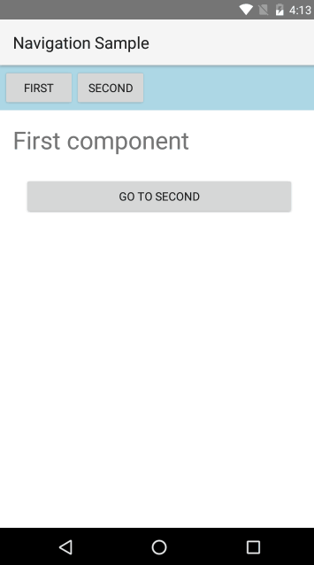
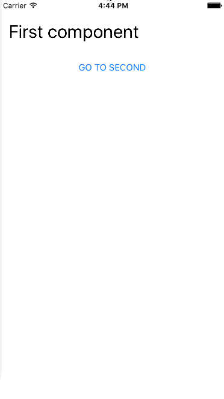
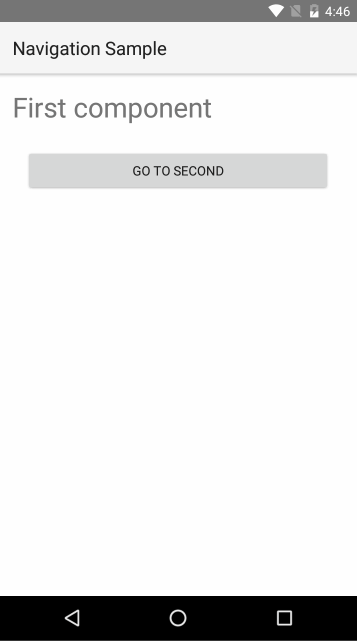

# Navigation
In this article we will cover how to do navigation in NativeScript application using Angular.

* [Router](#router)
* [Configuration](#configuration)
* [Pages](#pages)
* [Router Links](#router-links)
* [Router Outlet](#router-outlet)
* [Page Router Outlet](#page-router-outlet)
* [Navigating Back](#navigating-back)
* [Route Guards](#route-guards)

## Router

In an Angular 2 application navigation is done using the **Angular Component Router**. You can check [this detailed guide on how to use the router](https://angular.io/docs/ts/latest/guide/router.html). From here on we are going to assume that you are familiar with the basic concepts and concentrate on the specifics when doing navigation with Angular 2 inside a NativeScript app. 

> Note: This article covers usage of the @angular/router v3. For the `deprecated beta router` please import `nativescript-angular/router-deprecated`

## Configuration

The router configuration usually consists of the following steps:

Create a `RouterConfig` object which maps paths to components and parameters:


Use `nsRouterProvider` function to create provider for the router:


Pass the provider to the `nativeScriptBootstrap` when starting your app:


## Pages

NativeScript apps consist of pages which represent the separate application screens. Pages are instances of the [`Page`](http://docs.nativescript.org/api-reference/classes/_ui_page_.page.html) class. Page navigation integrates with the native navigation elements on the current platform (ex. the **Back** button in Android or the **NavigationBar** in iOS). 

> Note: You will rarely need to create Page instances manually. The framework creates pages automatically when bootstrapping or navigating the app. You can get a reference to the current page by injecting it into your component using the DI.

In NativeScript you have a choice between two router outlets:
* `router-outlet` - replaces the content of the outlet with different component. It is the default outlet that comes from Angular 2.
* `page-router-outlet` - uses pages to navigate. The new components are shown in a new page.

To show the difference between the to we are going to use the following components in the next examples:



We are also going to use the following route configuration file (`app.routes.ts`):



## Router Links

One thing you might have noticed in the code above is the `nsRouterLink` directive. It is similar to [`routerLink`](https://angular.io/docs/ts/latest/guide/router.html#!#-routerlink-binding), but works with NativeScript navigation. It is included in the `NS_ROUTER_DIRECTIVES`.

## Router Outlet

Let's take a look at the following example that uses `<router-outlet>`:



There are few things worth noting:

The main component uses both `ROUTER_DIRECTIVES` (needed for `<router-outlet>`) and `NS_ROUTER_DIRECTIVES` (needed for `routerLink`).

The result is that with each navigation the content of the `router-outlet` is replaced with the new component:

## Page Router Outlet

Here is a similar example using the `page-router-outlet`:



The main difference here is that when navigating - the new component will be loaded as a root view in a **new** `Page`. This means that any content *outside* the `page-router-outlet` will not be included in the new page. This is the reason why the `page-router-outlet` is usually the single root element in the application component. 

Here is the result:

Note that we can now use the **Back button** and the **NavigationBar** to navigate. 

## Navigating Back

You can navigate back pragmatically by injecting `Location` in your component and calling its `back()` method:



## Route Guards

You can use the [route guards](https://angular.io/docs/ts/latest/guide/router.html#!#guards) more control over the navigation. 

> Note: Currently, there is no way to prevent user initiated back navigation - trying to apply guards in such scenario is not supported.
