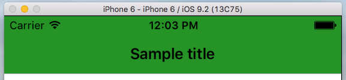
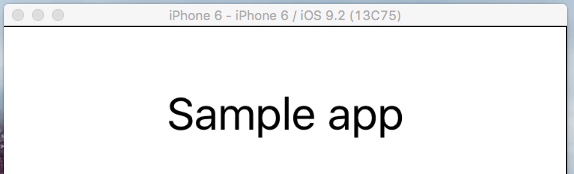
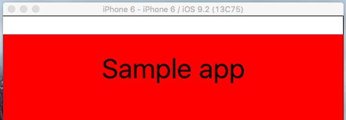

# Changing Status Bar Style in iOS
 
NativeScript allows you to build multiplatform application using its module without knowing specifics of the different platforms.
However sometimes you should use specific `Native` code to access some platform specific functionality e.g. changing the style of the `UIStatusBar` in iOS.
There are two options to do this in NativeScript. The first one is to change the style of the whole `NavigationBar` or to change only `StatusBarStyle` using `Info.plist`
 
## Changing StatusBarStyle With Help Of NavigationBar barStyle Property
 
NativeScript `ActionBar` is common abstraction over iOS `UINavigationBar`. In regard to this you could change the style of the `NavigationBar`, which will change and the style of the `StatusBar` automatically.
In iOS there are two possible styles, which you could set to the NavigationBar: `UIBarStyleDefault` and `UIBarStyleBlack`. To style StatusBar you could follow the described steps below.
1. Adding ActionBar To The Project

**XML**

```
<Page xmlns="http://schemas.nativescript.org/tns.xsd" loaded="loaded">
  <Page.actionBar>
     <ActionBar title="Sample title" backgroundColor="green"></ActionBar>
  </Page.actionBar>
</Page>

```
The result of adding this sample code should be this:


By default NavigationBar style in iOS is `UIBarStyleDefault`, which means that the letters will be in black and background color - white.

2. Changing The Style Of NavigationBar 

**TypeScript** 
```
import { EventData } from "data/observable";
import { Page } from "ui/page";
import { topmost } from "ui/frame";


export function loaded(args: EventData){
    var page:Page = <Page> args.object;
     if (page.ios) {
        var navigationBar = topmost().ios.controller.navigationBar;
        navigationBar.barStyle = UIBarStyle.UIBarStyleBlack;
    }
}
```

**JavaScript**
```
var frame_1 = require("ui/frame");
function loaded(args) {
    var page = args.object;
    if (page.ios) {
        var navigationBar = frame_1.topmost().ios.controller.navigationBar;
        navigationBar.barStyle = UIBarStyle.UIBarStyleBlack;
    }
}
exports.loaded = loaded;
```

In the code above, we are accessing iOS NavigationBar component with the help of NativeScript  `Frame` module. With its help we are accessing `barstyle` property of UINavigationBar and then changing 
the main style to `UIBarStyleBlack`.

The result:


As you can see the style of `NavigationBar` and `StatusBar` have been changed with gray background color and white text and icons.


3. Changing background color(Optional)


Changing the background color of `NavigationBar` and `StatusBar` is really easy. To do this you should setup `backgroundColor` property of NativeScript `ActionBar`. This has been demonstrate in examplegiven below.
 
 
**XML**
```
<Page.actionBar>
     <ActionBar title="Sample title" backgroundColor="green"></ActionBar>
</Page.actionBar>
```
 
Note that you could setup this property and in your `css` file
 
**CSS**
 
```
ActionBar{
    background-color: green;
}
```
 
The result is:
 

 
 
## Changing StatusBar Style Only
 
 
In iOS StatusBar has two style types: the default on - `UIStatusBarStyleDefault` and `UIStatusBarStyleLightContent`. Little more tricky part is to change only the style of the `StatusBar`.
If we create clean project our application should look like this, StatusBar with default style: icons with black color and white background color.


1. Changing the `UIStatusBar` style via Info.plist.
 
To make this change for StatusBar style we have to add several properties in our `Info.plist`. 
 
* go to `app/App_Resources/iOS` folder
 
* open `Info.plist` file 
 
* add below shown lines in your `Info.plist` before closing `</dict>` tag


```
<key>UIStatusBarStyle</key>
<string>UIStatusBarStyleLightContent</string>
<key>UIViewControllerBasedStatusBarAppearance</key>
<false/>
```


In a result your `Info.plist` should look like that:

**Info.plist**

```
    <?xml version="1.0" encoding="UTF-8"?>
    <!DOCTYPE plist PUBLIC "-//Apple//DTD PLIST 1.0//EN" "http://www.apple.com/DTDs/PropertyList-1.0.dtd">
    <plist version="1.0">
    <dict>
        <key>CFBundleDevelopmentRegion</key>
        <string>en</string>
        <key>CFBundleDisplayName</key>
        <string>${PRODUCT_NAME}</string>
        <key>CFBundleExecutable</key>
        <string>${EXECUTABLE_NAME}</string>
        <key>CFBundleIconFile</key>
        <string>icon.png</string>
        <key>CFBundleIcons</key>
        <dict>
            <key>CFBundlePrimaryIcon</key>
            <dict>
                <key>CFBundleIconFiles</key>
                <array>
                    <string>icon-40</string>
                    <string>icon-60</string>
                    <string>icon-72</string>
                    <string>icon-76</string>
                    <string>Icon-Small</string>
                    <string>Icon-Small-50</string>
                </array>
                <key>UIPrerenderedIcon</key>
                <false/>
            </dict>
        </dict>
        <key>CFBundleInfoDictionaryVersion</key>
        <string>6.0</string>
        <key>CFBundleName</key>
        <string>${PRODUCT_NAME}</string>
        <key>CFBundlePackageType</key>
        <string>APPL</string>
        <key>CFBundleShortVersionString</key>
        <string>1.0</string>
        <key>CFBundleSignature</key>
        <string>????</string>
        <key>CFBundleVersion</key>
        <string>1.0</string>
        <key>LSRequiresIPhoneOS</key>
        <true/>
        <key>UILaunchStoryboardName</key>
        <string>LaunchScreen</string>
        <key>UIRequiresFullScreen</key>
        <true/>
        <key>UIRequiredDeviceCapabilities</key>
        <array>
            <string>armv7</string>
        </array>
        <key>UISupportedInterfaceOrientations</key>
        <array>
            <string>UIInterfaceOrientationPortrait</string>
            <string>UIInterfaceOrientationLandscapeLeft</string>
            <string>UIInterfaceOrientationLandscapeRight</string>
        </array>
        <key>UISupportedInterfaceOrientations~ipad</key>
        <array>
            <string>UIInterfaceOrientationPortrait</string>
            <string>UIInterfaceOrientationPortraitUpsideDown</string>
            <string>UIInterfaceOrientationLandscapeLeft</string>
            <string>UIInterfaceOrientationLandscapeRight</string>
        </array>
        <key>UIStatusBarStyle</key>
        <string>UIStatusBarStyleLightContent</string>
        <key>UIViewControllerBasedStatusBarAppearance</key>
        <false/>
    </dict>
    </plist>
```

The result: 



Note: Now on the place of the StatusBar we can see one white line. That's happened, because we changed the color of the icon to white, however the background color is the same as those of the icon. To fix this
we should now setup page `backgroundColor` property.
 
2. Change Background Color Of The Page
 
We can do that through `XML` or `CSS`
 
**XML**
```
<Page xmlns="http://schemas.nativescript.org/tns.xsd" backgroundColor="red">
  <StackLayout>
    <Label text="Tap the button" class="title"/>
    <Button text="TAP" tap="{{ onTap }}" />
    <Label text="{{ message }}" class="message" textWrap="true"/>
  </StackLayout>
</Page>
```
 
**CSS**
```
Page{
    background-color:red;
}
```
 
In a result our application should look like the image below:
 

 
Even though we have changed the page background color, the white line above still have been seen.
 
3. Setting up Background Color To Cover Whole Window
 
In NativeScript we have page property `backgroundSpanUnderStatusBar`, which will allow us to control, when the background color is span under the StatusBar in iOS. The default value of `backgroundSpanUnderStatusBar`
is false and to allow background-color to cover StatusBar, we should change this property to `true`.
 
**XML**
```
<Page xmlns="http://schemas.nativescript.org/tns.xsd"  backgroundSpanUnderStatusBar="true" backgroundColor="red">
  <StackLayout>
    <Label text="Tap the button" class="title"/>
    <Button text="TAP" tap="{{ onTap }}" />
    <Label text="{{ message }}" class="message" textWrap="true"/>
  </StackLayout>
</Page>
```
 
At the end the result is:
 
 

 
 
Note: The sample projects for both cases are available in those GitHub repositories: [StyleStatusBariOSviaActionBar](https://github.com/tsonevn/StyleStatusBariOSviaActionBar.git) and [StyleStatusBariOSviaInfo.plist](https://github.com/tsonevn/StyleStatusBariOSviaInfo.plist.git)
