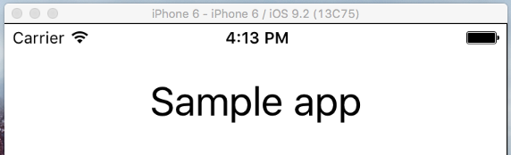

# Changing Status Bar Style in iOS
 
NativeScript allows you to build multiplatform applications by exposing a rich common API. You don't need to know specifics of the different platforms. However, every platform has its own features. In those cases when you need to fine tune your application and make it look more native, NativeScrpt gives you full control and access to the native API and platform specific functionality. One such scenario is when changing the status bar style in iOS. 

There are two options to change the status bar style for iOS applications in NativeScript.

- By changing the `NavigationBar` style. 
- By using the `Info.plist` file.
 
## Changing Status Bar Style With Help Of NavigationBar barStyle Property
 
This method is easier, but it implies using an `ActionBar`. NativeScript `ActionBar` is common abstraction over iOS `UINavigationBar` and Android's `ActionBar`. It is a bar typically located at the top of the screen and provides title and navigation control in your application.

- Use page's XML file to activate `ActionBar` in your application:

``` XML
<Page xmlns="http://schemas.nativescript.org/tns.xsd" loaded="loaded">
  <Page.actionBar>
     <ActionBar title="Sample title"></ActionBar>
  </Page.actionBar>
</Page>
```

The result of adding this sample code should be this:


It is easy to change the background color of `UINavigationBar` and the status bar respectively. To do this you should set `backgroundColor` property of the `ActionBar`. This can be done in XML or with CSS.

 
``` XML
<Page.actionBar>
     <ActionBar title="Sample title" backgroundColor="green"></ActionBar>
</Page.actionBar>
``` 
``` CSS
ActionBar 
{
    background-color: green;
}
```
 
The result is:
 


In iOS there are two possible styles, which you could set to the `UINavigationBar`: `UIBarStyleDefault` and `UIBarStyleBlack`. Changing `UINavigationBar` style will change the style of the status bar automatically. By default `UINavigationBar` style in iOS is `UIBarStyleDefault`, which means that the letters will be in black and background color - white. 

- Changing The Style Of UINavigationBar 

You should use the `frame` module to access the native instance of `UINavigationBar`. Then you can use its `barStyle` property to change its style to `UIBarStyleBlack`.

``` JavaScript
var frame = require("ui/frame");
function loaded(args) {
    var page = args.object;
    if (page.ios) {
        var navigationBar = frame.topmost().ios.controller.navigationBar;
        navigationBar.barStyle = UIBarStyle.UIBarStyleBlack;
    }
}
exports.loaded = loaded;
```
``` TypeScript
import { EventData } from "data/observable";
import { Page } from "ui/page";
import { topmost } from "ui/frame";

export function loaded(args: EventData){
    var page:Page = <Page> args.object;
     if (page.ios) {
        var navigationBar = topmost().ios.controller.navigationBar;
        navigationBar.barStyle = UIBarStyle.UIBarStyleBlack;
    }
}
```

The result:


As you can see the style of `UINavigationBar` and status bar have been changed with gray background color and white text and icons.
 
## Changing Status Bar Style Only
 
You should use this option in scenarios when you don't want to use `ActionBar`. In iOS the status bar has two style types: the default one - `UIStatusBarStyleDefault` and `UIStatusBarStyleLightContent`. The default style looks like this: icons with black color and white background color.



Use application's Info.plist file to change status bar style:
  
* go to `app/App_Resources/iOS` folder
 
* open `Info.plist` file 
 
* add below shown lines in your `Info.plist` before closing `</dict>` tag

``` XML
<key>UIStatusBarStyle</key>
<string>UIStatusBarStyleLightContent</string>
<key>UIViewControllerBasedStatusBarAppearance</key>
<false/>
```

In a result your `Info.plist` should look like that:

``` XML
    <?xml version="1.0" encoding="UTF-8"?>
    <!DOCTYPE plist PUBLIC "-//Apple//DTD PLIST 1.0//EN" "http://www.apple.com/DTDs/PropertyList-1.0.dtd">
    <plist version="1.0">
    <dict>
        <key>CFBundleDevelopmentRegion</key>
        <string>en</string>
        <key>CFBundleDisplayName</key>
        <string>${PRODUCT_NAME}</string>
        <key>CFBundleExecutable</key>
        <string>${EXECUTABLE_NAME}</string>
        <key>CFBundleIconFile</key>
        <string>icon.png</string>
        <key>CFBundleIcons</key>
        <dict>
            <key>CFBundlePrimaryIcon</key>
            <dict>
                <key>CFBundleIconFiles</key>
                <array>
                    <string>icon-40</string>
                    <string>icon-60</string>
                    <string>icon-72</string>
                    <string>icon-76</string>
                    <string>Icon-Small</string>
                    <string>Icon-Small-50</string>
                </array>
                <key>UIPrerenderedIcon</key>
                <false/>
            </dict>
        </dict>
        <key>CFBundleInfoDictionaryVersion</key>
        <string>6.0</string>
        <key>CFBundleName</key>
        <string>${PRODUCT_NAME}</string>
        <key>CFBundlePackageType</key>
        <string>APPL</string>
        <key>CFBundleShortVersionString</key>
        <string>1.0</string>
        <key>CFBundleSignature</key>
        <string>????</string>
        <key>CFBundleVersion</key>
        <string>1.0</string>
        <key>LSRequiresIPhoneOS</key>
        <true/>
        <key>UILaunchStoryboardName</key>
        <string>LaunchScreen</string>
        <key>UIRequiresFullScreen</key>
        <true/>
        <key>UIRequiredDeviceCapabilities</key>
        <array>
            <string>armv7</string>
        </array>
        <key>UISupportedInterfaceOrientations</key>
        <array>
            <string>UIInterfaceOrientationPortrait</string>
            <string>UIInterfaceOrientationLandscapeLeft</string>
            <string>UIInterfaceOrientationLandscapeRight</string>
        </array>
        <key>UISupportedInterfaceOrientations~ipad</key>
        <array>
            <string>UIInterfaceOrientationPortrait</string>
            <string>UIInterfaceOrientationPortraitUpsideDown</string>
            <string>UIInterfaceOrientationLandscapeLeft</string>
            <string>UIInterfaceOrientationLandscapeRight</string>
        </array>
        <key>UIStatusBarStyle</key>
        <string>UIStatusBarStyleLightContent</string>
        <key>UIViewControllerBasedStatusBarAppearance</key>
        <false/>
    </dict>
    </plist>
```


> Now on the place of the status bar we can see one white line. That's happened, because we changed the color of the icon to white, however the background color is the same as those of the icon. To fix this we should set page `backgroundColor` property. You should set also the `backgroundSpanUnderStatusBar` property to `true`. This will span the background color under the status bar:
  
``` XML
<Page xmlns="http://schemas.nativescript.org/tns.xsd" backgroundSpanUnderStatusBar="true" backgroundColor="red">
  <StackLayout>
    <Label text="Tap the button" class="title"/>
    <Button text="TAP" tap="{{ onTap }}" />
    <Label text="{{ message }}" class="message" textWrap="true"/>
  </StackLayout>
</Page>
```
 
The result is:
  

 
> The sample projects for both cases are available in those GitHub repositories: [StyleStatusBariOSviaActionBar](https://github.com/tsonevn/StyleStatusBariOSviaActionBar.git) and [StyleStatusBariOSviaInfo.plist](https://github.com/tsonevn/StyleStatusBariOSviaInfo.plist.git)
