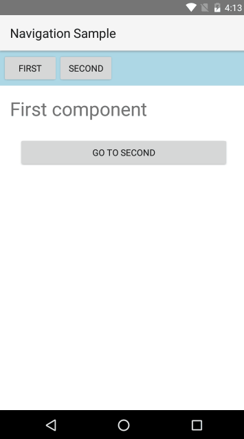

# Navigation
In this article we will cover how to do navigation in NativeScript application using Angular.

* [Router](#router)
* [Pages](#pages)
* [Router Links](#router-links)
* [Router Outlet](#router-outlet)
* [Page Router Outlet](#page-router-outlet)
* [Navigating Back](#navigate-back)
* [Lifecycle Hooks](#lifecycle-hooks)

## Router

In an Angular 2 application navigation is done using the **Angular Component Router**. You can check [this detailed guide on how to use the router](https://angular.io/docs/ts/latest/guide/router.html). From here on we are going to assume that you are familiar with the basic concepts and concentrate on the specifics when doing navigation with Angular 2 inside a NativeScript app. 

## Pages

NativeScript apps consist of pages which represent the separate application screens. Pages are instances of the [`Page`](/ApiReference/ui/page/Page.md) class. Page navigation integrates with the native navigation elements on the current platform (ex. the **Back** button in Android or the **NavigationBar** in iOS). 

> Note: You will rarely need to create Page instances manually. The framework creates pages automatically when bootstrapping or navigating the app. You can get a reference to the current page by injecting it into your component using the DI.

In NativeScript you have a choice between two router outlets:
* `router-outlet` - replaces the content of the outlet with different component. It is the default outlet that comes from angular2.
* `page-router-outlet` - uses pages to navigate. The new components are shown in a new page.

To show the difference between the to we are going to use the following components in the next examples:

``` first-component.ts
import {NS_ROUTER_DIRECTIVES} from "nativescript-angular/router/ns-router";
@Component({
    selector: "first",
    directives: [NS_ROUTER_DIRECTIVES],
    template: `
    <StackLayout>
        <Label text="First component" class="title"></Label>
        <Button text="GO TO SECOND" [nsRouterLink]="['Second']" class="link"></Button>
    </StackLayout>`
})
class FirstComponent { }
```
``` second-component.ts
import {NS_ROUTER_DIRECTIVES} from "nativescript-angular/router/ns-router";
@Component({
    selector: "second",
    directives: [NS_ROUTER_DIRECTIVES],
    template: `
    <StackLayout>
        <Label text="Second component" class="title"></Label>
        <Button text="GO TO FIRST" [nsRouterLink]="['First']" class="link"></Button>
    </StackLayout>`
})
class SecondComponent { }
```
``` app.css
.title {
    font-size: 30;
    margin: 16;
}

.nav {
    orientation: horizontal;
    horizontal-align: stretch;
    padding: 4;
    background-color: lightblue;
}

.link {
    margin: 10 30;
}
```

## Router Links

One thing you might have noticed in the code above is the `nsRouterLink` directive. It is similar to [`routerLink`](https://angular.io/docs/ts/latest/guide/router.html#!#-routerlink-binding), but works with NativeScript navigation. It is included in the `NS_ROUTER_DIRECTIVES`.

## Router Outlet

Let's take a look at the following example that uses `router-outlet`:

``` TypeScript
import {nativeScriptBootstrap} from "nativescript-angular/application";
import {RouteConfig, ROUTER_DIRECTIVES} from 'angular2/router';
import {NS_ROUTER_DIRECTIVES, NS_ROUTER_PROVIDERS} from "nativescript-angular/router";

@Component({
    selector: 'navigation-test',
    directives: [ROUTER_DIRECTIVES, NS_ROUTER_DIRECTIVES],
    template: `
        <StackLayout>
            <StackLayout class="nav">
                <Button text="First" 
                    [nsRouterLink]="['First']"></Button>
                <Button text="Second"
                    [nsRouterLink]="['Second']"></Button>
            </StackLayout>
            
            <router-outlet></router-outlet>
        </StackLayout>
    `
})
@RouteConfig([
    { path: '/first', component: FirstComponent, name: 'First', useAsDefault: true },
    { path: '/second', component: SecondComponent, name: 'Second' },
])
export class NavigationTestRouter { }

nativeScriptBootstrap(NavigationTestRouter, [NS_ROUTER_PROVIDERS]);
```

There are few things worth noting:

The application is bootstrapped using the `NS_ROUTER_PROVIDERS`. It is a collection of DI providers which internally includes the `ROUTER_PROVIDERS` from `angular2/router`, but also adds some NativeScript specific providers. 

The result is that with each navigation the content of the `router-outlet` is replaced with the new component:




## Page Router Outlet

Here is a similar example using the `page-router-outlet`:

```
@Component({
    selector: 'navigation-test',
    directives: [NS_ROUTER_DIRECTIVES],
    template: `<page-router-outlet></page-router-outlet>`
})
@RouteConfig([
    { path: '/first', component: FirstComponent, name: 'First', useAsDefault: true },
    { path: '/second', component: SecondComponent, name: 'Second' },
])
export class NavigationTestPageRouter { }

nativeScriptBootstrap(NavigationTestPageRouter, [NS_ROUTER_PROVIDERS]);
```

The main difference here is that when navigating - the new component will be loaded as a root view in a **new** `Page`. This means that any content *outside* the `page-router-outlet` will not be included in the new page. This is the reason why the `page-router-outlet` is usually the single root element in the application component. 

Here is the result:


Note that we can now use the **Back button** and the **NavigationBar** to navigate. 


## Navigating Back

You can navigate back pragmatically by injecting `Location` in your component and calling its `back()` method:

``` Typescript
import {Location} from 'angular2/router';

@Component({ ... })
export class MyComponent {
    constructor(private location: Location) { }

    public goBack() {
        this.location.back();
    }
}
```

## Lifecycle Hooks

You can use the [router lifecycle hooks](http://angular.io/docs/ts/latest/guide/router.html#!#lifecycle-hooks). 

> Note: Currently there is no way to prevent user initiated navigation and so returning `false` in `CanActivate` or `CanDeactivate` will not stop the navigation.
