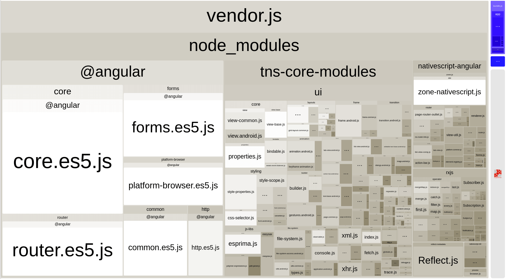

# Using Webpack to Bundle Your Code

1. [Overview](#overview)
1. [Introducing Webpack](#introducing-webpack)
1. [Installation](#installation-and-configuration)
1. [How nativescript-dev-webpack works](#how-nativescript-dev-webpack-works)
1. [Usage](#usage)
    1. [NativeScript CLI commands](#nativescript-cli-commands)
    1. [Publishing Application](#publishing-application)
    1. [Angular and Ahead-of-Time Compilation](#angular-and-ahead-of-time-compilation)
    1. [Generating WebPack Report](#generating-webpack-report)
    1. [Bundling Extra Assets](#bundling-extra-assets)
    1. [Bundling Background Workers](#bundling-background-workers)
1. [Advanced Optimizations](#advanced-optimizations)
    1. [Uglify.js](#uglifyjs)
    1. [V8 heap snapshot generation](#v8-heap-snapshot)
1. [Debugging common errors](#debugging-common-errors)
    1. [Dynamic Imports](#dynamic-imports)
    1. [Debugging Bundling Errors](#debugging-bundling-errors)
    1. [Inspecting Bundles](#inspecting-bundles)
1. [Recommendations for Plugin Authors](#recommendations-for-plugin-authors)
1. [Webpack resources](#webpack-resources)
1. [Showcase apps](#showcase-apps)

## Overview

JavaScript code and general asset bundling have been a member of the web developer toolbox for a long time. Tools like [webpack](https://webpack.github.io/) have been providing support for an enjoyable development experience that lets you assemble client-side code from various module sources and formats and then package it together. Most importantly, they allow for page load time optimizations that reduce or parallelize the number of requests a browser makes to the server.

Why bundle scripts in a mobile app though? Aren't all files stored on the local device, so requesting them should be faster than an HTTP request?! Yes, that is the case, but bundling still has an important place in mobile app optimizations:

* Fewer filesystem operations on app startup since all code is loaded from a single bundle file. Mobile file storage is not known for being very performant.
* Smaller code size. Bundlers traverse the module import graph and do not bundle unused modules. Not using that obscure feature in module X? Don't make your users pay for it then.
    * Tree-shaking. With the advent of ECMAScript 2015 modules, we have new tools that allow stripping unused parts of big modules and further reduce our application size.
* Preprocessing and interoperability hooks (not covered in this article). Webpack provides a way to resolve modules and expressions differently according to its configuration. It also contains a lot of plugins and loaders that let you embed different content in your application or use code written in different programming languages.

## Introducing Webpack

Webpack works by traversing your source tree starting from some "entry" modules and navigating through module imports. This makes it possible to collect just modules that are used in your program. Webpack is very extensible -- you can customize every step of the bundling process and add support for all sorts of asset generation and manipulation procedures.

Since bundling can be a slow and resource intensive operation, we do not enable it for every build. It is easiest to develop and debug your code without bundling, and use bundled code for QA/release builds.


## Installation and Configuration

Since every project is unique and can have quite complex requirements for bundling, we tried to make webpack configuration as simple as possible. After installation, the plugin will configure the bundling dependencies, and add a basic configuration that should work for most projects. Developers can (and should) extend that to fit their specific project needs.

The easiest way to enable webpack support for your application is to install the `nativescript-dev-webpack` plugin. To do that, run this in your application folder:

```
$ npm install --save-dev nativescript-dev-webpack
```

The plugin adds a few dependencies to the project. Don't forget to install them:

```
$ npm install
```

#### XML Pages and Code-behind Files

XML page definitions load JavaScript modules named with the same name as the XML file that contains the UI markup. To make those work with webpack bundles, you need to register them as dynamic modules:

```JavaScript
global.registerModule("main-page", () => require("./main-page"));
```

Here's an example [configuration](https://github.com/NickIliev/NativeScript-Cosmos-Databank/blob/master/app/bundle-config.ts).

For non-Angular apps, make sure to add `bundle-config.js|ts` file in the `app` folder with the following content:

```
if (global["TNS_WEBPACK"]) {
    require("tns-core-modules/bundle-entry-points");
    global.registerModule("main-page", function () { return require("./main-page"); });
    // register more application modules here following the example above
}
```

Then import `bundle-config` on top of `app.js|ts`

```JavaScript
require("./bundle-config");
```

```TypeScript
import "./bundle-config";
```
## How nativescript-dev-webpack Works

Installing the plugin adds several updates to your project:

- `devDependencies` settings that will contain the most popular webpack package and several loaders and plugins.
- `webpack.config.js` -- this is the configuration file. It contains sensible defaults, but it is designed to be as readable and easy to modify as possible.
- Application source files configuring bundle chunks:
    - `app/vendor`. Defines vendor modules which get bundled separately from application code.
    - `app/vendor-platform.android` and `app/vendor-platform.ios`. Define platform-specific vendor modules.
- Several helper scripts in your project's `package.json` files that let you build a bundled version: `build-<platform>-bundle`, `start-<platform>-bundle` and others.


## Usage

### NativeScript CLI commands

`nativescript-dev-webpack` implements the usual workflow of working with your project. Using `tns` CLI  commands to invoke scripts that prepare the bundled version.

Given that you have your project running in its non-bundled state, you can test the bundled version with the following command(s):

```
$ tns run android --bundle
```

or

```
$ tns run ios --bundle
```

If you want to package your application, you need the `build-...` commands:

```
$ tns build android --bundle
```

or

```
$ tns build ios --bundle
```

The former will produce an android `.apk` archive, while the latter will create an `.app` or `.ipa` package.

By default it will not pass any extra parameters to the `tns` tool, so, if you need a release build, signed with a certain key, you would need to provide the parameters prefixed by a `--` marker. For example, here is how you'd create a release build for an iOS device containing bundled scripts:

```
$ tns build ios --bundle --release --forDevice
```

The corresponding command for android looks like:

```
$ tns build android --bundle --release --keyStorePath ~/path/to/keystore --keyStorePassword your-pass --keyStoreAlias your-alias --keyStoreAliasPassword your-alias-pass
```

You can also use the same method to provide environmental variables to the webpack build:

```
$ tns build android --bundle --env.development --env.property=value
```

They can be accessed through the `env` object in the webpack configuration:

```js
// webpack.config.js

...
module.exports = env => {
    console.dir(env); // { development: true, property: 'value' }
    ...
}
```

### Publishing Application

A bundled version of the application for Android can be built in release with this script:

```
$ tns build android --bundle --release --keyStorePath ~/path/to/keystore --keyStorePassword your-pass --keyStoreAlias your-alias --keyStoreAliasPassword your-alias-pass
```

Once this is finished, proceed with uploading the output .apk file in the <project>/platforms/android/build/outputs/apk directory on Google Play store.

You can build a bundled version of the application for iOS in release with this script:

```
$ tns build ios --bundle --release --forDevice --teamId TEAM_ID
```

Note  that if `--teamId` flag is emmited, the NativeScript CLI will prompt for team ID during the build process.

Once the release build is ready, you have two options:

* Open `<project/platforms/ios/<project>.xcodeproj>` (or `<project/platforms/ios/<project>.xcworkspace>` if present) in Xcode to configure project signing and upload the archive to App Store. This is the recommended option.
* Specify your development team in `<project>/app/App_Resources/iOS/build.xcconfig` from the command line and execute 

```
$ tns publish ios --ipa ipa-file-path-here
```

More options for publishing an iOS application can be found in ["Publishing for iOS"](https://docs.nativescript.org/publishing/publishing-ios-apps) article.

>If there are multiple mobile provisioning profiles for the selected development team available on the machine, it is not guaranteed that Xcode will select the desired one and publishing using the command line will be successful. Therefore, in such cases, we recommend manually configuring and uploading the project from Xcode.

### Angular and Ahead-of-Time Compilation

NativeScript Angular projects will also have the [`@ngtools/webpack`](https://www.npmjs.com/package/@ngtools/webpack) plugin added. The former performs Ahead-of-Time compilation and code splitting for lazily loaded modules. Also, if your application is Ahead-of-Time compiled, you won't have Angular compiler included in your bundle which results in smaller application size and improved start up time.
To take advantage of Ahead-of-Time compilation, you need to bootstrap your app with the static NativeScript Angular platform instead of the dynamic one. For that, you will have to create a `main.aot.ts` file next to your `app/main.ts` file. Also make sure, that the `main` property in your `app/package.json` is `main.js`. If your root NgModule is named `AppModule` and is located in `app/app.module.ts`, the content of the `main.aot.ts` file should be the following:

```ts
// app/main.aot.ts
import { platformNativeScript } from "nativescript-angular/platform-static";
import { AppModuleNgFactory } from "./app.module.ngfactory";

platformNativeScript().bootstrapModuleFactory(AppModuleNgFactory);
```

Note that the `./app.module.ngfactory` file still does not exist. It will be in-memory generated by the Angular compiler (ngc) during build time. That's why you don't want TypeScript to try to compile the `main.aot.ts` file and fail. You can exclude it from compilation by configuring your `tsconfig.json`:

```ts
// tsconfig.json
{
    "compilerOptions": {
        ...
        "paths": {
            "~/*": [
                "app/*"
            ],
            "*": [
                "./node_modules/tns-core-modules/*",
                "./node_modules/*"
            ]
        }
    },
    "exclude": [
        ...
        "app/main.aot.ts"
    ]
}

```

PS: If you created your project with `tns create AppName --ng`, it will already be prepared for Ahead-of-Time compilation.

### Bundling Extra Assets

The default webpack configuration tries to copy certain files to your app folder:

- HTML/XML markup files.
- App/theme CSS files.
- Images: png/jpg/etc.

If you need other files bundled with your app, find the `CopyWebpackPlugin` configuration in `webpack.config.js`, and add a new config:

```JavaScript
new CopyWebpackPlugin([
    ...
    {from: "**/*.pdf"},
    ...
], {ignore: ["App_Resources/**"]}),

```

### Bundling Background Workers

When the applicaiton is implementing workers some additional steps are required to make the project WebPack compatible. Use `nativescript-worker-loader` plugin.

```
npm i nativescript-worker-loader -D
```

Detailed instructions on how to implement WebPack compatible workers can be found in [this demonstration applicaiton](https://github.com/NativeScript/worker-loader#usage).

## Advanced Optimizations

### Uglify.js

The webpack configuration includes the `uglifyjs-webpack-plugin`(https://github.com/webpack-contrib/uglifyjs-webpack-plugin). The plugin performs code minification and improves the size of the bundle.
That plugin is disabled by default because it slows down the building process. You can enable it by providing the `--env.uglify` flag to the CLI command. Example usage:

```
$ tns build android --bundle --env.uglify
```

or, if you are building for release on Android:
```
$ tns build android --bundle --env.uglify --release --keyStorePath ~/path/to/keystore --keyStorePassword your-pass --keyStoreAlias your-alias --keyStoreAliasPassword your-alias-pass
```

Building for release with uglify on iOS
```
$ tns build ios --bundle --env.uglify --release --forDevice --teamId TEAM_ID
```

### V8 Heap Snapshot

The webpack configuration also includes the [`NativeScriptSnapshotPlugin`](https://github.com/NativeScript/nativescript-dev-webpack/blob/master/plugins/NativeScriptSnapshotPlugin.js). The plugin loads a single webpack bundle in an empty V8 context, aka snapshotted context, and after its execution captures a snapshot of the produced V8 heap and saves it in a blob file. Next the blob file is included in the apk bundle and [is loaded by the Android Runtime](https://docs.nativescript.org/runtimes/android/advanced-topics/V8-heap-snapshots) on app initialization. This will obviate the need for loading, parsing and executing the script on app startup which can drastically decrease the starting time.

To include the `NativeScriptSnapshotPlugin` in already existing webpack configuration regenerate your `webpack.config.js` or use the `update-ns-webpack` script to update it:

```
$ ./node_modules/.bin/update-ns-webpack
$ npm install
```

Once you have updated your `webpack.config.js`, you can enable the feature by providing the `--env.snapshot` flag to the bundling command:

```
$ tns build android --bundle --env.snapshot
```

Snapshot generation can be used in combination with uglify (`--env.uglify`) which will result in smaller heap size.

```
$ tns build android --bundle --env.uglify --env.snapshot
```

Known limitations:
* No iOS support. Heap snapshot is a V8 feature which is the engine used in the Android Runtime. Providing `--env.snapshot` flag on the iOS bundling commands will have no effect.
* No Windows support. Providing `--env.snapshot` flag on the Android bundling command will not affect Windows machine.
* Only one webpack bundle can be snapshotted. By default, this is the `vendor` bundle because in most of the cases it is the largest one.


### Angular Ahead-of-Time Compilation Build (AOT)

The Angular Ahead-of-Time (AOT) compiler converts your Angular HTML and TypeScript code into efficient JavaScript code during the build phase before the browser downloads and runs that code. To enable AOT  provide `--env.aot` flag to the CLI command.

Building with AOT on Android
```
$ tns build android --bundle --env.aot
```

Building with AOT on iOS
```
$ tns build ios --bundle --env.aot
```

The `--env.aot` flag can be used in combination with `--env.uglify` and `--env.snapshot` (Note that snapshots are available for Android only).

Building with AOT, uglify and snapshot on Android
```
$ tns build android --bundle --env.aot --env.uglify --env.snapshot
```

Building with AOT and uglify on iOS
```
$ tns build ios --bundle --env.aot --env.uglify
```

### Generating WebPack Report

WebPack bundling comes with a report functionality provided via `--env.report` flag. Enabling the flag will generate `report` folder
in the root directory of the project with `report.html` page rendering the application chunks. 
The plugin used fpr generating the report is [webpack-bundle-analyzer](https://www.npmjs.com/package/webpack-bundle-analyzer).

Generating report
```
$ tns build android --bundle --env.report
```

#### NativeScriptSnapshotPlugin configuration

The `NativeScriptSnapshotPlugin` by default comes with the following configuration:

```
if (env.snapshot) {
    plugins.push(new nsWebpack.NativeScriptSnapshotPlugin({
        chunk: "vendor",
        projectRoot: __dirname,
        webpackConfig: config,
        targetArchs: ["arm", "arm64", "ia32"],
        tnsJavaClassesOptions: { packages: ["tns-core-modules" ] },
        useLibs: false
    }));
}
```

* `chunk` - the name of the chunk to be snapshotted
* `projectRoot` - path to the app root folder
* `webpackConfig` - Webpack configurations object. The snapshot generation modifies the webpack config object to ensure that the specified bundle will be snapshotted successfully
* `targetArchs` - Since the serialization format of the V8 heap is architecture-specific, we need a different blob file for each V8 library target architecture. The Android Runtime library contains 3 architecture slices - `ia32` (for emulators), `arm` and `arm64` (for devices). However, [if not explicitly specified](https://github.com/NativeScript/android-runtime/issues/614), the `arm` slice will be used even on `arm64` devices. In other words, generating heap snapshot for all supported architectures (`arm`, `arm64`, `ia32`) will guarantee that the snapshotted heap will be available on every device/emulator. However, when building for the release, you can leave only `arm` (and `arm64` in case you have [explicitly enabled `arm64` support](https://github.com/NativeScript/android-runtime/issues/614)) in the `targetArchs` array which will decrease the size of the produced APK file.
* `tnsJavaClassesOptions` - Basically, every Java class successor, declared in NativeScript, consists of two parts - native Java part generated by the [static binding generator](https://www.nativescript.org/blog/static-binding-generator---what-is-it-good-for) and JavaScript counterpart, created when the [JavaScript extending](https://docs.nativescript.org/runtimes/android/generator/extend-class-interface#classes) is evaluated. Both parts must be loaded to instantiate the class. The native Java definition is compiled with the app, so it is loaded by the JVM without requiring any additional work. Since the JavaScript counterpart is created by [the extend function](https://docs.nativescript.org/runtimes/android/generator/how-extend-works#the-extend-function), we should make sure that it is evaluated before using the successor class. This is not a concern, when the class is instantiated from JavaScript, because its constructor is created by the `extend` function call, which means that there is no way to refer to the extended class without having the `extend` call executed beforehand. However, there are classes defined in JavaScript that are instantiated from native code. For example, the `NativeScriptActivity` class defined in `ui/frame/activity` is instantiated on app startup by the system. When bundling is disabled, such cases are handled by the Android runtime in the following way:
    1. The static binding generator saves the path to the file containing its JavaScript implementation in the class metadata.
    2. Before instantiating the class, the runtime loads and executes the module at the path saved in the metadata, assuming that this will evaluate the class extending code.
    When bundling with Webpack, the saved path in the metadata always points to the bundle script. However, depending on configurations, executing the bundle script may not evaluate the module containing the Java class definition. Therefore, instead of relying on the Android runtime mechanism to automatically load the JavaScript counterparts we load them on startup by explicitly adding `require` calls to such modules in our default `app/vendor-platform.android` module:
    ```
    require("application");
    if (!global["__snapshot"]) {
        /*
        In case snapshot generation is enabled these modules will get into the bundle but will not be required/evaluated.
        The snapshot webpack plugin will add them to the tns-java-classes.js bundle file. This way, they will be evaluated on app start as early as possible.
        */
        require("ui/frame");
        require("ui/frame/activity");
    }
    ```
    However, when we add the V8 heap snapshot in the whole story, we are not allowed to extend native classes in snapshotted context. Therefore, we always include `ui/frame` and `ui/frame/activity` in the bundle but when snapshot is enabled they are not evaluated. Here is where the `tns-java-classes.js` file comes into play. Just after initialization, the Android runtime [will evaluate the script at `app/tns-java-classes.js` path if such exists](https://github.com/NativeScript/android-runtime/commit/d13189e4206b374142dc61d309d5aa708fb8095f). The snapshot generator creates such file and populates it with `require` calls to a user defined list of paths. This way, they are explicitly evaluated on app startup. You can add paths to be `require`-d in `tns-java-classes.js` like this:
    ```
    new nsWebpack.NativeScriptSnapshotPlugin({
        ...
        tnsJavaClassesOptions: { modules: ["path/to/file1.js", "path-to-module", "path/to/other-script"] }
        ...
    });
    ```
    If you are a plugin author and your plugin contains a module that have to be listed here, you can specify it in your plugin's `package.json` file:
    ```
    "snapshot": {
        "android": {
            "tns-java-classes": {
            "modules": ["ui/frame/activity", "ui/frame/fragment"]
            }
        }
    }
    ```
     This gives the opportunity to the plugin's clients to add all needed paths in their `tns-java-classes.js` file only by specifying the name of your package:
    ```
    new nsWebpack.NativeScriptSnapshotPlugin({
        ...
        tnsJavaClassesOptions: { packages: ["my-package" ] }
        ...
    });
    ```
#### Checking if snapshot is enabled
If you want to toggle whether specific logic is executed only in snapshotted context you can use the `global.__snapshot` flag. Its value is `true` only if the current execution happens in the snapshotted context. Once the app is deployed on the device, the value of the flag is changed to `false`. There is also `global.__snapshotEnabled` flag. Its only difference compared to `global.__snapshot` is that its value is `true` in both snapshotted and runtime contexts, given that snapshot generation is enabled.
```
function logMessage(message) {
    if (global.__snapshotEnabled) {
        if (!global.__snapshot) {
            console.log("The current execution is happening in runtime context when we have all {N} APIs available, including console.log, so this line of code won't fail.");
        }
        console.log("This will fail if logMessage is called in snapshotted context because console.log is not available there.");
    }
}
```

#### Using snapshot without Webpack
The `nativescript-dev-webpack` plugin adds `generate-android-snapshot` npm script in the app's `package.json` file. The command will check if `__snapshot.js` file exists in the app root folder and will generate and install blob files using the file as input. Make sure you have prepared the android platform beforehand, because a subsequent prepare will clear some installed artefacts. This is how V8 heap snapshot can be generated from a single file, without using Webpack bundling. However, generating snapshot from something different than a Webpack bundle is not a common scenario. Packing all scripts into one fat bundle in advance, is what makes the snapshot so beneficial. Generating snapshot for a single script only will rarely have some notable effect on the app performance.

## Debugging Common Errors

Webpack bundling can fail for different reasons. It sometimes fails to resolve certain modules, or it generates code that breaks at runtime. We'll try to cover a few common failure reasons with steps to resolve them in the following sections.

### Dynamic Imports

A significant drawback to using bundled code is that you have to know the names of all imported modules in advance at bundle time. That means code using variables and passing them to `require` will not work:

```JavaScript
// THROWS AN ERROR!
require(myPlugin);
```

You can solve this if you have a known set of resolvable modules and you need to switch between them by registering those so that webpack discovers them. You do that by adding a set of `global.registerModule` calls to your application bootstrap code (or some other module that is discovered by webpack when traversing the module import graph):

```JavaScript
require("globals");
global.registerModule("my-plugin", function() { return require("my-plugin"); });
```

Then you will be able to import this module using the `global.loadModule` API:

```JavaScript
const myPlugin = "my-plugin";
//...
global.loadModule(myPlugin);
```

### Passing extra flags

Webpack may not show all error details by default, but you can always enable that by passing the `--display-error-details` [configuration option](https://webpack.js.org/api/cli/#stats-options). You can manually invoke the webpack tool, and pass the extra options using the same `--` trick we mentioned above:


```
$ tns run android --bundle --display-error-details
```

Note that the above command will not run a full build. Use it only to run the webpack process manually and troubleshoot failed builds.

Other options that can be useful when diagnosing a problem are: `--display-modules`, `--display-reasons`, `--display-chunks`.

### Inspecting Bundles

Bundles are generated in the platform output folders. Look for the `bundle.js` and `tns-bundle.js` files in your `platforms/android/...` and `platforms/ios/...` "app" folders. You could change the destination directory by editing your configuration.

You could also rely on webpack analysis and visualization plugins that can help you diagnoze bundle problems and reduce bundle size. The default webpack configuration includes the `webpack-bundle-analyzer` plugin.

When you build your project, the analyzer plugin will generate a `report` directory in the app root, which contains two files - `${platform}-report.html` and `${platform}-stats.json`. You can open the html in any web browser and inspect the generated bundles.



For analyzing the dependency graph between the modules, you can use [webpack.github.ui/analyse](http://webpack.github.io/analyse/) and open the `${platform}-stats.json` file.

## Recommendations for Plugin Authors

Most third party packages are problem free, and get picked up by webpack without any issues. Some libraries though require a bit of tweaking. When you encounter a library that does not get recognized by your webpack configuration, please open up an issue on that library's GitHub repository.

### Referencing Platform-specific modules from "package.json"

This is the most common problem with third party plugins. Most plugins provide two platform-specific implementations stored in modules named like `my-plugin.android.js` and `my-plugin.ios.js`. The `package.json` file for the plugin looks like this:

```JSON
{
    "main": "my-plugin.js"
}
```

Webpack will read the `package.json` file and try to find a `my-plugin.js` module and will fail. The correct way to reference a platform-specific module would be to remove the `.js` extension:

```JSON
{
    "main": "my-plugin"
}
```

That will allow webpack to correctly reference `my-plugin.android.js` or `my-plugin.ios.js`.

### Emitting Helper Functions in TypeScript Plugins

The TypeScript compiler implements class inheritance, decorators and other features using a set of helper functions that get emitted at compile time. NativeScript ships with its own implementations of those helpers to allow features like extending platform native classes. That is why plugin authors need to configure their compiler **NOT** to emit helpers. The easiest way is to edit the `tsconfig.json` file and set the `noEmitHelpers` option to `true`:

```JSON
{
    "compilerOptions": {
        ...
        "noEmitHelpers": true,
        ...
    },
    ...
}
```


## Webpack Resources

Bundling JavaScript code can get complex quickly, and encountering webpack for the first time can be daunting. A full introduction to webpack and related technologies is beyond the scope of this article, and we recommend the following resources:

* [Introduction](https://webpack.js.org/guides/getting-started/)
* [Tutorial](https://webpack.js.org/concepts/)
* [Webpack CLI Reference](https://webpack.js.org/api/cli/#components/sidebar/sidebar.jsx)

## Showcase apps

Apps using the nativescript-dev-webpack plugin:

* [Groceries](https://github.com/NativeScript/sample-Groceries)
* [NativeScript SDK Examples](https://github.com/NativeScript/nativescript-sdk-examples-ng)
* [NativeScript-UI SDK Examples](https://github.com/telerik/nativescript-ui-samples-angular)
* [Cosmos Databank](https://github.com/NickIliev/nativescript-ng-cosmos)
* [Tests app NG](https://github.com/NativeScript/tests-app-ng)
