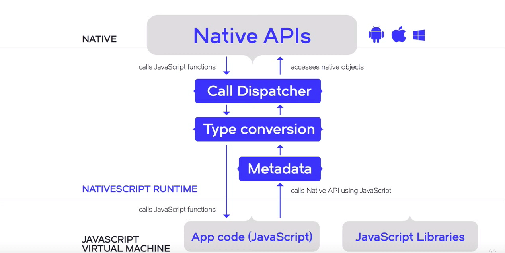

# Application Workflow

Android Runtime
---
_Disclaimer: The author of this article assumes that you are familiar with the core concepts of [NativeScript](http://docs.nativescript.org/) and the [NativeScript Android Runtime](../overview.md)_

The Android Runtime is built on top of **[Google's V8 JavaScript Virtual Machine](#googles-v8)**. Pre-generated **[Metadata](#metadata-generator)** is embedded in the resulting application and as a result we get very efficient native access, while the **[Binding Generator](#binding-generator)** component takes care of the creation of custom Java classes build-time to extend Java/Android class functionality or serve as proxy.

---

## Google's V8
 V8 is the JavaScript Engine which compiles and executes the JavaScript code. It takes advantage of the [Just-In-Time Compilation technique](http://whatis.techtarget.com/definition/just-in-time-compiler-JIT) to process JavaScript code with great efficiency. [Read more.](https://developers.google.com/v8/)

## JNI
 JNI is the **Java Native Interface** that provides means for Java code to interact with native code. Put shortly - it allows a Java program to invoke functions in another C/C++ program and vice versa. In the context of a NativeScript application JNI is the communicational layer between the V8 JavaScript Engine and the platform - Java/Android code. [Read more.](http://developer.android.com/training/articles/perf-jni.html)

## Metadata Generator
 The [Metadata Generator](../metadata/overview.md) uses Apache Commons BCEL to iterate through all native dependencies added to the project, and exposes their public API to the Android Runtime.

## Bindings Generator
 The [Bindings Generator](../generator/overview.md) is responsible for the dynamic generation of implemented classes and interfaces. When the user implements an Android object, a custom Java proxy object is created. The process of generating Java classes at build-time is highly optimized.

---

# Application Workflow
 Much like in a Node.js application, a NativeScript application needs a virtual machine that understands the JavaScript code we write. Google's V8 parses JavaScript already, but would not know of Java syntax or objects. That is why pre-generated metadata is necessary. The Metadata Generator creates binaries of all Android types at build-time, that will later be consumed by the Android Runtime and exposed to JavaScript. But JavaScript and Java are two entirely different programming languages with no means to communicate directly. The Android Runtime uses JNI to bridge the gap between V8 and Android's Dalvik, allowing the two to send instructions back and forth despite their discrepancies where data types and objects are concerned.

 Let's look at an example where, much like in JavaScript, we can write an event and attach it to a view (button) to respond to user's actions.

```javascript
 // ... code omitted for brevity

 var Color = android.graphics.Color; // 1
 var colors = [Color.BLUE, Color.RED, Color.MAGENTA, Color.YELLOW, Color.parseColor("#FF7F50")] // 2
 var taps = 0;

 var button = new android.widget.Button(this); // 3
 button.setText("Hit me"); // 4
 layout.addView(button);

 button.setOnClickListener(new android.view.View.OnClickListener({ // 5
    onClick:  function() {
    	button.setBackgroundColor(colors[taps % colors.length]);
    	taps++;
 }}));

 // ... code omitted for brevity
```

In plain* JavaScript in the browser that same code would look like this *(Depending on your choice of framework, if any, some lines may differ):

```javascript
 var colors = ["#0000FF", "#FF0000", "#FF00FF", "#FFFF00", "#FF7F50"];
 var taps = 0;

 var button = document.createElement("button");
 var btnText = document.createTextNode("Hit me");
 button.appendChild(btnText);
 document.body.appendChild(button);

 button.addEventListener("click", function() {
    button.style.background = colors[taps % colors.length];
    taps++;
 });
```

And now let's go through the steps of exactly what happens when we write the above:

 1. We access a native [Class](https://docs.oracle.com/javase/tutorial/java/concepts/class.html) through JavaScript and save it to a variable for the purposes of writing shorter code later. From here on we can call any of the class Color's public static methods, access its public fields and constants, or make an instance of it, if a public constructor is present. On the following line we save the [constants' values](http://developer.android.com/reference/android/graphics/Color.html) in an array, as they have different representations than in JavaScript.
 2. As mentioned above, we get access to a [Class object](https://docs.oracle.com/javase/8/docs/api/java/lang/Class.html)'s methods, and we take advantage of that to produce another color that was not in the predefined values of the class.
 3. We create a new instance of an Android button. In normal scenarios of writing JavaScript none of it would make sense, but in the context of NativeScript that is a totally valid syntax, and will in fact work and create a button for us. Similar to how we handled colors earlier, we can save the Button class in a variable and use it to make a Button instance - `var Button = android.widget.Button; var button = new Button(this);`. This not only creates an object in JavaScript, but in Android as well. What this means is that any changes made to the object using the relevant API will be reflected on the button that will appear on the screen of your device.
 4. We then proceed to set the button instance's text to a string. A marshalling service will take care of converting any arguments passed to functions to their respective data type representation in the Java world, in our case - JavaScript `string` to Java `java.lang.String`. The button's content will be changed to "Hit me".
 5. Finally, we add event listener to our button. Again, similar to the way we do it in JavaScript, we need to provide a callback that will be executed when an action - a click, hold, load, etc., occurs. The way this is done using the NativeScript Android Runtime is by passing our button instance's method `setOnClickListener` an argument which contains the callback implementation.

---

# Execution Flow Illustration
Now that we know how to access the native API, let's have a look at the common execution flow of an application written in NativeScript.
Triggering an event in Android will always be handled by the Dalvik Virtual Machine ([ART](https://en.wikipedia.org/wiki/Android_Runtime)) which acts as the first responder in a native application. Any implementation included in the body of the event will then be executed by the NativeScript Android runtime, and the result of the operation returned to JavaScript. If a change to a native variable or view is made, instructions will again go through Dalvik.

**Note**: If no changes to native variables are present as a result of the execution of the callback (for example, when a local JavaScript variable that doesnt hold a reference to an Android object is modified - a number, a string, an array of JavaScript Objects, etc.), no calls to Dalvik will be made.

Execution Flow illustration:


