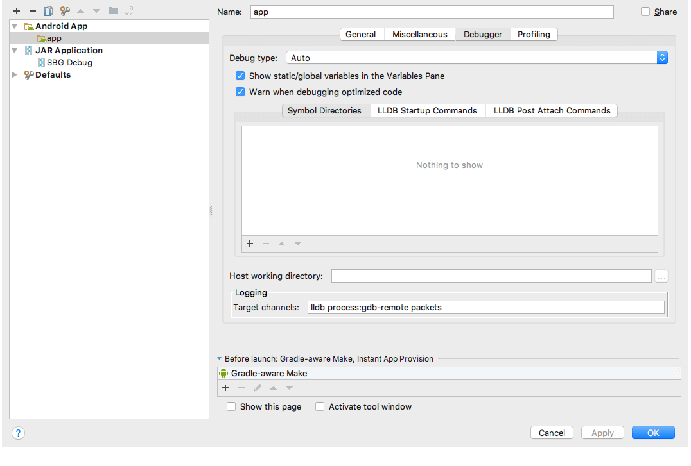

# Debugging the Android Runtime

## Overview

The [Debug article](./debug-cli) shows how to debug the business logic of your application. But what happens when the problem is in the runtime? How do I debug the application and the runtime simultaneously?

Since {N} version 4.0 you can open your `<app_name>/platforms/android` folder in Android Studio, do a couple of simple configurations and debug your application and the Android Runtime. This means you'll be able to debug the C++ and Java side of the runtime and the JavaScript business logic as you've done up to now.

## Setting up the project for native debugging

Once you have your project up and running you can open the `<app-name>/platforms/android` in Android Studio.
>Note: be sure you're using ^4.0 version of the Android Runtime if you want the following steps to work.

After you've open the project in Android Studio find the `settings.gradle` file which should look like this:
>Note: Before opening the project in Android Studio, you need to run at least `tns prepare android`!

```
rootProject.name = "com.example.yourprojectname"
include ':app'//, ':runtime', ':runtime-binding-generator'

//project(':runtime').projectDir = new File('path/to/runtime')
//project(':runtime-binding-generator').projectDir = new File('path/to/runtime-binding-generator')

file("google-services.json").renameTo(file("./app/google-services.json"))
```
Uncomment the `:runtime` and `':runtime-binding-generator` sub-projects along with the absolute paths to them.
After all the changes the `settings.gradle` should look like this:

```
rootProject.name = "com.example.yourprojectname"
include ':app', ':runtime', ':runtime-binding-generator'

project(':runtime').projectDir = new File('/c/your/android-runtime/test-app/runtime')
project(':runtime-binding-generator').projectDir = new File('/c/your/android-runtime/test-app/runtime-binding-generator')

file("google-services.json").renameTo(file("./app/google-services.json"))
```

>Note the `project(':runtime').projectDir` should point to an already cloned and set-up android-runtime repo.

That's all, now you can debug the Java part of the runtime. Just put a break point and hit `debug`.

If you want to debug the c++ part of the runtime, you should point the debug tool to the debug symbols.

From Android Studio: Open the "Run" menu -> "Edit Configurations ..." -> The following screen will open:



Select the "Debugging" tab -> "Symbol Directories" -> Click on the "+" sign and add the path to the debug symbols. They should be at the following path, relative to the folder where the runtime is set up: "./android-runtime/test-app/runtime/build/intermediates/cmake/debug/obj".

You can set a debug break point inside the c++ code and hit debug.

## Debugging with chrome-dev-tools and Android Studio

It's a bit more tricky to debug your application as you're used to through the CLI and chrome-dev-tools.
First of all you need to have the `adb` command available in the terminal. Either that or access it through an environment variable like so:
* `$ANDROID_HOME/platform-tools/adb` for unix
* `%ANDROID_HOME%\platform-tools\adb` for windows

### Adb forward
In order for chrome-dev-tools to connect to your application it needs to have a named socket set up. Usually the CLI takes care of this, but as we mentioned we won't be using the CLI for building or for debugging. In order to set up this named socket you need to run:

```
 adb forward tcp:<local-host-port> localabstract:<application-full-name>-inspectorServer
```

`<local-host-port>`: the port where chrome-dev-tools will connect locally
`<application-full-name>`: name of your application (you can find it in the `AndroidManifest.xml` of your application, it's the value of the 'package' attribute, e.g. "com.tns.testapplication")

Example command:

```
adb forward tcp:40000 localabstract:com.tns.testapplication-inspectorServer
```

>Note: This is a one time command and needs to be reran only if adb-server is killed.

### Open Google Chrome with debug url

Usually the CLI provides this link so you can open it in Google Chrome, so it's not that different from the normal debug flow.

```
chrome-devtools://devtools/bundled/inspector.html?experiments=true&ws=localhost:<local-host-port>
```

`<local-host-port>`: the same socket we set-up earlier (40000)

Open this link in Google Chrome and it will automatically connect to your running application if you've done the `adb forward` part correctly.
If it doesn't connect right away, you'll get a button to `Reconnect`. This will happen when you try to connect chrome-dev-tools before the application has started.
If you want to stop early in the execution you can put a `debugger;` statement in your JavaScript code.

>Note: always start the application before trying to if through Google Chrome.

Now you can debug both the Android Runtime && Android Runtime Binging Generator through Android Studio and your business logic through Chrome-Dev-Tools.

## Known issues

### Android SDK is not configured properly

To resolve this problem you need to set the Compile SDK Version properties of your application, following these steps:
"File" -> "Project Structure ..." -> Select your app -> "Properties" tab -> Set the "Compile Sdk Version" property to "API 26: Android 8.0 (Oreo)"

### Error while Installing APK

If you have already ran `tns run android` before following those steps, once you hit debug you might get the "Error while Installing APK" error. The solution is to delete the problematic folder created from the CLI so it doesn't get in the way of Android Studio.

```
adb root && adb shell "rm -rf /data/local/tmp/<application-full-name>"`
```

Example command:

```
adb root && adb shell "rm -rf /data/local/tmp/org.nativescript.aaa"
```

After the folder is deleted successfully from the device, just run/debug again from Android Studio.

## See Also
* [Google Chrome DevTools reference](https://developer.chrome.com/devtools/index).
* [JavaScript debugging](https://developer.chrome.com/devtools/docs/javascript-debugging).
* [debugger; statement](https://developer.mozilla.org/en/docs/Web/JavaScript/Reference/Statements/debugger)
