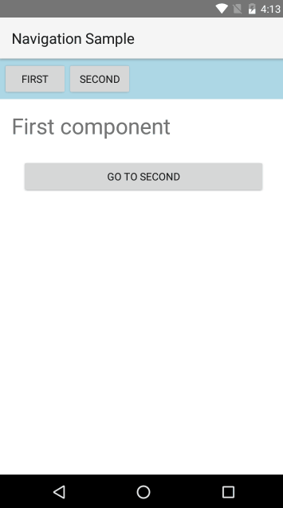
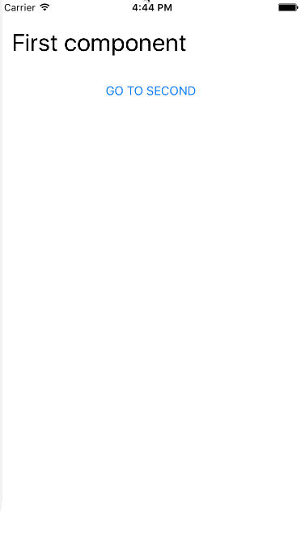
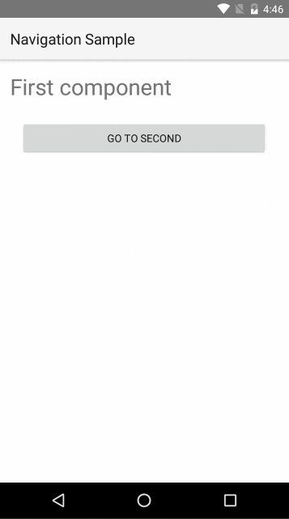

# Navigation
In this article we will cover how to do navigation in NativeScript application using Angular.

## Router

In an Angular application navigation is done using the **Angular Component Router**. You can check [this detailed guide on how to use the router](https://angular.io/docs/ts/latest/guide/router.html). From here on we are going to assume that you are familiar with the basic concepts and concentrate on the specifics when doing navigation with Angular inside a NativeScript app.

> Note: This article covers usage of the @angular/router v3. For the `deprecated beta router` please import `nativescript-angular/router-deprecated`.

## Configuration

The router configuration usually consists of the following steps:

Create a `RouterConfig` object which maps paths to components and parameters:



Use the `NativeScriptRouterModule` API to import your routes:



As usual, pass your module to the `bootstrapModule` function to start your app:


## Pages

NativeScript apps consist of pages which represent the separate application screens. Pages are instances of the [`Page`](http://docs.nativescript.org/api-reference/classes/_ui_page_.page.html) class. Page navigation integrates with the native navigation elements on the current platform (ex. the **Back** button in Android or the **NavigationBar** in iOS).

> Note: You will rarely need to create Page instances manually. The framework creates pages automatically when bootstrapping or navigating the app. You can get a reference to the current page by injecting it into your component using the DI.

In NativeScript you have a choice between two router outlets:
* `router-outlet` - replaces the content of the outlet with different component. It is the default outlet that comes from Angular.
* `page-router-outlet` - uses pages to navigate. The new components are shown in a new page.

To show the difference between the two we are going to use the following components in the next examples:



We are also going to use the following route configuration file (`app.routes.ts`):




## Router Links

One thing you might have noticed in the code above is the `nsRouterLink` directive. It is similar to [`routerLink`](https://angular.io/docs/ts/latest/guide/router.html#!#-routerlink-binding), but works with NativeScript navigation. To use it, you need to import `NativeScriptRouterModule` in your NgModule.

## Router Outlet

Let's take a look at the following example that uses `<router-outlet>`:



The result is that with each navigation the content of the `router-outlet` is replaced with the new component:




## Page Router Outlet

Here is a similar example using the `page-router-outlet`:



The main difference here is that when navigating - the new component will be loaded as a root view in a **new** `Page`. This means that any content *outside* the `page-router-outlet` will not be included in the new page. This is the reason why the `page-router-outlet` is usually the single root element in the application component.

Here is the result:




Note that we can now use the **Back button** and the **NavigationBar** to navigate.

It is possible to nest `<router-outlet>` component inside `<page-router-outlet>` or another `<router-outlet>`.

## Navigation Options

You can define the trigger in your application declaratively - using the `nsRouterLink` directive in your markup. Or you can do it through code - by injecting  the `RouterExtensions` class and using its methods:



> Note: You can also use the stock Angular `Route` and `Location` classes to handle your navigation—`RouterExtensions` actually invokes those APIs internally. However, `RouterExtensions` provides access to some NativeScript-specific features like clearing navigation history or defining page transitions.

### Navigating Back

You can navigate back using `back()` method of the `RouterExtensions`:



You can also navigate back to the previous page with `backToPreviousPage()`:



The difference between the two methods is visible when there are nested(child) router-outlet(s) inside the current page:

* `back()` - goes back to the previous router location even if the navigation occurred inside the child router outlet on the current page.
* `backToPreviousPage()` - goes back to the previous page. The method skips all child router-outlet navigations inside the current page and goes directly to the previous one.


### Clearing Page Navigation History

In NativeScript's page navigation, you have the option to navigate to another page and clear the page navigation history. This means that the user will not be able to go back using the back button (or swipe back in iOS). This is useful in scenarios where you have a login page and you don't want users to be able to go back to it once logged in.

You can specify `clearHistory` as an attribute on your `nsRouterLink` tag in the markup:



Or you can use `RouterExtensions` class:



### Specifying Page Transitions

By default, all navigation will be animated and will use the default transition for the respective platform (UINavigationController transitions for iOS and Fragment transitions for Android). To change the transition type, set the `pageTransition` attribute on your `nsRouterLink` tag in the markup:



> Note: You can set `pageTransition="none"` to disable the transition.

You can also do this through code using the `RouterExtensions` class:



> Note: You can pass `animated: false` in `NavigationOptions` to disable the transition.

> Note: `transition` animation provided by NativeScript `routerExtensions` is supported only in cases when `page-router-outlet` is used.

For other customization options check the [`NavigationTransition`](http://docs.nativescript.org/api-reference/interfaces/_ui_frame_.navigationtransition.html) interface.

## Route Guards

You can use Angular’s [route guards](https://angular.io/docs/ts/latest/guide/router.html#!#guards) for even more control over the navigation.

> **Note**: Currently, there is no way to prevent user-initiated back navigation - trying to apply guards in such scenario is not supported.

## Lifecycle Hooks And Component Caching

There is a difference in the component lifecycle when using `<page-router-outlet>` and `<router-outlet>`.

With `<router-outlet>` new instance of the component is created with each navigation and is destroyed when you navigate to another component. The component's constructor and its **init** hooks will be called every time you navigate to the component and `ngOnDestroy()` will be called every time you navigate away from it.

With `<page-router-outlet>` when you navigate **forward**, the current page and views are saved in the native navigation stack. The corresponding component is **not** destroyed. It is cached, so that it can be shown when you go back to the same page. It will still be connected to the views that were cached natively.

Let's demonstrate with the following navigation example:

```
┌───────────────┐  --- 1. Forward ->  ┌─────────────┐  --- 2. Forward ->  ┌───────────────┐
│ PrevComponent │                     │ MyComponent │                     │ NextComponent │
└───────────────┘  <--- 4. Back ----  └─────────────┘  <--- 3. Back ----  └───────────────┘
```

Here is a comparison of what will happen with `MyComponent` using both outlets.

| Action | `<router-outlet>` | `<page-router-outlet>` |
|--------|-------------------|------------------------|
| 1. Forward to MyComponent | New `MyComponent` instance is created. `Init` hooks are called.| New `MyComponent` instance is created. `Init` hooks are called. |
| 2. Forward to NextComponent | `MyComponent` is destroyed. `ngOnDestroy()` is called. | `MyComponent` instance is cached. No hooks are called. |
| 3. Back to MyComponent |  New `MyComponent` instance is created. `Init` hooks are called. | `MyComponent` is brought back from the cache and is shown. No hooks are called. |
| 4. Back to PrevComponent |  `MyComponent` is destroyed. `ngOnDestroy()` is called. | `MyComponent` is destroyed. `ngOnDestroy()` is called.  |

You might want to perform some cleanup actions (ex. unsubscribe from a service to stop updates) when you are navigating forward to a next page (step 2). If you are using `<page-router-outlet>` you cannot do that in the `ngOnDestroy()` hook, as this will not be called when you navigate forward. What you can do is inject `Page` inside your component and attach to page navigation events (for example `navigatedFrom`) and do the cleanup there. You can check all the available page events [here](http://docs.nativescript.org/api-reference/classes/_ui_page_.page.html#on).

## Passing Parameter

In Angular you can inject `ActivatedRoute` and read route parameters from it. Your component will be reused if you do a subsequent navigations to the same route while only changing the params. That's why `params` and `data` inside `ActivatedRoute` are observables. Using `ActivatedRoute` is covered in [angular route-parameters guide](https://angular.io/docs/ts/latest/guide/router.html#!#route-parameters).

As explained in previous chapter, with `<page-router-outlet>` when navigating **back** to an existing page, your component will **not** be re-created. Angular router will still create an **new instance** `ActivatedRoute` and put all params in it, but you cannot get hold of it through injection, as your component is revived from the cache and not constructed anew.

**The Solution**: In NativeScript you can inject `PageRoute` which has an `activatedRoute: Observable<ActivatedRoute>` field inside it. Each time a new `ActivatedRoute` instance is created for this reused component it will be pushed in this observable, so you can still get your params:

So, instead of:


You do:


## Application Without Page Router Outlet

In some cases, you might want to create an application without using `page-router-outlet`. To achieve that with nativescript-angular version 6 and above an additional bootstrap parameter called `createFrameOnBootstrap` must be provided to create a `Frame` during the bootstrapping.

app/main.ts
```TypeScript
platformNativeScriptDynamic({ createFrameOnBootstrap: true }).bootstrapModule(AppModule);

```