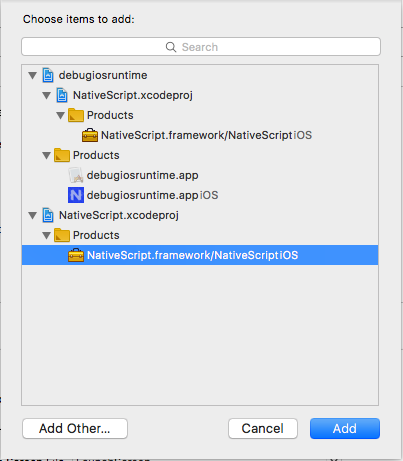
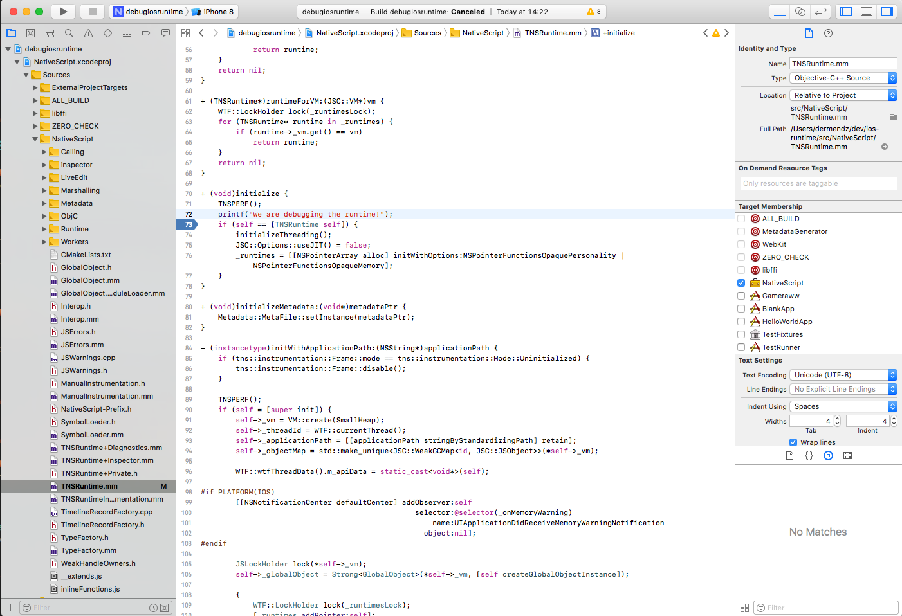
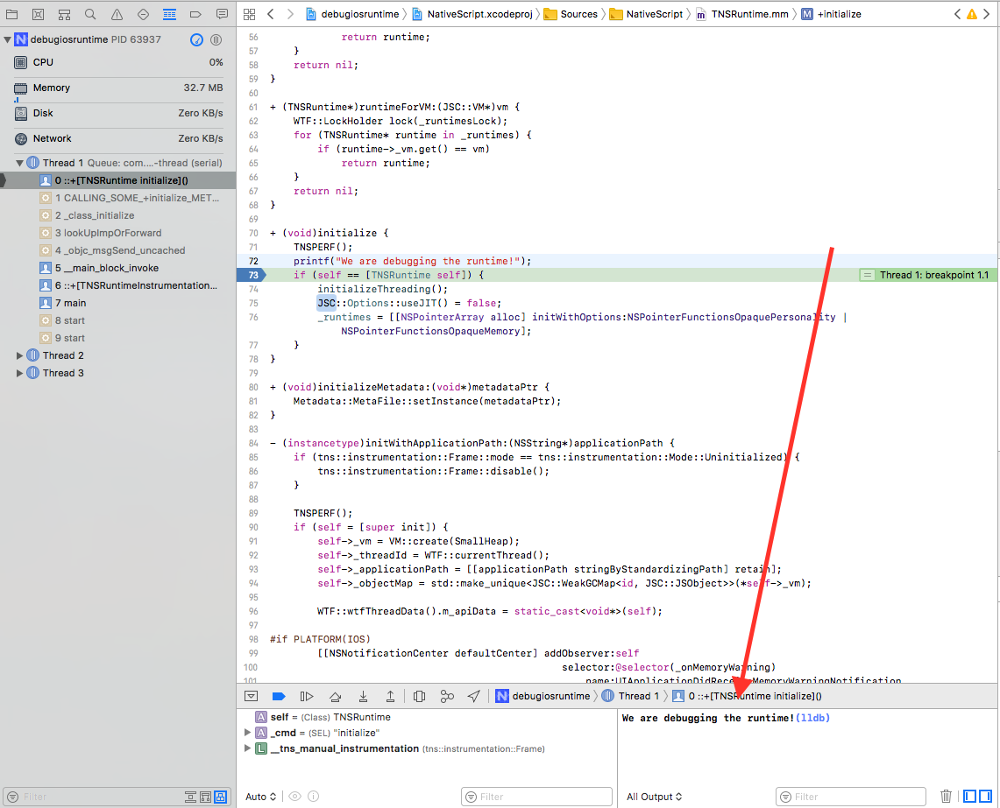

# Debugging the iOS Runtime within your app's XCode project

## What is this document about?

In certain scenarios where runtime errors occur, the debug info provided by the NativeScript CLI or by the application's XCode project is not sufficient. This article will guide you through the steps needed to debug the iOS Runtime library as a part of your NativeScript application. It implies you have the [ios-runtime repository](https://github.com/NativeScript/ios-runtime) already cloned and set up. For more info on how to setup the ios-runtime project on your machine refer to its [README](https://github.com/NativeScript/ios-runtime/blob/master/README.md).

## Creating the sample application

### 1. Create a new NativeScript application using one of the following commands depending on your platform preference:
#### *You can skip this step if you want to use some of your existing apps*

NativeScript with Angular:

`tns create debug-ios-runtime --ng`

NativeScript with TypeScript:

`tns create debug-ios-runtime --tsc`

NativeScript with plain JavaScript:

`tns create debug-ios-runtime`

### 2. Prepare your application's XCode project:

`cd debug-ios-runtime`

`tns prepare ios`

### 3. Open the XCode project:

`open ./platforms/ios/"debugiosruntime.xcodeproj"`

## Build NativeScript runtime as a dynamic library

> **WARNING**: Make sure your environment fulfills all the requirements mentioned in [ios-runtime](https://github.com/NativeScript/ios-runtime)'s README.

### 1. Create a `cmake-build` folder in the already cloned ios-runtime repository

`cd ios-runtime`

`mkdir cmake-build && cd cmake-build`

### 2. Generate the XCode project

> **WARNING**: By default the generated XCode project builds the Runtime as a static library. In order to build it as a dynamic library you should pass the `BUILD_SHARED_LIBS=1` flag to CMake.

`cmake .. -GXcode -DBUILD_SHARED_LIBS=1`

### 3. Build the Nativescript.xcodeproj *Nativescript* target

## Add the iOS Runtime .xcodeproj to your application's one and start debugging

### 1. Close *Nativescript.xcodeproj* and drag it into your application's .xcodeproj

> **IMPORTANT**: If you drag it from the Runtime's xcodeproj you will get an error, thus drag it from Finder after closing *Nativescript.xcodeproj*

### 2. Connect the framework you've just built to the application:

##### Select your app target and go to General tab. Then under *Embedded binaries* select the `+`  button and add `Nativescript.framework`

### 3. Let's try to change a function's implementation and set a breakpoint there:

### 4. If you run the application project you should hit the breakpoint and see the printed text in the console:

