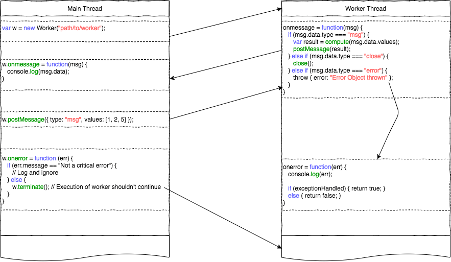

# Multithreading Model

One of NativeScript's benefits is that it allows fast and efficient access to all native platform (Android/Objective-C) APIs through JavaScript, without using (de)serialization or reflection. This however comes with a tradeoff - all JavaScript executes on the main thread (AKA the `UI thread`). That means that operations that potentially take longer can lag the rendering of the UI and make the application look and feel slow.

To tackle issues with slowness where UI sharpness and high performance are critical, developers can use NativeScript's solution to multithreading - worker threads. Workers are scripts executing on a background thread in an absolutely isolated context. Tasks that could take long to execute should be offloaded on to a worker thread. 

Workers API in NativeScript is loosely based on the [Dedicated Web Workers API](https://developer.mozilla.org/en-US/docs/Web/API/Web_Workers_API/Using_web_workers) and the [Web Workers Specification](https://www.w3.org/TR/workers/)

## Workers API

### Worker Object prototype
 - `new Worker(path)` - creates an instance of a Worker and spawns a new OS thread, where the script pointed to by the `path` parameter is executed.
 - `postMessage(message)` - sends a JSON-serializable message to the associated script's `onmessage` event handler.
 - `terminate()` - terminates the execution of the worker thread on the next run loop tick.

**Worker** Object event handlers
 - `onmessage(message)` - handle incoming messages sent from the associated worker thread. The message object has the following properties:
    - `message.data` - the message's content, as sent in the worker thread's `postMessage`
 - `onerror(error)` - handle uncaught errors from the worker thread. The error object exposes the following properties:
    - `error.message` - the uncaught error, and a stacktrace, if applicable
    - `error.filename` - the file where the uncaught error was thrown
    - `error.lineno` - the line where the uncaught error was thrown
 
### Worker Global Scope
 - `self` - returns a reference to the `WorkerGlobalScope` itself
 - `postMessage(message)` - sends a JSON-serializable message to the Worker instance's `onmessage` event handler on the main thread.
 - `close()` - terminates the execution of the worker thread on the next run loop tick

**Worker** Global Scope event handlers
 - `onmessage(message)` - handle incoming messages sent from the main thread. The message object exposes the following properties:
    - `message.data` - the message's content, as sent in the main thread's `postMessage`
 - `onerror(error)` - handle uncaught errors occurring during execution of functions inside the Worker Scope (worker thread). The `error` parameter contains the uncaught error. If the handler returns a true-like value, the message will not propagate to the Worker instance's `onerror` handler on the main thread. After `onerror` is called the worker thread, execution is not terminated and the worker is still capable of sending/receiving messages.
 - `onclose()` - handle any "clean-up" work; suitable for freeing up resources, closing streams and sockets.

## Sample Usage



> Note: In order to use `console`'s methods, setTimeout/setInterval, or other functionality coming from the core-modules package, the `globals` module needs to be imported manually to bootstrap the infrastructure on the new worker thread.

 main-view-model.js
 ```JavaScript
    ...

    var worker = new Worker('./workers/image-processor');
    worker.postMessage({ src: imageSource, mode: 'scale', options: options });

    worker.onmessage = function(msg) {
        if (msg.data.success) {
            // Stop idle animation
            // Update Image View
            // Terminate worker or send another message

            worker.terminate();
        } else {
            // Stop idle animation
            // Display meaningful message
            // Terminate worker or send message with different parameters
        }
    }

    worker.onerror = function(err) {
        console.log(`An unhandled error occurred in worker: ${err.filename}, line: ${err.lineno} :`);
        console.log(err.message);
    }

    ...
 ```

 workers/image-processor.js
 ```JavaScript
    require('globals'); // necessary to bootstrap tns modules on the new thread

    global.onmessage = function(msg) {
        var request = msg.data;
        var src = request.src;
        var mode = request.mode || 'noop'
        var options = request.options;

        var result = processImage(src, mode, options);

        var msg = result !== undefined ? { success: true, src: result } : { }

        global.postMessage(msg);
    }

    function processImage(src, mode, options) {
        console.log(options); // will throw an exception if `globals` hasn't been imported before this call

        // image processing logic

        // save image, retrieve location

        // return source to processed image
        return updatedImgSrc;
    }

    // does not handle errors with an `onerror` handler
    // errors will propagate directly to the main thread Worker instance

    // to handle errors implement the global.onerror handler:
    // global.onerror = function(err) {}
 ```


## General Guidelines

 For optimal results when using the Workers API, follow these guidelines:
  - Always make sure you close the worker threads, using the appropriate API (`terminate()` or `close()`), when the worker's finished its job. If Worker instances become unreachable in the scope you are working in before you are able to terminate it, you will be able to close it only from inside the worker script itself by calling the `close()` function.
  - Workers are not a general solution for all performance-related problems. Starting a Worker has an overhead of its own, and may sometimes be slower than just processing a quick task. Optimize DB queries, or rethink complex application logic before resorting to workers.
  - Since worker threads have access to the entire native SDK, the NativeScript developer must take care of all the synchronization when calling APIs which are not guaranteed to be thread-safe from more than one thread.

## Limitations

There are certain limitations to keep in mind when working with workers:
 - No JavaScript memory sharing. This means that you can't access a JavaScript value/object from both threads. You can only serialize the object, send it to the other thread and deserialize it there. This is what postMessage() function is responsible for. However, this is not the case with native objects. You can access a native object from more than one thread, without copying it, because the runtime will create a separate JavaScript wrapper object for each thread. Keep in mind that when you are using non-thread-safe native APIs and data you have to handle the synchronization part on your own. The runtime doesn't perform any locking or synchronization logic on native data access and API calls.
 - Only JSON-serializable objects can be sent with postMessage() API. 
   * You can’t send native objects. This means that you can't send native objects with postMessage, because in most of the cases JSON serializing a JavaScript wrapper of a native object results in empty object literal - "{}". On the other side this message will be deserialized to a pure empty JavaScript object. Sending native object is something we want to support in the future, so stay tuned. 
   * Also, be careful when sending circular objects because their recursive nodes will be stripped on the serialization step. 
 - No object transferring. If you are a web developer you may be familiar with the ArrayBuffer and MessagePort transferring support in browsers. Currently, in NativeScript there is no such concept as object transferring.
 - Currently, you can’t debug scripts running in the context of worker thread. It will be available in the future.
 - No nested workers support. We want to hear from the community if this is something we need to support.

## Demo projects

The below-attached projects demonstrate, how we could use the multithreading functionality in non-Angular NativeScript project as well as NativeScript Angular one.

[non-Angular NativeScript Demo](https://github.com/NativeScript/demo-workers)

[NativeScript Angular Demo](https://github.com/NativeScript/worker-loader)