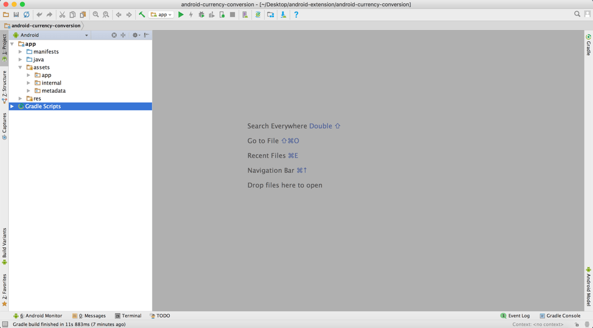

# Extend your existing Android app with NativeScript

> **WARNING**: Embedding NativeScript into an existing Android application is an experimental feature. If you’re interested in seeing this scenario being officially supported, please [let us know on GitHub](https://github.com/NativeScript/android-runtime/issues/321).

This article will walk you through setting up an already existing Android Studio project to integrate with the NativeScript runtime, and execute NativeScript code.

## Requirements: 
 - Android Studio 3.1+
 - NativeScript CLI 4.0+
    - Nativescript Android platform 4.0+

## Extending the native application

1. Create or open the NativeScript application that will serve as an extension to the original Android app:

    NativeScript with Angular:
    `tns create ns-stock-ticker --ng`

    NativeScript with TypeScript:
    `tns create ns-stock-ticker --tsc`

    NativeScript with plain JavaScript:
    `tns create ns-stock-ticker`

2. You can either use the NativeScriptActivity which is part of the NativeScript framework or you can do the following if you want to override or add new functionality to the NativeScriptActivity:  
    1. Copy the corresponding MyNativeScriptActivity file (.ts or .js depending on your NativeScript application type) from [the following location](https://github.com/NativeScript/sample-extend-android-app/tree/master/common) to your NativeScript application **app** folder. Change the Android Activity referenced in JavaProxy to match that of your actual project.
    2. If you are using webpack build add the MyNativeScriptActivity file to the **appComponents** array in your **webpack.config.js** file:

        ```javascript
            const appComponents = [
                "tns-core-modules/ui/frame",
                "tns-core-modules/ui/frame/activity",
                resolve(__dirname, "app/MyNativeScriptActivity"),
            ];
        ```

3. Implement the necessary functionality in NativeScript using your preferable language, style, or technology. 

    Build your NativeScript application for Android. Everything necessary to integrate with the existing Android app will be output inside `platforms/android`

    ```shell
    cd ns-stock-ticker
    tns build android
    ```

4. Copy the NativeScript assets dir into the Android Studio project main dir:
    **ns-stock-ticker/platforms/android/app/src/main/assets** -> **android-project/app/src/main**

    
    


5. Copy the NativeScript Java files into the Android Studio project:
    **ns-stock-ticker/platforms/android/app/src/main/java** -> **android-project/app/src/main/java**

6. Copy the NativeScript Android Runtime **aar** into the Android Studio project:
    **ns-stock-ticker/platforms/android/app/libs/runtime-libs/nativescript-optimized-with-inspector.aar** -> **android-project/app/lib**
    
7. Copy the NativeScript core modules widgets **aar** into the Android Studio project:
    **ns-stock-ticker/node_modules/tns-core-modules-widgets/platforms/android/widgets-release.aar** -> **android-project/app/lib**

8. Reference the runtime and widgets libraries in the Android Studio project:

    Open **Gradle Scripts/build.gradle** for the **app** module and add the following:

    ```groovy
        dependencies {
            ...
            implementation fileTree(dir: 'libs', include: ['*.aar'])
            implementation "com.android.support:multidex:1.0.2"
            ...
        }
    ```

9. Register the NativeScript activity in the AndroidManifest:

    Like with any Android Activity, it needs to be added to the AndroidManifest.xml file.

        * The AndroidManifest.xml file should include the following line if you use the NativeScriptActivity:
            ```xml
            <activity android:name="com.tns.NativeScriptActivity" />
            ```
        * If you are using your own NativeScript activity you need to add it like this:
            ```xml
            <activity android:name=".MyNativeScriptActivity" />
            ```

10. Register com.tns.ErrorReportActivity in the AndroidManifest:

    It is used for showing any NativeScript errors during runtime. The AndroidManifest.xml file should include the following line:
    ```xml
    <activity android:name="com.tns.ErrorReportActivity" />
    ```

11. Initialize the NativeScript Android runtime:

    Anywhere in your Activity place the following snippet:
    ```Java
    private com.tns.Runtime nsRuntime;

    public void openNativeScriptActivity() {
        if (nsRuntime == null) {
            nsRuntime = com.tns.RuntimeHelper.initRuntime(MainActivity.this.getApplication());
            if (nsRuntime != null) {

                nsRuntime.run();
            } else {
                return;
            }
        }

        android.content.Intent intent = new android.content.Intent(MainActivity.this, MyCustomNativeScriptActivity.class);
        intent.setAction(android.content.Intent.ACTION_DEFAULT);
        startActivity(intent);
    }
    ```

12. Play the app:

    Finally call `openNativeScriptActivity` to fire up the NS Android Runtime.

---

## **Sample app code** 
[NativeScript](https://github.com/NativeScript/)/[sample-extend-android-app](https://github.com/NativeScript/sample-extend-android-app)

## **Additional Notes**
 - Arbitrary JavaScript files can be executed using the `Runtime.runScript()` method like so:
    - ```Java
      nsRuntimeInstance.runScript(new File(context.getFilesDir(),"app/view.js"))
      ```

## **Known Limitations**
 - JavaScript metadata for all available Android classes is prebuilt and cannot be generated from within the Android Studio project. Rebuild the NativeScript project with the respective Android plugins if their classes are going to be consumed from within JavaScript/TypeScript/Angular.
 
## **Credits** 
Original *CurrencyConversion* Android application and step-by-step tutorial courtesy of [The Polyglot Developer](https://www.thepolyglotdeveloper.com/2017/06/legacy-android-java-nativescript-angular/).
