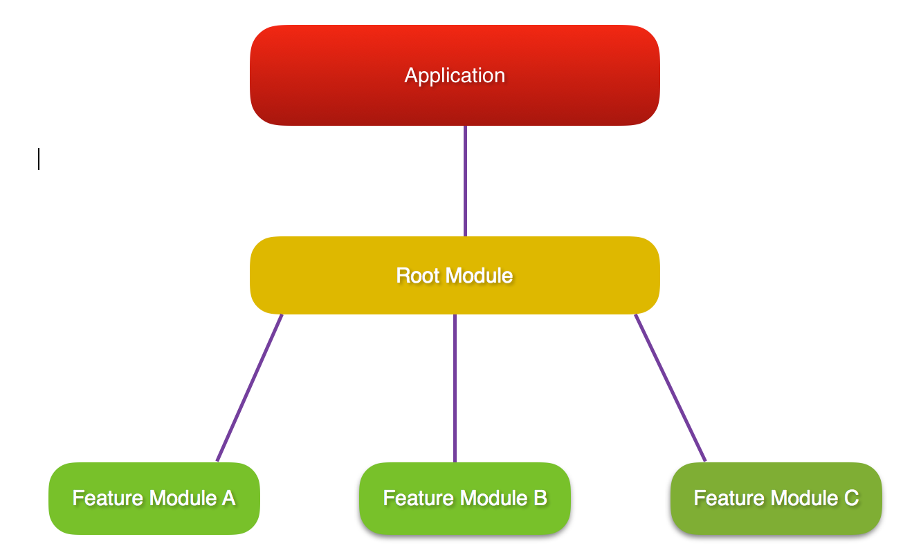

## What is Lazy Loading (and why you should use it)?

Lazy loading is an Angular technique that allows you to load feature components asynchronously when a specific route is activated. This can add some initial performance during application bootstrap, especially if you have many components with heavy UI and complex routing. 

Use lazy loading to decrease the startup time of your NativeScript application.

## How does Lazy Loading work?

With lazy loading, the application is split into multiple modules. There is the main module which in the context of NativeScript application will hold the root components (usually called `app.module.ts` located in the `app` folder) and the featured modules which will be loaded "on demand" after user interaction. Each module can define multiple components, services, and routes.




## Implementing Lazy Loading in NativeScript

In the following sections, we will create a simple Angular application using the [Hello World template](https://github.com/NativeScript/template-hello-world-ng) which by default has no lazy loaded modules. Then, we will add the featured lazy loaded **HomeModule**.

- Create the Hello World Angular template

    ```Shell
    tns create my-app --ng
    cd my-app
    ```

- Add a new folder to hold your `FeatureModule` along with all the components, services, routing tables of the module. 

    A good practice is to use the name of the module as the name of the containing folder. For example, create a `feature` folder and add `feature.module.ts` and the needed components that will be part of the module (in our case `feature.component.ts` wih the respective HTML and CSS files).
    ```JS
    my-app
    --app
    ----feature
    ------feature.component.css
    ------feature.component.html
    ------feature.component.ts
    ------feature.module.ts
    ------feature.routing.ts
    ------feature.service.ts
    ```

-  Create the routing table and the lazily loaded module

    _app/feature/feature.routing.ts_
    ```TypeScript
    // app/feature/feature.routing
    import { NgModule } from "@angular/core";
    import { Routes } from "@angular/router";
    import { NativeScriptRouterModule } from "nativescript-angular/router";
    import { FeatureComponent } from "./feature.component";

    export const routes: Routes = [
        {
            path: "",
            component: FeatureComponent
        }
    ];

    @NgModule({
        imports: [NativeScriptRouterModule.forChild(routes)],  // set the lazy loaded routes using forChild
        exports: [NativeScriptRouterModule]
    })
    export class FeatureRoutingModule { }
    ```

    _app/feature/feature.module.ts_
    ```TypeScript
    // app/feature/feature.module.ts
    import { NativeScriptCommonModule } from "nativescript-angular/common";
    import { NgModule, NO_ERRORS_SCHEMA } from "@angular/core";
    import { FeatureComponent } from "./feature.component"; // Import all components that will be used in the lazy loaded module
    import { FeatureService } from "./feature.service"; // Import all services that will be used in the lazy loaded module
    import { FeatureRoutingModule } from "./feature.routing"; // import the routing module

    @NgModule({
        schemas: [NO_ERRORS_SCHEMA],
        imports: [
            NativeScriptCommonModule,
            FeatureRoutingModule
        ],
        declarations: [FeatureComponent], // declare all components that will be used within the module
        providers: [ FeatureService ] // provide all services that will be used within the module
    })
    export class FeatureModule { }
    ```

-  Add the lazily loaded module to the application routing table

    _app/app.routing.ts_
    ```TypeScript
    // app/app.routing.ts
    import { NgModule } from "@angular/core";
    import { NativeScriptRouterModule } from "nativescript-angular/router";
    import { Routes } from "@angular/router";

    import { ItemsComponent } from "./item/items.component";
    import { ItemDetailComponent } from "./item/item-detail.component";

    const routes: Routes = [
        { path: "", redirectTo: "/items", pathMatch: "full" },
        { path: "items", component: ItemsComponent },
        { path: "item/:id", component: ItemDetailComponent },
        { path: "feature", loadChildren: "~/feature/feature.module#FeatureModule" }, // lazy loaded module
    ];

    @NgModule({
        imports: [NativeScriptRouterModule.forRoot(routes)],
        exports: [NativeScriptRouterModule]
    })
    export class AppRoutingModule { }
    ```

> **Note:** Use the **tilde (`~`)** to set the route paths for the `loadChildren`. The tilde is an alias for the project's `app` folder.
>  ```TS
>  // Use tilde for construcing your route relative to project's app folder.
>  loadChildren: "~/feature/feature.module#FeatureModule", 
>  ```
>  This way you will be able to create nested routes. The tilde alias is added in the `tsconfig.json` of all NativeScript 4.x.x projects. For older projects, you can update the tsconfig.json 
>  content by installing the latest `nativescript-dev-typescript` and executing
>  ```Shell
>  ./node_modules/.bin/ns-upgrade-tsconfig
>  ```

-  Navigating to lazily loaded module

    With all of the above steps implemented, you can start navigating to the default path of the lazily loaded module.

    _app/item/items.component.html_
    ```HTML
    <!-- app/item/items.component.html -->
    <StackLayout class="page">
        <!-- navigate to the default path in the lazy loaded module -->
        <Label text="Go to my Feature" [nsRouterLink]="['/feature']" class="h2 m-10"></Label>

        <ListView [items]="items" class="list-group">
            <ng-template let-item="item">
                <Label [nsRouterLink]="['/item', item.id]" [text]="item.name"
                    class="list-group-item"></Label>
            </ng-template>
        </ListView>
    </StackLayout>
    ```

## Benefits from using Lazy Loading

A real-life NativeScript application (like the [Angular SDK Examples](https://github.com/NativeScript/nativescript-sdk-examples-ng)) can have hundreds of different components. Each component may have its route, services, and multiple featured components. Using lazy loading modules improves the startup time dramatically (in the case of SDK Examples app with up-to 5x better startup timings). Instead of having to load the hundreds of components at the application bootstrap, you can load just the landing module and load all other submodules lazily.