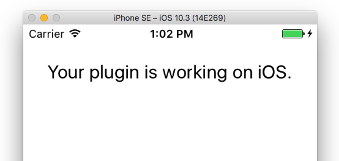
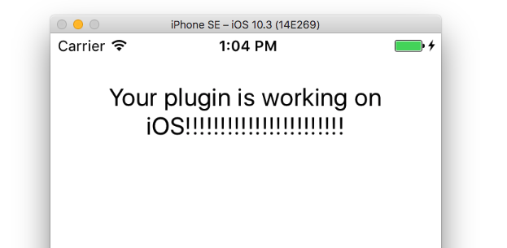
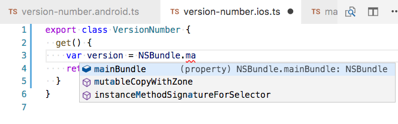
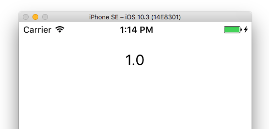

# Building Plugins

Building NativeScript plugins is a great way to learn more about how NativeScript works, to create functionality that you can share across applications, and to leverage some really powerful functionality—such as the ability to use native iOS and Android frameworks.

Let’s start by looking at the basics of how to structure a NativeScript plugin, and then move on to look at how you can generate that structure using the NativeScript plugin seed.

## Plugin Basics

At their basic level NativeScript plugins are simple JavaScript modules that use well established npm conventions. For example, here’s what the world’s simplest NativeScript plugin looks like.

```
nativescript-hello-world/
└── src
    ├── index.js
    └── package.json
```

>IMPORTANT: Putting your source in sub-folder is required for local live sync debugging.  
>Existing plugins should be updated to move their source code in to a subfolder.

And here is the simplest possible implementation of that plugin.

```JavaScript
// index.js
module.exports = {
  helloWorld: function() {
    console.log("Hello World");
  }
}
```

```JSON
/* package.json */
{
  "name": "nativescript-hello-world",
  "version": "1.0.0",
  "nativescript": {
    "platforms": {
      "ios": "3.0.0",
      "android": "3.0.0"
    }
  }
}
```

There are a few things to note in this implementation.

* NativeScript uses the [CommonJS format](http://wiki.commonjs.org/wiki/CommonJS) for defining JavaScript modules. In practical terms that just means you need to know the syntax for importing and exporting functionality (`require`, `export`, and `module.exports`). It’s pretty straightforward, and you’ll see several examples throughout this guide.
* NativeScript plugins must have a “nativescript” key in their `package.json` file that specifies the minimum version of the iOS and Android runtimes that the plugin supports. Don’t worry about this at the moment, other than to note that it’s there.

> **TIP**: Other than the `"nativescript"` key, everything about your plugin’s `package.json` file will be identical to any other npm package. Therefore, [npm own’s docs on the `package.json` file](https://docs.npmjs.com/files/package.json) is a great reference when tinkering with your NativeScript plugin’s metadata during development.

To use the above plugin all you need to do is install the plugin in one of your apps.

```
tns plugin add /path/to/nativescript-hello-world/src
```

> **TIP**: The `tns plugin add` command lets you install plugins from non-npm locations, such as GitHub repos and local folders. For details, run `tns plugin add --help` on your command line.

With the plugin installed, you can use the CommonJS `require()` method to import your plugin and use its  `helloWorld()` method.

```JavaScript
var helloWorldModule = require("nativescript-hello-world");
helloWorldModule.helloWorld();
```

And with that you have a functional, albeit extremely basic, NativeScript plugin. 

But most plugins need to do much more than log a simple string. To build a robust plugin you need some conventions for building, testing, and distributing the plugin you’re building. And that’s where the official NativeScript plugin seed comes in.

## The NativeScript Plugin Seed

The [NativeScript plugin seed](https://github.com/NativeScript/nativescript-plugin-seed) is a cloneable GitHub repository that makes starting, building, and maintaining NativeScript plugins easy.

Let’s look at how the plugin seed works, and in the process build a simple plugin that can retrieve an app’s version number on both Android and iOS.

> **NOTE**: Although we recommend using the NativeScript plugin seed, you do have the ability to build your NativeScript plugin from scratch. If you’re interested in creating your own plugin development workflow, refer to the [NativeScript plugin reference](/plugins/plugin-reference) for details on exactly how NativeScript plugins are structured.

### Step 1: Start Your Plugin

Because the NativeScript plugin seed is a cloneable repository, you’ll start your plugin by running `git clone`. The command below clones the seed into a new folder called “nativescript-version-number”.

```
git clone https://github.com/NativeScript/nativescript-plugin-seed nativescript-version-number
```

> **TIP**: 
> * The `git clone` command takes an [optional `<directory>` argument](https://git-scm.com/docs/git-clone#git-clone-ltdirectorygt), and you can use it to change the folder name of any repository that you clone. The above command uses this to clone a repository named “nativescript-plugin-seed” into a folder named “nativescript-version-number”.
> * By convention, NativeScript plugins use a naming convention of nativescript-name-of-plugin, which is why this plugin uses the name “nativescript-version-number” instead of something like “nativescript-VersionNumber” or “NativeScriptVersionNumber”. Sticking to this naming convention allows developers to find your plugin easily.

You’ll learn about the file structure of your plugin momentarily, but first there’s one last setup script you need to run. After your `git clone` command finishes, `cd` into your plugin’s `src` folder, and then run the npm `postclone` script.

```
cd nativescript-version-number/src
```
```
npm run postclone
```

The `postclone` script will ask you a few questions, such as your GitHub username, your plugin’s name, and whether you’d like to set up a new git repository for your plugin. (You probably want to, as otherwise your repo will start with the source control history of the NativeScript plugin seed itself.)

After the `postclone` script completes, your plugin should have a folder stucture that looks liks this.

```
nativescript-version-number/
├── demo
├── publish
└── src
```

Here are what these folders do.

* `demo`: Contains a pre-built NativeScript demo app that you’ll use to test your plugin in action.
* `publish`: Contains a shell script that will help you publish your plugin to npm. We’ll come back to this script later on.
* `src`: Contains your plugin’s source code.

During development, the NativeScript plugin seed allows you to work on your plugin’s source code in your `src` folder, and have the plugin update live in a demo app that lives in your `demo` folder. Let’s look at how to set up that workflow.

### Step 2: Set Up a Development Workflow

Setting up a robust development workflow lets you develop plugins quickly. With the NativeScript plugin seed your development workflow involves two scripts—`npm run demo ios|android`, and `npm run plugin.tscwatch`. Let’s talk about the `tscwatch` script first.

First of all, the “tsc” part of `tscwatch` refers to TypeScript. (The TypeScript CLI is called `tsc`.) The NativeScript seed generates a plugin written in TypeScript, and that TypeScript code needs to be compiled to JavaScript code for NativeScript to use the plugin at runtime. This is where the the `npm run plugin.tscwatch` script comes in.

> **NOTE**: While you can write NativeScript plugins in JavaScript, using TypeScript is highly recommended as it makes dealing with native iOS and Android APIs much easier. You’ll see this in action in a minute. Don’t worry if you’re new to TypeScript. The plugin seed automates every TypeScript-related thing you need to do as part of your plugin development process.

While still in your `src` folder, go ahead and execute the `npm run plugin.tscwatch` command.

```
npm run plugin.tscwatch
```

The command compiles your plugin’s TypeScript code, and then remains running to watch for any subsequent changes you make to your plugin’s source code. When the command detects changes, it’ll compile your plugin’s TypeScript to JavaScript automatically.

Next, let’s run your plugin in the demo app so you can see your plugin in action. Start by opening a new terminal tab or command prompt on your development machine. (Most command-line clients let you open new tabs with either `Command` + `T` on macOS or `Control` + `T` on Windows and Linux.) Next, run either `npm run demo.ios` or `npm run demo.android`, to start up the demo app on iOS or Android.

```
# Pick one of these commands and run it while still in the src folder.
npm run demo.ios
npm run demo.android
```

If all went well, you should see the demo app start up and show one of the following screens.



To show how the development process works, next, open your plugin’s `src/version-number.common.ts` file, find the line of code that contains the “Your plugin is working” string, and make a small change. For example you could change the entire line of code that sets the `msg` variable to the following.

```TypeScript
let msg = `Your plugin is working on ${app.android ? 'Android' : 'iOS'}!!!!!!!!!!!!!!!!!!!!!!!!!!!`;
```

After you save this change a few things are going to happen. First, your `tscwatch` command will detect the TypeScript change and automatically compile the `version-number.common.ts` file to JavaScript. Next, your `demo` command will detect the change and automatically refresh your demo app to show your string update.



> **NOTE**: Wondering how this works? The `npm run postclone` script you ran earlier uses the `npm link` command to connect the demo app to the source code you’re working on in the `src` folder. The link allows you to edit files in `src`, and see those changes in your demo immediately.

Pretty cool, huh? With this workflow you have the ability to develop NativeScript plugins just like they’re any other files in your NativeScript apps.

Now that you have a workflow in place, let’s take a step back and look at the files in `src` in detail, and discuss how you can alter the plugin’s default structure to meet your needs.

### Step 3: Write Your Plugin

Your plugin’s `src` folder is where you’ll work on writing your plugin. There are a number of files in this folder, but let’s start with the `.ts` files as they’re where you’ll spend the majority of your time.

```
.
├── version-number.android.ts
├── version-number.common.ts
└── version-number.ios.ts
```

> **NOTE**:
> * Each `.ts` file will have have a generated `.js` file with the same name, but you can safely ignore those. If you’re using Visual Studio Code you can add a [bit of configuration](https://docs.nativescript.org/angular/tutorial/ng-chapter-1.html#tip-2-hiding-generated-code) to hide generated `.js` files in your editor.
> * Each `.ts` file also has a generated `.d.ts` file. Don’t worry about these files as the NativeScript CLI takes care of creating these files for you. The only `.d.ts` file you need to worry about is `src/index.d.ts`, and you’ll learn about that file momentarily.

The `.android.ts` file is where you put the Android implementation of your plugin; the `.ios.ts` file is where you put the iOS implementation of your plugin; and the `.common.ts` file is an optional file where you can put any code you intend to share on both platforms.

To get an idea of what this looks like in action let’s implement a basic version of the version number plugin. Start by opening your `src/version-number.common.ts` file deleting all of the starting code, as you’ll start with a simple plugin that doesn’t share logic across iOS or Android.

Next, open your `version-number.ios.ts` file and paste in the following code.

``` TypeScript
export class VersionNumber {
  get() {
    var version = NSBundle.mainBundle.objectForInfoDictionaryKey("CFBundleShortVersionString");
    return version;
  }
}
```

The NativeScript plugin seed automatically sets up the necessary TypeScript configuration for working with native iOS and Android APIs, so as you develop your plugins you’ll get a little help working with these native APIs in TypeScript-friendly editors like Visual Studio Code. For example, if you start to type out `NSBundle`, Visual Studio Code helps you find the native iOS APIs that are available.



> **TIP**: If you’re new to working with native APIs in NativeScript, check out our documentation on [accessing native APIs in JavaScript and TypeScript](https://docs.nativescript.org/core-concepts/accessing-native-apis-with-javascript). You might also want to dive into a few existing plugin’s source code just to see how they work. Almost every plugin on the [NativeScript marketplace](http://market.nativescript.org) is open source.

There are still a few more changes you need to make before your plugin is ready to test. Next, open your `src/version-number.android.ts` file and paste in the following code:

```TypeScript
import * as application from "tns-core-modules/application";

export class VersionNumber {
  get() {
    var PackageManager = android.content.pm.PackageManager;
    var pkg = application.android.context.getPackageManager().getPackageInfo(application.android.context.getPackageName(),
      PackageManager.GET_META_DATA);
    return pkg.versionName;
  }
}
```

With this you have a functional plugin implementation for both iOS and Android, but you still have one minor configuration change to make.

Open your `src/index.d.ts` file and paste in the following code.

```TypeScript
export declare class VersionNumber {
  get(): string;
}
```

The `index.d.ts` file serves two purposes: first, it serves as a contract for any application that uses this plugin (you’ll see this in a minute when you switch your demo to use this new API). Second, the `.d.ts` file is what enables intellisense or code completion features in TypeScript-friendly editors.

The NativeScript CLI does not generate your `index.d.ts` file, but in most situations you can copy the contents of your `.android.d.ts` file or your `.ios.d.ts` file into your `index.d.ts` file. (The only time you wouldn’t want to do that is if your plugin had Android- or iOS-specific APIs that you wanted to expose.)

> **TIP** For more detailed information on writing declaration files refer to [TypeScript’s documentation on the topic](https://www.typescriptlang.org/docs/handbook/declaration-files/introduction.html).

With that, your plugin is completely functional and can retrieve your app’s version number on both iOS and Android. To test this out, head back to your demo app, open your `demo/app/main-view-model.ts` file, find the line of code that sets `this.message`, and change it to use the following line of code.

```TypeScript
this.message = this.versionNumber.get();
```

If you still have `npm run plugin.tscwatch` and `npm run demo.ios|android` watching your code, you should see your demo app update to show your app’s version number on the screen. (If not, refer back to step 2 and refamiliarize yourself with the plugin development workflow.)



Now that you have a complete plugin, you’re ready to use your plugin in your apps, and to do that you’ll need to publish it.

### Step 4: Publish Your Plugin

> **WARNING** The NativeScript plugin seed’s publishing scripts require you to use a bash-enabled terminal or command prompt. If you’re on Windows, you can install [GIT SCM](https://git-for-windows.github.io/) and use Git Bash to run these scripts.

Your NativeScript plugin is currently a collection of TypeScript files in a `src` folder. The NativeScript plugin seed provides a series of scripts that can build those files into a distributable npm package.

There are two different scripts that you can run depending on whether you just want to build a plugin package, or whether you want to additionally register that plugin on the npm registry.

Both scripts are in the `publish` folder in your plugin’s root folder, so start by using the `cd` command to navigate into that folder. Next, use the `chmod` command to make sure the shell scripts are executable.

```
chmod +x *.sh
```

> **NOTE**: You don’t need to know anything about shell scripts or file permissions in order to use the plugin seed, but if you’re curious, here’s a [pretty good explanation of working with file permissions](http://linuxcommand.org/lc3_lts0090.php).

Next, if you just want to create a package, execute the `pack.sh` script using the following command.

```
./pack.sh
```

The pack command will build your plugin, and place the built archive in your plugin’s `publish/package` folder, for example `publish/package/nativescript-version-number-1.0.0.tgz`. You can then take that plugin package and install it in other NativeScript apps using the `tns plugin add` command.

```
tns plugin add nativescript-version-number-1.0.0.tgz
```

If you want to additionally register your new plugin on npm, there are a few additional steps you need to take. First, open your plugin’s `src/package.json` file.

Your plugin’s `package.json` contains the metadata npm will display about your plugin, so you’ll want to make sure that the information listed in this file is correct. Specifically, make sure the `"description"` and `"author"` fields have appropriate values, and also that your `"version"` contains the version number you want npm to use. (You’ll need to increment that `"version"` with each subsequent release of your plugin.)

Next, open the `README.md` file in the root of your plugin. The NativeScript plugin seed generates a basic README with a simple outline, but you’ll want to replace this file with more complete documentation before you publish your plugin for the world to see. If you’re not sure what to put here take a look at what other plugins do. The [version number plugin](https://github.com/tjvantoll/nativescript-version-number) has a dead-simple README you can refer to, and plugins like the [fingerprint auth plugin](https://github.com/EddyVerbruggen/nativescript-fingerprint-auth/) or [MapBox plugin](https://github.com/eddyverbruggen/nativescript-mapbox) provide more complex README patterns you may want to copy from.

Once you’re all set with your `package.json` configuration, as well as your `README.md` documentation, return to the `publish` folder or your plugin and run the `publish.sh` script.

```
./publish.sh
```

The publish command runs through the same build process as the pack command, but after the build completes the command will additionally push your plugin to the npm registry.

> **NOTE**: For the publish command to work you need to be logged into the `npm` CLI using `npm adduser` or `npm login`. For details on how to use these commands see [npm’s documentation on the topic](https://docs.npmjs.com/getting-started/publishing-npm-packages).

And that’s it! You have now built a simple plugin, set up a robust development workflow, and got everything ready to share your plugin with the world.

And these are just the basics. The plugin seed supports more advanced workflows for your plugin development. You may be interested in trying out:

- [Adding unit tests]()
- [Setting up Travis CI](https://github.com/NativeScript/nativescript-plugin-seed#travisci)

If you run into any problems during your plugin development, reach out on [Stack Overflow](https://stackoverflow.com/questions/tagged/nativescript). And if you’d like to chat with other NativeScript plugin authors, sign up for the [NativeScript slack](http://developer.telerik.com/wp-login.php?action=slack-invitation) and join us in the #plugins channel.
