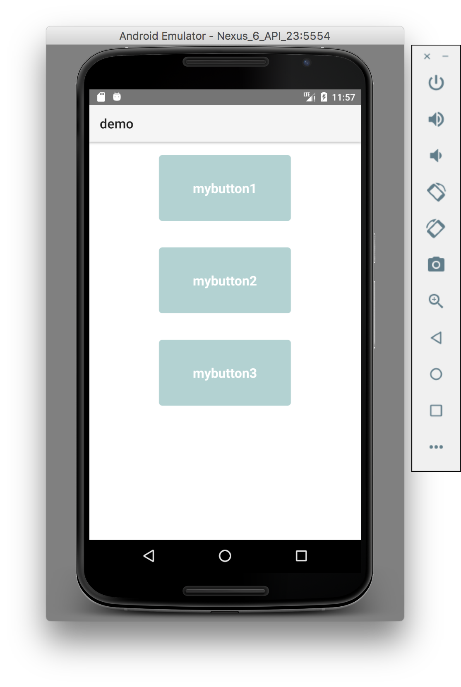

# Implementing the NativeScript Theme in Plugins

For plugins that use UI components, we highly recommend implementing the NativeScript core theme. It's up to you to decide if light and dark skins are enough or you want to implement more. Before continue reading make sure you read the basics about [NativeScript theme]({ % theme % }) and review the [NativeScript Theme repository](https://github.com/NativeScript/theme)

To review the working example, you can refer to [this branch](https://github.com/NativeScript/nativescript-ui-plugin-custom/tree/implement-core-themes/) of the [NativeScript Custom UI Plugin repository](https://github.com/NativeScript/nativescript-ui-plugin-custom).

What this article covers:
* [Prerequisites](#prerequisites)
* [Plugin Code Changes](#plugin-code-changes)
* [Implementation](#implementation)
    * [Files Structure and Contents](#files-structure-and-contents) 
    * [SCSS Compilation](#scss-compilation)
* [Usage](#usage)
* [Screenshots](#screenshots)

## Prerequisites

This article is built on top of a [custom UI plugin](https://github.com/NativeScript/nativescript-ui-plugin-custom) which is an example for another article about [Building UI Plugin using Custom Components ]({ % building-ui-plugins-custom-components % }) in this documentation.

We are using `.scss` files to define our plugin styles. So make sure you run the following commands in your plugin source folder:

* `npm install node-sass —save-dev` to install the `node-sass` library to compile `.scss` files into `.css` files.
* `npm install nativescript-theme-core —save-dev` to install the NativeScript core theme

## Plugin Code Changes

As we mentioned above, the starting point for this article is the repository showing how to [build UI plugin]((https://github.com/NativeScript/nativescript-ui-plugin-custom)). Before you start defining style definitions to the custom button created in the example, open `my-button.common.ts` and add the following constructor to `MyButtonBase` class:

```JavaScripts
function MyButtonBase() {
    var _this = _super.call(this) || this;
    _this.className = "mybtn";
    return _this;
}
```
```TypeScript
constructor() {
    super();
    this.className = "mybtn";
}  
```
This will add a `mybtn` class name to our custom button element. 

> **NOTE**: If you want to customize font styles and color, make sure your custom component inherits from `TextBase` instead of `View`.

## Implementation

In this example we will implement two main skins of the NativeScript core theme - dark and light. Any other skin can be implemented in a similar way. 

Review [NativeScript Core Theme supported skins] ({ % https://github.com/NativeScript/theme/tree/master/app/scss/skins % }).

### Files Structure and Contents

Add folder `scss` to your plugin soucre folder having the following structure:

```
scss
├── _mybutton.scss
├── _variables.scss
├── mybutton.dark.android.scss
├── mybutton.dark.ios.scss
├── mybutton.light.android.scss
├── mybutton.light.ios.scss
├── platforms
│   ├── _mybutton.android.scss
│   └── _mybutton.ios.scss
└── skins
    ├── _variables.dark.scss
    └── _variables.light.scss
```
`_variables.scss` describes your plugin scss variables that will be used to specify different styles for the different theme skins or platforms. In our example it contains the following definitions:

```
$mybtn-color: $primary;
$mybtn-background-color: $secondary;
$mybtn-border-color: $btn-color;
$mybtn-border-width: 10;
$mybtn-border-radius: 10;
$mybtn-opacity: 1;

``` 

You can see that variables `$primary`, `#secondary` and `$btn-color` are used. They are defined in the NativeScript core theme.

`_mybutton.scss` describes the base style definition of the component class. In our case this is `mybtn`:

```
.mybtn {
  padding: 20;
  background-color: $mybtn-background-color;
  color: $mybtn-color;
  font-size: 20;
  font-weight: bold;
  font-style: normal;
  text-align: center;
  text-decoration: none;
  text-transform: lowercase;
  margin: 20; 
  border-color: $mybtn-border-color;
  border-width: $mybtn-border-width;
  border-radius: $mybtn-border-radius;
  width: 200;
  opacity: $mybtn-opacity;
}

```

For full list of css properties that you can use, you can refer to (Styling)[{ % styling % }].

`skins/_variables.light.scss` and `skins/_variables.dark.scss` override some of the variables depending on the theme skin - dark or light. More skin overrides can be added to this folder (i.e. sky, lime, etc...). 

skins/_variables.light.scss:
```
@import '../../node_modules/nativescript-theme-core/scss/light';
@import '../variables';

$mybtn-opacity: 0.3;
$mybtn-border-color: $forest;
$mybtn-background-color: $forest;
$mybtn-color: $white;
```

skins/_variables.dark.scss:
```
@import '../../node_modules/nativescript-theme-core/scss/dark';
@import '../variables';

$mybtn-opacity: 0.8;
$mybtn-border-color: $lime;
$mybtn-background-color: $lime;
$mybtn-color: $black;
```

`platforms\_mybutton.android.scss` and `platforms\_mybutton.ios.scss` override some of the variables depending on the platfom - iOS or Android.

platforms\_mybutton.android.scss:
````
// Variables overrides for Android

$mybtn-border-width: 5;
$mybtn-border-radius: 5;

// Import common styles
@import '../mybutton';

// Describe Android specific styles
````

platforms\_mybutton.ios.scss:
```
// Variables overrides for ios

$mybtn-border-width: 5;
$mybtn-border-radius: 15;

// Import common styles
@import '../mybutton';

// Describe iOS specific styles
```

The other files are the entry point for each combination of skin and platform:

* mybutton.dark.android.scss
* mybutton.dark.ios.scss
* mybutton.light.android.scss
* mybutton.light.ios.scss

What you need to do in each of them is just import the corresponding skin and platform specific scss files. For example `mybutton.dark.android.scss` has the following content:

```
@import 'skins/variables.dark';
@import 'platforms/mybutton.android';

```

### SCSS compilation

Once you have all your styles defined per skin and platform, you're ready to compile the `scss` files to `css`. To do so, open your command prompt or terminal and run the following command from your plugin source folder:

`node_modules/node-sass/bin/node-sass scss --output css`

This will do the compilation and save the result css files in a `css` folder. There you can find one file for each combination of skin and platform. In our example there will be four files:

```
css
├── mybutton.dark.android.css
├── mybutton.dark.ios.css
├── mybutton.light.android.css
└── mybutton.light.ios.css
```

## Usage

Now, the plugin from the example has 2 skins and is ready to be used along with NativeScript theme and dark and light skins. To use the dark skin of NativeScript theme in your app and apply it to your plugin, all you need to is add the following to `app.css`:

```
@import 'nativescript-theme-core/css/core.dark.css';
@import 'nativescript-ui-plugin-custom/css/mybutton.dark.css';
```

For light skin, just import the corresponding `light` files to `app.css`.


## Screenshots

_Dark skin on Android_
 
_Dark skin on iOS_

_Light skin on Android_
 
_Light skin on iOS_

