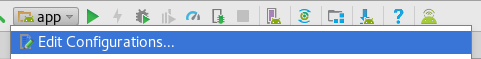
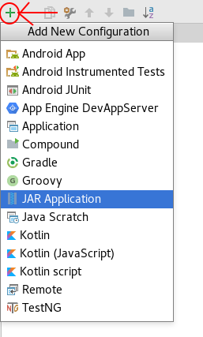

# Overview

The  shows how to debug the runtime and the application, but what if the problem is at build time?

Since {N} version 4.0 you can easily debug the tools used for building a {N} application.

# Debugging the metadata generator

* Open the android-runtime `test-app` in Android Studio. `/your/path/android-runtime/test-app`

* 
* 
* 
* 

Run debug

# Debugging the js_parser
Open js parser in Visual Studio Code

# Debugging the static binding generator

same as metadata generator