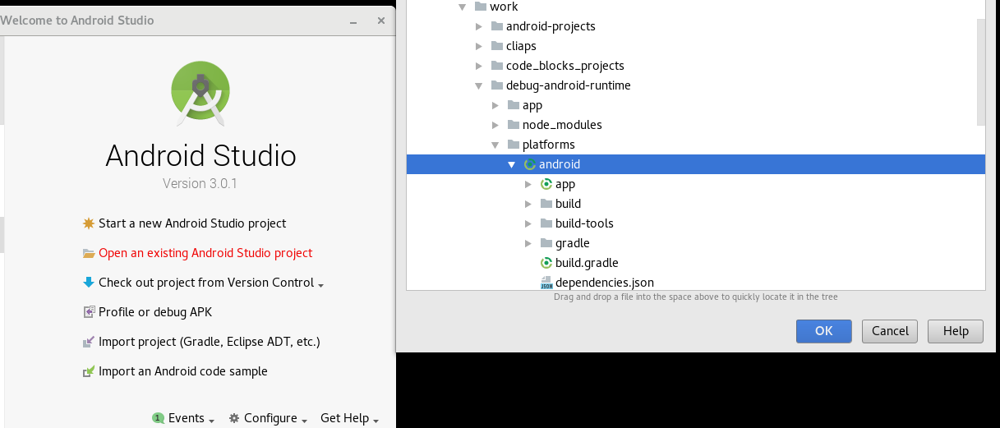
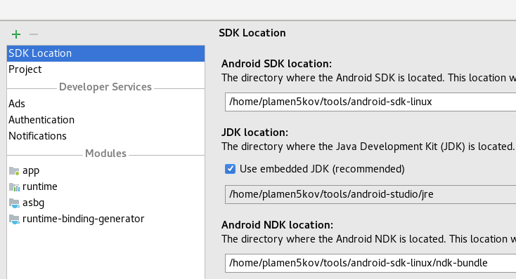
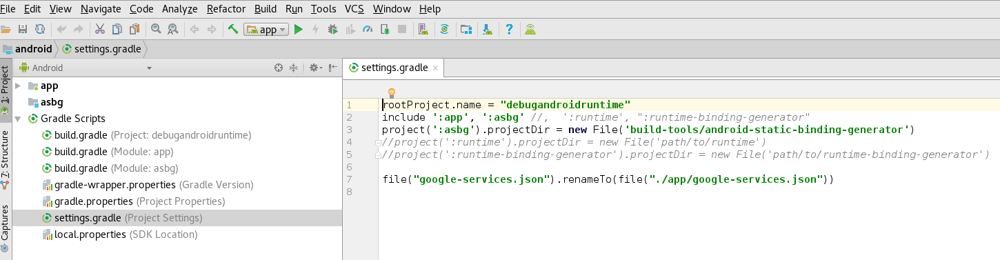
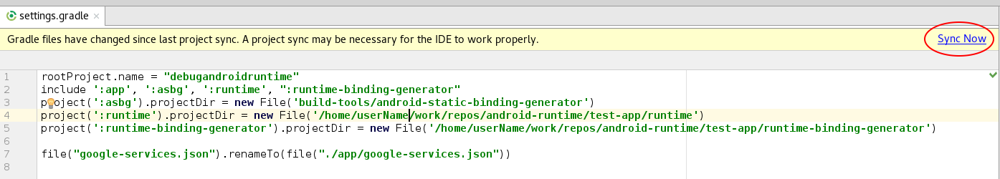
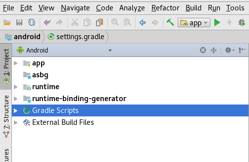
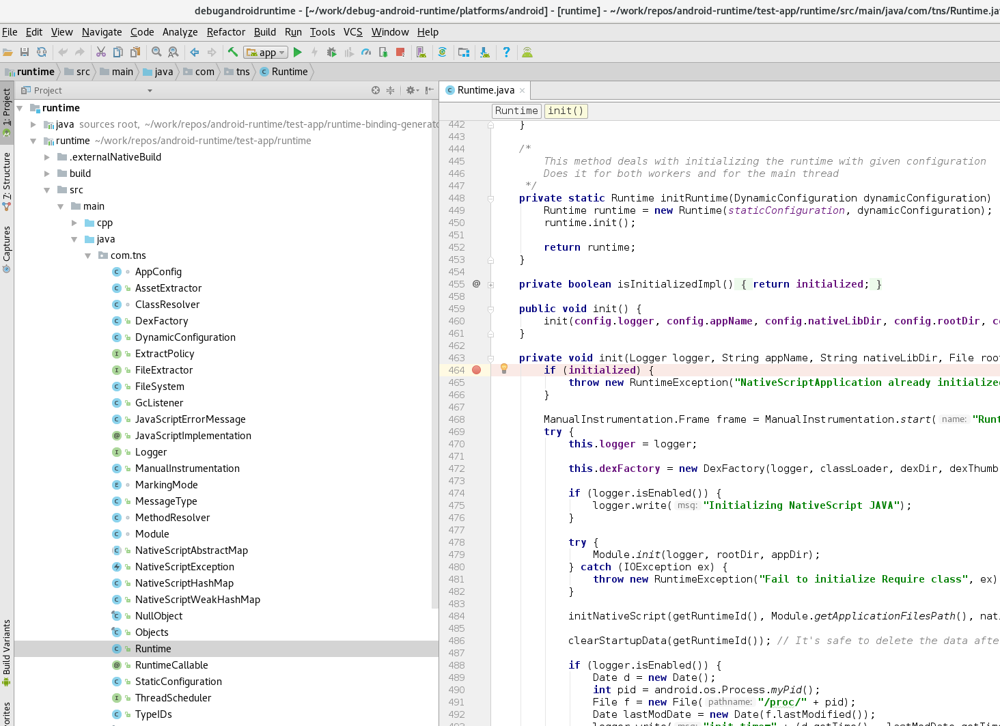
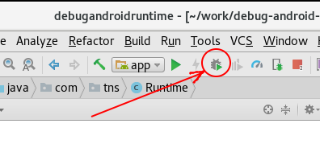
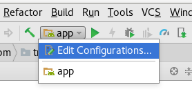
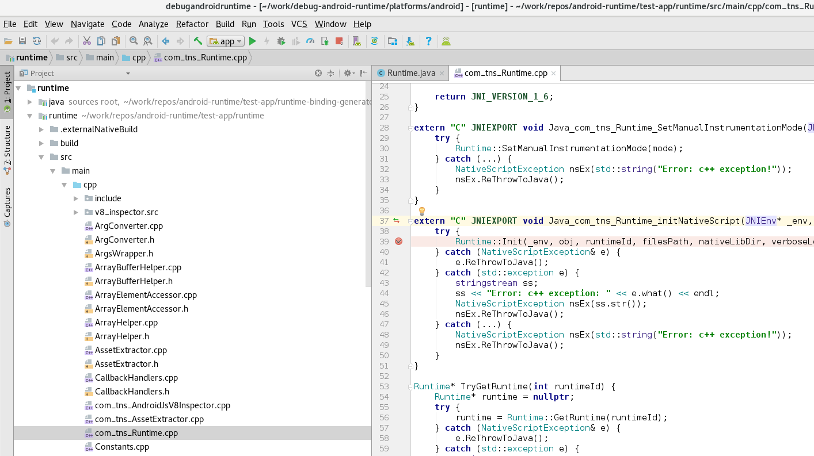

# Debugging the Android Runtime within your app's Android Studio project

## What is this document about?

In certain scenarios where runtime errors occur, the debug info provided by the NativeScript CLI are not sufficient. This article will guide you through the steps needed to debug the Android Runtime library module as a part of your NativeScript application. It implies you have the [android-runtime repository](https://github.com/NativeScript/android-runtime) already cloned and set up. For more info on how to setup the android-runtime project on your machine refer to its [README](https://github.com/NativeScript/android-runtime/blob/master/README.md).

## Creating the sample application

### 1. Create a new NativeScript application using one of the following commands depending on your platform preference:

NativeScript with Angular: 

`tns create debug-android-runtime --ng`

NativeScript with TypeScript: 

`tns create debug-android-runtime --tsc`

NativeScript with plain JavaScript: 

`tns create debug-android-runtime`

### 2. Prepare your application's Android Studio project:

`cd debug-android-runtime`

`tns prepare android`

> After you have prepared the project, make sure the `tns-android` version is at least 3.4.0, because that's the version the Android Studio support is introduced. You can check the version by running `tns info` inside the project folder.

### 3. Open the Android Studio project:

* Open Android Studio
* `File/Open` or `Open an existing Android Studio project`

* Set path to the project: e.g. `/home/userName/debug-android-runtime/platforms/android`
* Open the project

> Note: Tested with Android Studio 2.3.3, 3.0.0, 3.0.1
> If you don't need to debug the Android runtime, at this point you can already build your app using Android Studio by running the `:app` project play button.

## Add Android Runtime module library as a dependency

### 1. Make sure you have NDK and SDK directories set, because it's needed to build the Android runtime.

* `File/Project Structure`
* SDK Location
* Check if Android NDK and SDK Location is set

After set up the Project Structure should look like this:

### 2. Add runtime library module to your project

> **WARNING**: Make sure your environment fulfills all the requirements mentioned in [android-runtime](https://github.com/NativeScript/android-runtime)'s README.

* Open `settings.gradle` file in the already opened Android Studio project, which should look like this:

* Uncomment the included projects: `:runtime` and `:runtime-binding-generator`
* Uncomment and set the `:runtime` and `:runtime-binding-generator` project dirs. These project dirs, can be found in the already cloned [android-runtime repository](https://github.com/NativeScript/android-runtime).

After the changes, Android Studio will ask you to sync files and `settings.gradle` file should look like:

After the files are synced you should see the `:runtime` and `:runtime-binding-generator` modules in Android Studio and should look like this:

## Debug the Android Runtime

### 1. How to debug the Java part of the runtime

If you only want to debug the Java part of the runtime, you're already all set up. All you need to do is set a break point and run in debug.

* Open `Runtime.java` and set a breakpoint at: `private void init ...` method.

* Run Debug

> When you run the project in debug, you should see in the `Gradle Console`(bottom right) the Android Runtime being built.

### 2. How to debug both Java and the C++ part of the runtime

* Open the `:app` project debug configurations:

* Add the runtime symbols in the debugger tab.

The symbols can be found in the cloned android runtime repo in: `<android-runtime-repo>/test-app/runtime/build/intermediates/cmake/release/obj`. In order for this folder to exist, you must run the android runtime build at least once.

* Open `com_tns_Runtime.cpp` and set a breakpoint at: `extern "C" JNIEXPORT void Java_com_tns_Runtime_initNativeScript ...` method.

* Run Debug 

## Known Issues

If you have native plugins in your application, you will still be able to build it with Android Studio, but you won't be able to debug it with the Android runtime. We will fix that issue in the upcoming releases.
