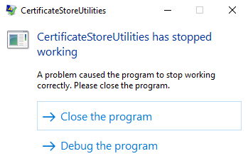
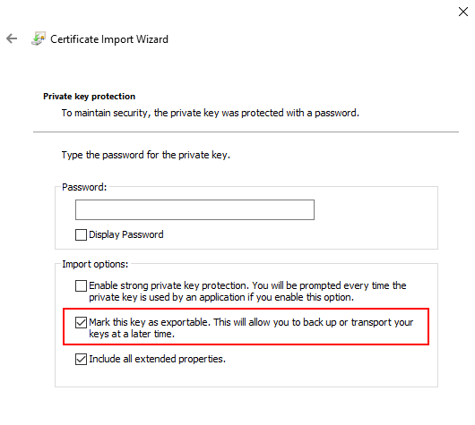

# Frequently Asked Questions

## {{ site.ns-sk }} can't be opened because the identity of the developer cannot be confirmed 

After installing the {{ site.ns-sk }} client, you might see the following error message on launch:

To resolve this issue, you need to follow the steps outlined below:

1. Click on the Apple icon in the left corner of your screen and select **System Preferences**.
2. Select **Security & Privacy**.  

1. On the bottom of the Security & Privacy dialog, you should be seeing the last app that was blocked from opening. Click on **Open Anyway**. 

> You may need to click on the **lock icon** in the lower left corner of the dialog and provide your username and password before you are able to edit settings or click buttons.

## CertificateStoreUtilities has stopped working

On a Windows machine, when you build in the cloud for iOS or Android with a certificate stored in the Windows Certificate Manager, you might encounter the following error:

This issue will occur when the selected certificate is not a valid iOS or Android certificate or when you have not enabled the "Mark this key as exportable..." option when importing the certificate to the Windows Certificate Manager. To resolve the latter, you need to enable the option when importing the certificate as shown in the image below:

Marking the key as exportable will resolve the error, as long as the provided certificate is a valid iOS or Android one.