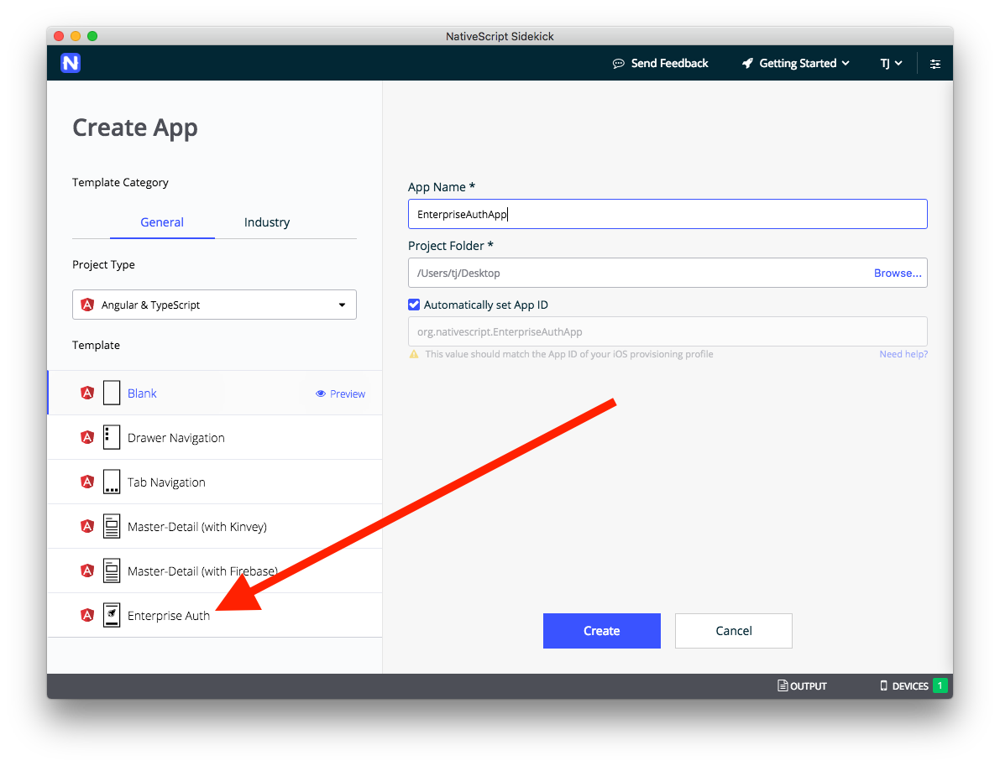
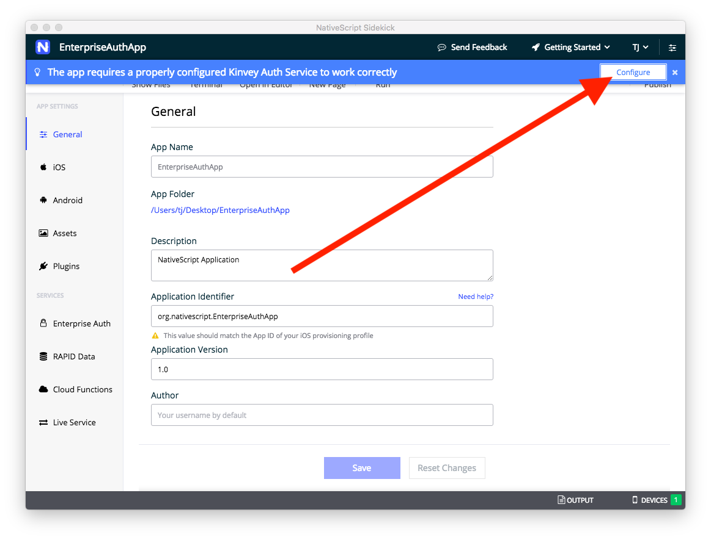

# Using Enterprise Authentication

NativeScript Sidekick lets you connect to existing enterprise identity and single sign-on solutions. This powerful functionality allows application developers to leverage enterprise user accounts, and to do so while avoiding the complexity of integrating these protocols into mobile apps.

Let’s look at how it works.

* [Step 1. Start your app](#step-1)
* [Step 2. Select a protocol](#step-2)
* [Step 3: Complete the configuration](#step-3)
* [Step 4: Run your app](#step-4)

* [How does this work?](#how-does-this-work)
* [What else can I do with my Kinvey account?](#what-else-can-i-do-with-my-kinvey-account)

<h2 id="step-1">Step 1. Start your app</h2>

As a first step, [create a new app]() using the Enterprise Auth template.

Give your app a name, and click **Create**. Sidekick will take a minute to scaffold your app. When it finishes, click the **Configure** button in the blue bar to start setting up the connection to your enterprise auth provider.

<h2 id="step-2">Step 2. Select a protocol</h2>

> **WARNING**: Completing this authentication setup can be hard, as the information you need to obtain varies depending on your auth provider. Therefore, you might need to work with your IT admins to help get the information that you need to make the connection, especially if you're not familiar with the infrastructure behind your auth setup.

On the Enterprise Auth screen the first thing you’ll see is a collection of radio buttons, asking you to choose between **SAML-Redirect**, **OpenID Connect**, and **OAuth 2**.

Knowing which service you need means knowing a little bit about your enterprise authentication provider. Some providers only support one of the above protocols, while others allow you to choose between the protocol you prefer.

Once you’ve figured out which protocol your service supports, select the appropriate radio button and move on to the next step.

<h2 id="step-3">Step 3: Complete the configuration</h2>

Each authentication service requires a different set of values needed to make the connection. Therefore, refer to one of the following guides to help complete the rest of the necessary configuration.

* [Configuring **SAML-Redirect** Authentication]()
* [Configuring **OpenID Connect** Authentication]()
* [Configuring **OAuth 2** Authentication]()

<h2 id="step-4">Step 4: Run your app</h2>

After you’ve completed the authentication setup, your last step is to run your app and see your new authentication workflow in action.

> **TIP**: If you haven’t run an app on a device using NativeScript Sidekick before, check out our documentation on [running your app]().

After Sidekick deploys your new app to your device(s) you should see an app that looks like this.

When you tap the **Log in** button, if all went well, you should be prompted to authenticate with your enterprise authentication provider. In the case of our Microsoft Azure-based example, the app prompts the user to authenticate with their Microsoft account.

> **NOTE**: Configuring enterprise authentication providers is very tricky. If you’re not seeing your auth screen as expected, or if you hit problems at any time throughout the process, feel free to [reach out on Stack Overflow](https://stackoverflow.com/questions/tagged/nativescript).

And that’s it! You’ve now successfully built an app that can connect to an enterprise authentication provider.

## How does this work?

Sidekick’s enterprise authentication implementation is powered by [Progress Kinvey](https://www.kinvey.com/), a leading backend app development platform, with powerful capabilities to connect to and use enterprise data sources. As part of the process of setting up the Enterprise Auth feature, NativeScript Sidekick creates a Kinvey account using the Telerik credentials that you log into Sidekick with. Kinvey has a feature called [Mobile Identity Connect](https://devcenter.kinvey.com/nativescript/guides/mobile-identity-connect) that is designed to connect with existing identity and single sign-on solutions. This is the feature that powers the Enteprise Auth template.

You can see the Mobile Identity Connect service that NativeScript Sidekick automatically created for you inside Kinvey by logging into the [Kinvey Console](https://console.kinvey.com) using the same credentials that you use for NativeScript Sidekick. You will have an app that corresponds to your NativeScript Sidekick project under the **Apps** tab, as well as a service corresponding to the authentication provider you connected to under the **Service Catalog** tab. Feel free to access and customize these further if you wish - there are many additional customization options available within the Kinvey Console.

## What else can I do with my Kinvey account?

Your Kinvey account also gives you access to a ton of additional features beyond just Mobile Identity Connect. Some of them include:

* [NoSQL data stores](https://devcenter.kinvey.com/nativescript/guides/datastore) and [file stores](https://devcenter.kinvey.com/nativescript/guides/files) that can serve as a back end to your app.
* [Push notification](https://devcenter.kinvey.com/nativescript/guides/push) support for your NativeScript app.
* [RapidData](https://devcenter.kinvey.com/nativescript/guides/rapid-data) lets you connect your NativeScript mobile app to existing enterprise data sources like SQL Server, SharePoint, Salesforce, SAP and REST.
* [FlexServices](https://devcenter.kinvey.com/nativescript/guides/flex-services) allow you to build complex data integrations or add functional business logic that lives in the cloud (aka serverless).

For a full overview of Kinvey features and how to use them, visit the [Kinvey Dev Center](https://devcenter.kinvey.com/nativescript).