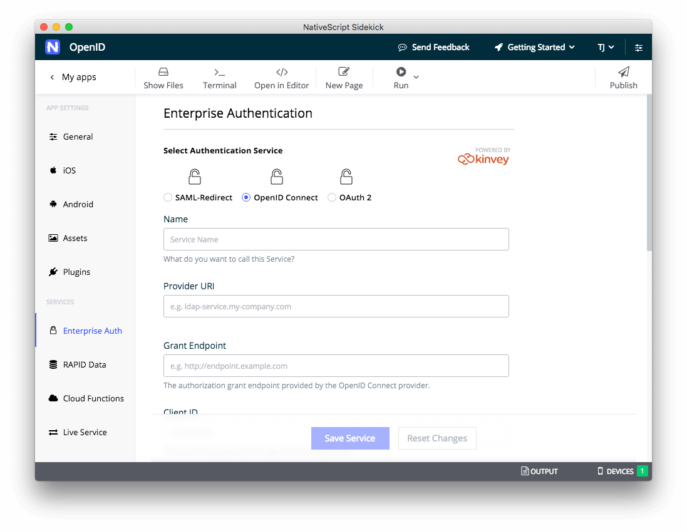
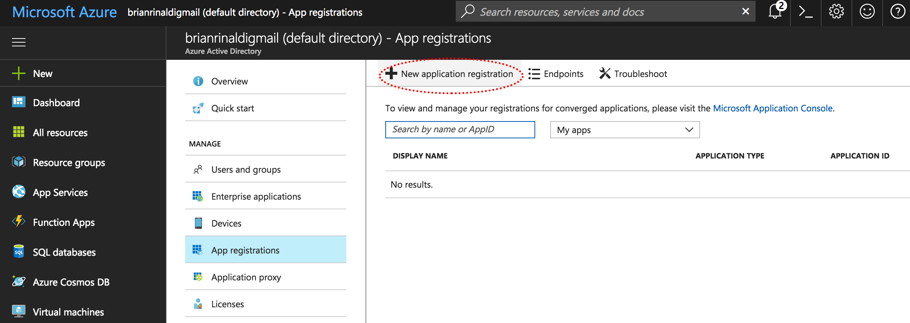
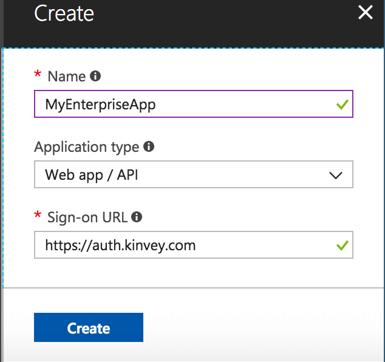
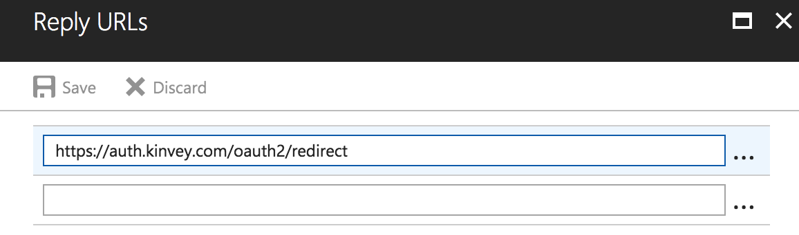
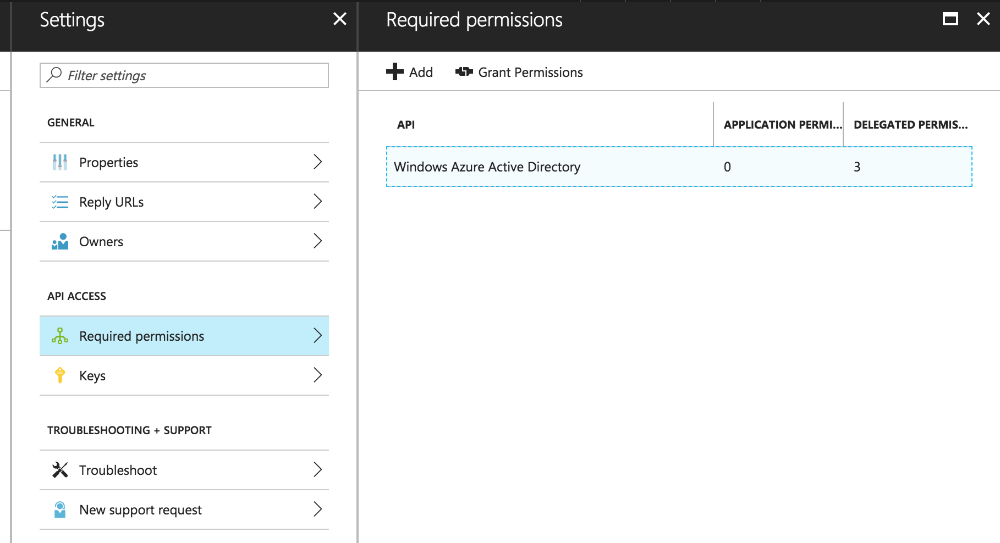
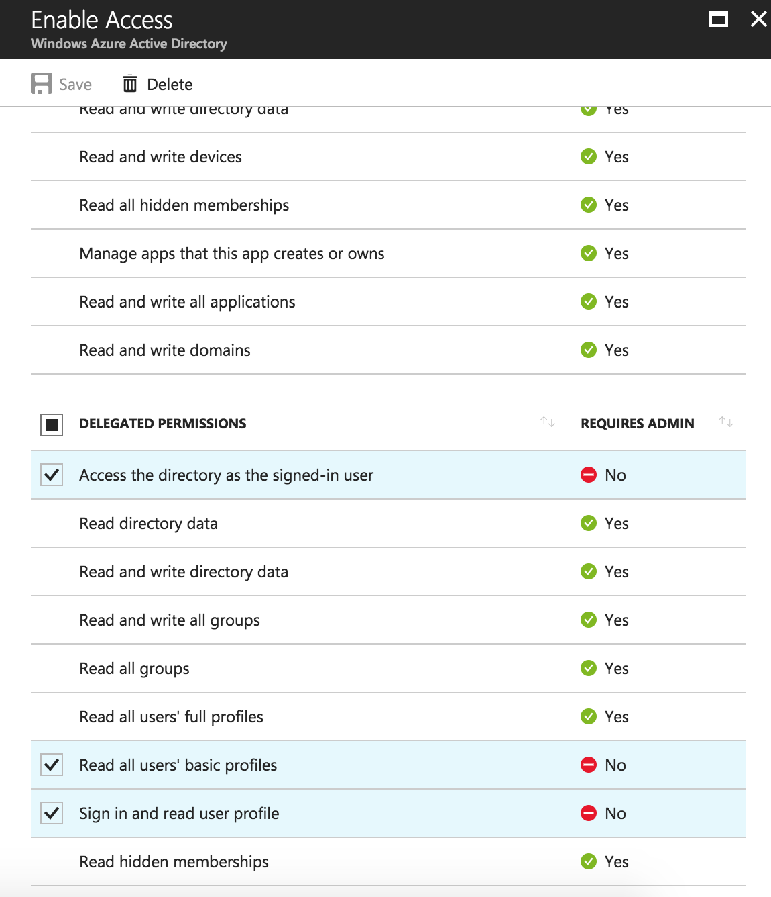
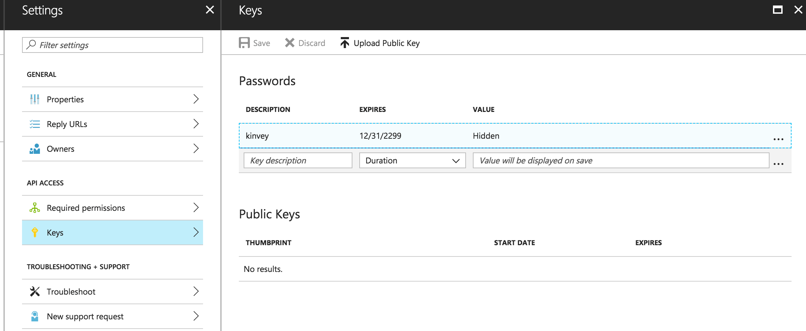
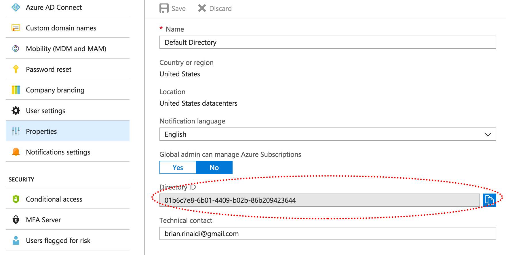
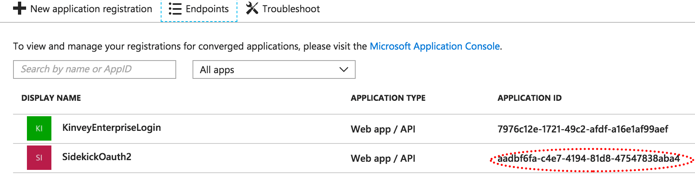
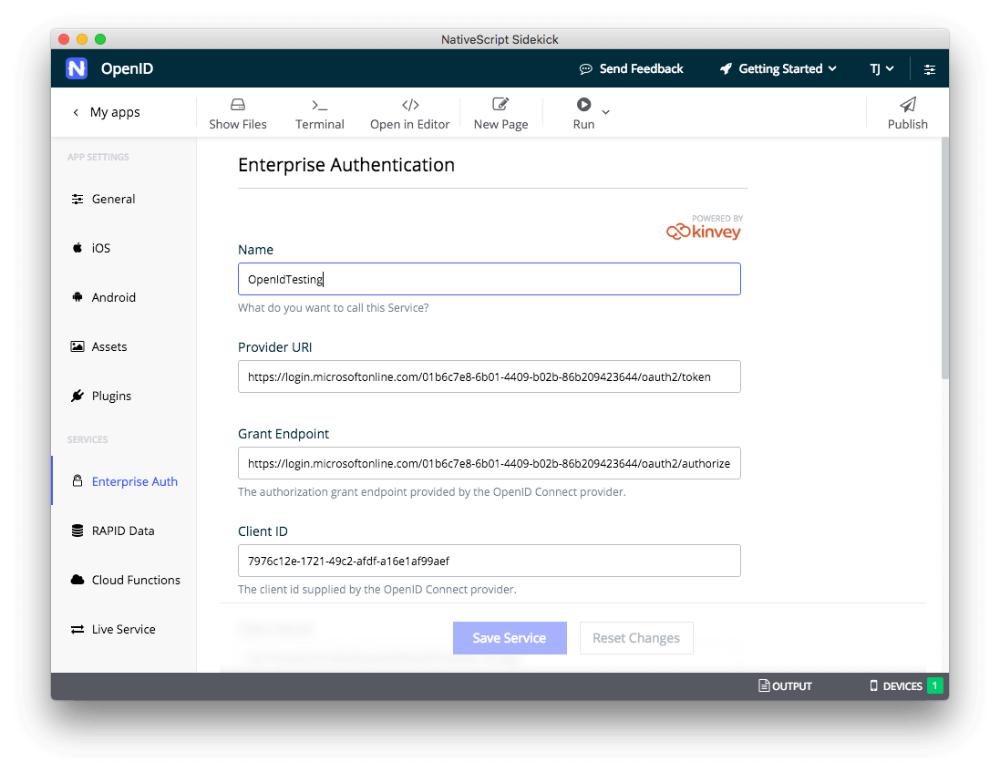

# Configuring OpenID Connect Authentication

NativeScript Sidekick gives you the ability to connect to enterprise authentication providers via OpenID. In this article we’ll look at the various data points NativeScript Sidekick needs to make the connection, and then look at a concrete example of a sample connection using Microsoft Azure.

## Configuring your connection

The first thing you need to do to configure an OpenID connection is to visit the **Enterprise Auth** screen and select the **OpenID Connect** radio button. You should see a form that looks like this.



Let’s start by looking at the fields you need to provide to connect to your enterprise authentication provider. Then, as an example, we'll explore how we'd complete the form for a project using Azure Active Directory.

## Completing the connection setup

Here is a list of the fields you need to provide in Sidekick, and a brief description of what they are.

<table>
	<thead>
		<tr>
			<th style="width: 20%">Field name</th>
			<th align="center">Description</th>
		</tr>
	</thead>
	<tbody>
		<tr>
			<td><code>Name</code></td>
			<td align="center">The name can be anything you choose. NativeScript Sidekick will create a new service in Kinvey and the name is simply intended an an identifier to make it easier find your authentication service within the <a href="https://console.kinvey.com/">Kinvey console</a>.</td>
		</tr>
		<tr>
			<td><code>Provider URI</code></td>
			<td align="center">In OpenID terms, this is usually referred to as the <em>token endpoint</em> for the authentication service that you are connecting to.</td>
		</tr>
		<tr>
			<td><code>Grant Endpoint</code></td>
			<td align="center">In OpenID terms, this is usually referred to as the <em>authorization endpoint</em> for the authentication service that you are connecting to.</td>
		</tr>
		<tr>
			<td><code>Client ID</code></td>
			<td align="center">This is the public identifier for your app that is provided by the authentication service that you are connecting to. In some cases (as in our Azure example below), this may be referred to as an application ID.</td>
		</tr>
		<tr>
			<td><code>Client Secret</code></td>
			<td align="center">This is a private app key provided by the authentication service that you are connecting to.</td>
		</tr>
		<tr>
			<td><code>Issuer identifier</code></td>
			<td align="center">This is a case-sensistive URL that identifies the issuer of the response.</td>
		</tr>
		<tr>
			<td><code>Scope</code></td>
			<td align="center">The scope defines what information your app requires access to from the OpenID authentication service provider. The specific scopes that you are requesting access to are displayed to the user by the provider when granting the authentication request. For example, a value of <code>profile</code> may indicate that you are requesting access to read the user's basic profile info from the authentication service while a value of <code>email</code> could indicate that you are requesting access to read their email address.</td>
		</tr>
	</tbody>
</table>

<br/>
Once all the fields are filled in appropriately, click the **Save Service** button to continue.

## Example - Azure Active Directory

While general field descriptions can be useful, it can be really helpful to see what this looks like in a real-world scenario. Microsoft offers a number of cloud services under the [Azure](https://azure.microsoft.com/en-us/) umbrella. One of these services is the Azure Active Directory (Azure AD) service and it functions similarly to the Windows Active Directory that many enterprises use. In this example, we'll set up Azure Active Directory, and then we’ll fill out the appropriate OpenID Connect data in Sidekick to make the connection.

### Setting Up Azure AD

The following steps will walk you through creating a new Azure Active Directory from scratch. If you already have Azure AD set up, simply skip step 1 below and complete steps 2 through 8.

1. From within the [Azure portal](https://portal.azure.com), click on Azure Active Directory or click on **+New** and search for Azure Active Directory.

	

2. Choose the **App Registrations** option and **New Application Registration**.
	
	
	
3. Enter a name for the application (this can be any name you prefer), choose **Web app / API** and, for the Sign-on URL, enter `https://auth.kinvey.com`.

	

4. Once it is created, choose **Reply URLs**.

	

5. Enter `https://auth.kinvey.com/oidc/redirect` (see the [Kinvey docs](https://devcenter.kinvey.com/html5/guides/mobile-identity-connect#ConfiguringyourOpenIDConnectIdentityProvidertoacceptKinveyRequests) for additional details).

	

6. Back in the application settings, choose **Required Permissions** and then **Windows Azure Active Directory**.

	

7. Enable the following:

	* Access the directory as the signed-in user
	* Read all users' basic profiles
	* Sign in and read user profile

	

8. Back in the application settings again, choose **Keys** and create a new option under **Passwords**. Set the description (this can be any text you prefer) and expiration (for example, "never"). Click **Save**. Be sure to copy the key's value before leaving.

	

In order to test the log in process, Azure Active Directory will need a user. To add a user, go to Active Directory, click **Users and Groups**, then **All Users**, and finally **New User**. For testing purposes, you could add yourself.

### Providing Open ID Connect form values for Azure

Now that our Azure Active Directory is set up, let's look at the values within Azure that we need to complete the Enterprise Authentication form within NativeScript Sidekick.

* **Name**: Any name you choose.
* **Provider URI**, **Grant Endpoint** and **Issuer Identifier** : All three of these values can be found in the OpenID Connect metadata document provided by Azure. Azure's [documentation](https://docs.microsoft.com/en-us/azure/active-directory/develop/active-directory-protocols-openid-connect-code#openid-connect-metadata-document) indicates that the Open ID Connect metadata document can be found at:

  ```
  https://login.microsoftonline.com/{tenant}/.well-known/openid-configuration
  ```

  The value of `{tenant}` is an identifier with Azure for your account. This information can be found by clicking on Azure Active Directory and choosing **Properties**. The value of `{tenant}` is the value listed for **Directory ID**.

  

  Replace the value of `{tenant}` in the URL and navigate to it. This page will contain some JSON formatted values. The value for Provider URI is listed as `token_endpoint`. The value for Grant Endpoint is listed as `authorization_endpoint`. Finally, the value for Issuer Identifier is listed as `issuer`

* **Client ID** is the application ID found by going to Azure Active Directory and then choosing **App registrations**.

  

* **Client Secret** is the value of the key created in step 8 above. If you did not copy the key during that step, it is hidden and you'll simply need to create a new key.
* **Scope** should be set to `email` to give your app access to the user's email address.

When you’re done, your form should look something like this in Sidekick.



Click the **Save Service** button and you are ready to move on to building and testing your NativeScript mobile app.

* [Next step: Running your app](#step-3)
