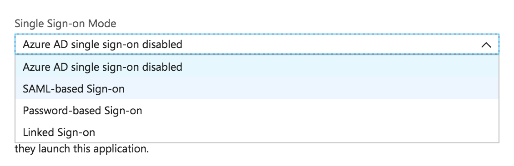

# Configuring SAML-Redirect Authentication

SAML, or Security Assertion Markup Language, is a standard for exchanging authentication and authorization data between security domains.

NativeScript Sidekick gives you the ability to connect to enterprise authentication providers via SAML. In this article we’ll look at the various data points NativeScript Sidekick needs to make the connection, and then look at a concrete example of a sample connection using Microsoft Azure.

## Configuring your connection

The first thing you need to do to configure a SAML-Redirect connection is to visit the **Enterprise Auth** screen and select the **SAML-Redirect** radio button. You should see a form that looks like this.

Let’s start by looking at the fields you need to provide to connect to your enterprise authentication provider. Then, as an example, we'll explore how we'd complete the form for a project using Azure Active Directory.

## Completing the connection setup

Here is a list of the fields you need to provide in Sidekick, and a brief description of what they are.

<table>
	<thead>
		<tr>
			<th style="width: 20%">Field name</th>
			<th align="center">Description</th>
		</tr>
	</thead>
	<tbody>
		<tr>
			<td><code>Name</code></td>
			<td align="center">The name can be anything you choose. NativeScript Sidekick will create a new service in Kinvey and the name is simply intended an an identifier to make it easier find your authentication service within the <a href="https://console.kinvey.com/">Kinvey console</a>.</td>
		</tr>
		<tr>
		<td><code>Provider URI</code></td>
		<td align="center">This is the single sign on service URL where the request is initiated with the SAML authentication service that you are connecting to.</td>
		</tr>
		<tr>
		<td><code>Certificate Text</code></td>
		<td align="center">This is the Base64 text of the SAML signing certificate provided by the SAML authentication service.</td>
		</tr>
		<tr>
		<td><code>Name ID Format URI</code></td>
		<td align="center">This is optional depending on the requirements of your SAML authentication provider. In simple terms, this specifies the kind of user identifier that the service will provide. The default value (<code>urn:oasis:names:tc:SAML:1.1:nameid-format:unspecified</code>) allows the provider to determine the format it will send the user identifier as we are not specifying a format (i.e. <code>unspecified</code>).</td>
		</tr>
	</tbody>
</table>

 
Once all the fields are filled in appropriately, click the "Save Service" button to continue.

## Example - Azure Active Directory

While general field descriptions can be useful, it can be really helpful to see what this looks like in a real-world scenario. Microsoft offers a number of cloud services under the [Azure](https://azure.microsoft.com/en-us/) umbrella. One of these services is the Azure Active Directory (Azure AD) service and it functions similarly to the Windows Active Directory that many enterprises use. In this example, we'll set up Azure Active Directory, and then we’ll fill out the appropriate SAML data in Sidekick to make the connection.

### Setting Up Azure AD

The following steps will walk you through creating a new Azure Active Directory from scratch. If you already have Azure AD set up, simply skip step 1 below and complete steps 2 through 8.

1. From within the [Azure portal](https://portal.azure.com), click on Azure Active Directory or click on +New and search for Azure Active Directory.

	

2. Choose the **App Registrations** option and **Enterprise applications**.
	
	

3. Click **+ New application** and then choose **Non-gallery application**. Give your application a name (this can be whatever you like) and click **Add**.

  

4. Click on **Configure single sign-on**.

5. Choose **SAML-based Sign-on** from the drop down.

  

6. Fill in the following values:

  * For **Identifier** enter `https://auth.kinvey.com/kinvey-mobile-identity-connect`.
  * For **Reply URL** enter `https://auth.kinvey.com/v3/saml/assertion`.
  * Click on **Show sdvanced URL settings**.
  * For **Sign on URL** enter `https://auth.kinvey.com/`.

  

7. Scroll down to the SAML Signing Certificate. If it is not active yet, enable it and then download the Base64 version. (More details about managing signing certificates within Azure can be found in their [documentation](https://docs.microsoft.com/en-us/azure/active-directory/active-directory-sso-certs).)

  

8. Click the **Save** button to save your settings.

In order to test the log in process, your Azure Active Directory application will need a user. To add a user, click on the **Assign a user for testing** option within Azure's enterprise application quick start guide. The easiest way to start is by adding your own user to the application.

### Providing SAML form values for Azure

Now that our Azure Active Directory is set up, let's look at the values within Azure that we need to complete the Enterprise Authentication form within NativeScript Sidekick.

* **Name**: Any name you choose.
* **Provider URI**: To get this value from within Azure, go to Azure Active Directory, choose **App registrations** and then **Endpoints**.

  

  On the subsequent page, the Provider URI is the SAML-P Sign-on Endpoint value value.

  

* **Certificate text** is the contents of the Base64 signing certificate you downloaded. Open the file using a text editor and copy the contents between the `-----BEGIN CERTIFICATE-----` and `-----END CERTIFICATE-----` lines into the form field.
* **Name ID Format URI** for Azure Active Directory should be `urn:oasis:names:tc:SAML:1.1:nameid-format:emailAddress`. (You can find more information about the various values Azure accepts here and what they mean in their [documentation](https://docs.microsoft.com/en-us/azure/active-directory/develop/active-directory-single-sign-on-protocol-reference#nameidpolicy).)

When you’re done, your form should look something like this in Sidekick.

Click the **Save Service** button and you are ready to move on to building and testing your NativeScript mobile app.

* [Next step: Running your app](#step-3)