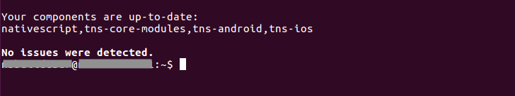

# NativeScript Advanced Setup: Linux

This page contains a list of all system requirements needed to build and run NativeScript apps on Linux, as well as a guided walkthrough for getting these requirements in place.

* [System Requirements](#system-requirements)
* [Advanced Setup Steps](#advanced-setup-steps)

> **NOTE**: On Linux systems you can only use the NativeScript CLI to develop Android apps. This is because the NativeScript CLI uses Xcode to build iOS apps, which is only available on the macOS operating system. If you’re interested in building iOS apps on Linux, you may want to try out the public preview of [NativeScript Sidekick](https://www.nativescript.org/nativescript-sidekick). NativeScript Sidekick provides robust tooling for NativeScript apps, including a service that performs iOS and Android builds in the cloud, removing the need to complete these system requirements, and allowing you to build for iOS on Linux.

## System Requirements

* Ubuntu 14.04 LTS
* The latest stable official release of Node.js (LTS) [8.x](https://nodejs.org/dist/latest-v8.x/) 
* G++ compiler
* JDK 8
* Android SDK 22 or a later stable official release
* Android Support Repository
* (Optional) Google Repository
* Android SDK Build-tools 27.0.3 or a later stable official release

You must also have the following two environment variables setup for Android development:

* JAVA_HOME
* ANDROID_HOME

## Advanced Setup Steps

Complete the following steps to set up NativeScript on your Linux development machine:

1. Install the latest Node.js [8.x](https://nodejs.org/dist/latest-v8.x/) stable official release. 

1. If you are running on a 64-bit system, install the runtime libraries for the ia32/i386 architecture.

    <pre class="add-copy-button"><code class="language-terminal">sudo apt-get install lib32z1 lib32ncurses5 lib32bz2-1.0 libstdc++6:i386
    </code></pre>
    If you encounter an error showing "Unable to locate package lib32bz2-1.0" then use
    <pre class="add-copy-button"><code class="language-terminal">sudo apt-get install lib32z1 lib32ncurses5 libbz2-1.0:i386 libstdc++6:i386
    </code></pre>

1. Install the G++ compiler.

    <pre class="add-copy-button"><code class="language-terminal">sudo apt-get install g++
    </code></pre>

1. Install [JDK 8](http://www.oracle.com/technetwork/java/javase/downloads/jdk8-downloads-2133151.html).
    1. Run the following commands.

        <pre class="add-copy-button"><code class="language-terminal">sudo apt-get install python-software-properties
        sudo add-apt-repository ppa:webupd8team/java
        sudo apt-get update
        sudo apt-get install oracle-java8-installer
        </code></pre>

    1. After installation if you have multiple installations of java you can choose which to use:

        <pre class="add-copy-button"><code class="language-terminal">sudo update-alternatives --config java
        </code></pre>

    1. Set the JAVA_HOME system environment variable.

        <pre class="add-copy-button"><code class="language-terminal">export JAVA_HOME=$(update-alternatives --query javac | sed -n -e 's/Best: *\(.*\)\/bin\/javac/\1/p')
        </code></pre>

1. Install the [Android SDK](http://developer.android.com/sdk/index.html).
    1. Go to [Android Studio and SDK Downloads](https://developer.android.com/sdk/index.html#Other) and in the **SDK Tools Only** section download the package for Linux at the bottom of the page.
    1. After the download completes, unpack the downloaded archive into a folder, such as `/android/sdk`
       * The archive you just extracted was the `tools` folder, so in this case it would be at: `/android/sdk/tools`
    1. Set the ANDROID_HOME system environment variable.
        <pre><code class="language-terminal">export ANDROID_HOME=Path to Android installation directory
        </code></pre>
        For example: `ANDROID_HOME=/android/sdk`
        <blockquote><b>NOTE</b>: This is the directory that contains the <code>tools</code> (just installed) and <code>platform-tools</code> (installed by scripts in the next step) directories.</blockquote>

1. Install all packages for the Android SDK Platform 25, Android SDK Build-Tools 27.0.3 or later, Android Support Repository, Google Repository and any other SDKs that you may need. You can alternatively use the following command, which will install all required packages.

    <pre class="add-copy-button"><code class="language-terminal">sudo $ANDROID_HOME/tools/bin/sdkmanager "tools" "platform-tools" "platforms;android-25" "build-tools;27.0.3" "extras;android;m2repository" "extras;google;m2repository"
    </code></pre>

1. Setup Android Emulators (AVD) by following the article [here]()
    1. After creating an emulated device you need to:
        * Enable its Developer mode - go to _Settings -> About emulated device_ and tap 7 times on _Build number_
        * Enable USB debugging - go to _Settings -> Developer options_ and enable USB Debugging 

1. Install the NativeScript CLI.
    1. Run the following command.

    <pre class="add-copy-button"><code class="language-terminal">sudo npm install nativescript -g --unsafe-perm
    </code></pre>

    1. Restart the command prompt.

1. To check if your system is configured properly, run the following command.

    <pre class="add-copy-button"><code class="language-terminal">tns doctor
    </code></pre>

If you see "No issues were detected" you are good to go!

## What’s Next

* [Return to the JavaScript tutorial](http://docs.nativescript.org/tutorial/chapter-1#11-install-nativescript-and-configure-your-environment)
* [Return to the TypeScript & Angular tutorial](http://docs.nativescript.org/angular/tutorial/ng-chapter-1#11-install-nativescript-and-configure-your-environment)
