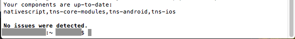

# NativeScript Advanced Setup: macOS

This page contains a list of all system requirements needed to build and run NativeScript apps on macOS, as well as a guided walkthrough for getting these requirements in place. On macOS systems, you can use the NativeScript CLI to develop Android and iOS apps.

## System Requirements

* macOS High Sierra or later
* The latest stable official release of Node.js (LTS) [10.x](https://nodejs.org/dist/latest-v8.x/). 
* (Optional) [Homebrew](https://brew.sh/) to simplify the installation of dependencies
* For iOS development
    * Latest Xcode
    * Command-line tools for Xcode
    * xcodeproj ruby gem
    * CocoaPods
    * The `six` python package
    * (Optional) xcproj command line tool
* For Android development
    * JDK 8 or later
    * Latest official release of Android SDK
    * Android Support Repository
    * (Optional) Google Repository
    * Android SDK Build-tools 28.0.3 or later

You must also have the following two environment variables setup for Android development:

* JAVA_HOME
* ANDROID_HOME

## Advanced Setup Steps

Complete the following steps to setup NativeScript on your macOS development machine:

1. Install [Homebrew](http://brew.sh) to simplify the installation process.

    <pre class="add-copy-button"><code class="language-terminal">ruby -e "$(curl -fsSL https://raw.githubusercontent.com/Homebrew/install/master/install)"
    </code></pre>

2. Install the latest Node.js (LTS) [10.x](https://nodejs.org/dist/latest-v10.x/).

    <pre class="add-copy-button"><code class="language-terminal">brew update
    </code></pre>

    <pre class="add-copy-button"><code class="language-terminal">brew install node@10
    </code></pre>
     
     1. After you run the command above you will see this on console:
     ```
     If you need to have this software first in your PATH run:
     echo 'export PATH="/usr/local/opt/node@10/bin:$PATH"' >> ~/.bash_profile
     ```
     In order to make node available, please add it to path with this command:
     ```
     echo 'export PATH="/usr/local/opt/node@10/bin:$PATH"' >> ~/.bash_profile
     ```      
     Then restart the terminal or run `source ~/.bash_profile` command.
     
3. Install the dependencies for iOS development.
    1. Run the App Store and download Xcode.
    2. Start Xcode and you will be prompted to install **Command Line Tools for Xcode**.
        1. To verify that the installation is correct please run
         ```
         xcodebuild -version
         ```
        If command above do not pass then build tools are either not installed or not selected.
        You can select build tools via `xcode-select` command or via Xcode (Preferences -> Locations -> Command Line Tools).
        
    3. Install the [xcodeproj ruby gem](https://rubygems.org/gems/xcodeproj/versions/0.28.2) with the following command.

        <pre class="add-copy-button"><code class="language-terminal">sudo gem install xcodeproj
        </code></pre>

    4. Install [CocoaPods](https://guides.cocoapods.org/using/getting-started.html)

        <pre class="add-copy-button"><code class="language-terminal">sudo gem install cocoapods
        </code></pre>

    5. Setup [CocoaPods](https://guides.cocoapods.org/using/getting-started.html)
    
        <pre class="add-copy-button"><code class="language-terminal">pod setup</code></pre>

    6. Install python `six` package

        <pre class="add-copy-button"><code class="language-terminal">pip install six
        </code></pre>

    7. (Optional) If you are using Xcode 7.3 as well as an older version of CocoaPods (0.39.0 or earlier), you must install the `xcproj` command-line tool by running `brew install xcproj` in your terminal. You can check your CocoaPods version with pod --version.

        <pre class="add-copy-button"><code class="language-terminal">brew install xcproj
        </code></pre>

4. Install the dependencies for Android development.
    1. Install [JDK 8](http://www.oracle.com/technetwork/java/javase/downloads/index.html).
      
    <pre class="add-copy-button"><code class="language-terminal">brew tap caskroom/versions
    </code></pre>

    <pre class="add-copy-button"><code class="language-terminal">brew cask install java8
    </code></pre>
    
    2. Set the JAVA_HOME system environment variable.

        <pre class="add-copy-button"><code class="language-terminal">export JAVA_HOME=$(/usr/libexec/java_home -v 1.8)
        </code></pre>

    3. Install the [Android SDK](http://developer.android.com/sdk/index.html).
        1. In the terminal, run the following command:

            <pre class="add-copy-button"><code class="language-terminal">brew cask install android-sdk
            </code></pre>

        2. Next, run the following command to set the ANDROID_HOME system environment variable:

            <pre class="add-copy-button"><code class="language-terminal">export ANDROID_HOME=/usr/local/share/android-sdk
            </code></pre>

            <blockquote><b>NOTE</b>: This is the directory that contains the <code>tools</code> and <code>platform-tools</code> directories.</blockquote>
            <blockquote><b>NOTE</b>: In order to persist these variables after your terminal session is closed, they have to be persisted in your shell profile file (e.g. <code>~/.bash_profile</code> if you are using Bash, <code>~/.zprofile if you are using Zsh)</blockquote>            

        3. In addition, install all packages for the Android SDK Platform 28, Android SDK Build-Tools 28.0.3 or later, Android Support Repository, Google Repository and any other SDKs that you may need. You can alternatively use the following command, which will install all required packages.

           <pre class="add-copy-button"><code class="language-terminal">$ANDROID_HOME/tools/bin/sdkmanager "tools" "emulator" "platform-tools" "platforms;android-28" "build-tools;28.0.3" "extras;android;m2repository" "extras;google;m2repository"
           </code></pre>
           
           *If you are behind a corporate proxy, it might be necessary to pass additional arguments. You can check [sdkmanager documentation] (https://developer.android.com/studio/command-line/sdkmanager.html)*

5. Setup Android Emulators (AVD) by following the article [here]()

6. Install the NativeScript CLI.
    1. Run the following command.

        <pre class="add-copy-button"><code class="language-terminal">npm i -g nativescript
        </code></pre>

    2. Restart the command prompt.

7. To check if your system is configured properly, run the following command.

    <pre class="add-copy-button"><code class="language-terminal">tns doctor
    </code></pre>

If you see "No issues were detected" you are good to go!



## What’s Next


* [Learn the Basics of the NativeScript CLI](/angular/start/cli-basics)



* [Learn the Basics of the NativeScript CLI](/start/cli-basics)

