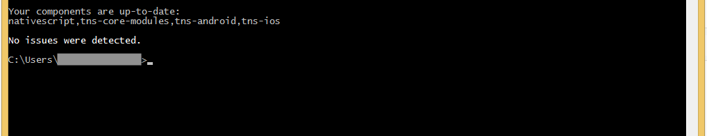

# NativeScript Advanced Setup: Windows

This page contains a guided walkthrough for installing NativeScript requirements and start building and running NativeScript apps on Windows.

> **NOTE**: On Windows systems you can only use the NativeScript CLI to develop Android apps. This is because the NativeScript CLI uses Xcode to build iOS apps, which is only available on the macOS operating system. If you’re interested in building iOS apps on Windows, you may want to try out the public preview of [NativeScript Sidekick](https://www.nativescript.org/nativescript-sidekick). NativeScript Sidekick provides robust tooling for NativeScript apps, including a service that performs iOS and Android builds in the cloud, removing the need to complete these system requirements, and allowing you to build for iOS on Windows.

## Prerequisites
* Windows 7 Service Pack 1 or later

## Setup Steps

Complete the following steps to set up NativeScript on your Windows development machine:

1. Install [Chocolatey](https://chocolatey.org) to simplify the installation and configuration of the requirements.
    - Run the command prompt as an Administrator.
    - Copy and paste the following script in the command prompt.

        <pre class="add-copy-button"><code class="language-terminal">@powershell -NoProfile -ExecutionPolicy unrestricted -Command "iex ((new-object net.webclient).DownloadString('https://chocolatey.org/install.ps1'))" && SET PATH=%PATH%;%ALLUSERSPROFILE%\chocolatey\bin
        </code></pre>
    - Restart the command prompt.

2. Install [Google Chrome](https://www.google.com/chrome/browser/desktop/index.html) (required to debug NativeScript apps)
    - In the command prompt, run the following command.

        <pre class="add-copy-button"><code class="language-terminal">choco install googlechrome -y
        </code></pre>

3. Install the latest [Node.js LTS](https://nodejs.org/en/)

    - In the command prompt, run the following command.

        <pre class="add-copy-button"><code class="language-terminal">choco install nodejs-lts -y
        </code></pre>

4. Install [JDK 8](http://www.oracle.com/technetwork/java/javase/downloads/index.html)
    - In the command prompt, run the following command.

        <pre class="add-copy-button"><code class="language-terminal">choco install jdk8 -y
        </code></pre>

5. Install the [Android SDK](http://developer.android.com/sdk/index.html).
    - In the command prompt, run the following command.

        <pre class="add-copy-button"><code class="language-terminal">choco install android-sdk -y
        </code></pre>

    - Restart the command prompt.

6. Install all packages for the Android SDK Platform 25, Android SDK Build-Tools 27.0.3 or later, Android Support Repository, Google Repository and any other SDKs that you may need. You can alternatively use the following command, which will install all required packages.

    <pre class="add-copy-button"><code class="language-terminal">"%ANDROID_HOME%\tools\bin\sdkmanager" "emulator" "platform-tools" "platforms;android-25" "build-tools;27.0.3" "extras;android;m2repository" "extras;google;m2repository"
    </code></pre>

7. Install Android virtual devices (AVDs). There are multiple ways to do it so just choose one:
    
    a. Execute the following command in Command Prompt as Administrator:
        <pre class="add-copy-button"><code class="language-terminal">@powershell -NoProfile -ExecutionPolicy Bypass -Command "iex ((new-object net.webclient).DownloadString('https://nativescript.org/setup/win-avd'))"</code></pre>

    b. Use [Android Studio](https://developer.android.com/studio/index.html) and [install Android virtual devices (AVDs)](https://developer.android.com/studio/run/managing-avds.html) from there:
        
    * Install the Android Studio by running the following command in the command prompt as Administrator:

        <pre class="add-copy-button"><code class="language-terminal">choco install androidstudio -y</code></pre>

    * Restart the command prompt.
    * Open Android Studio
        > NOTE: If you see a gradle error like "Failed to find Build Tools revision 25.0.2", make sure to click on the install link and fix this error. Otherwise Tools->Android->AVD Manager might not be available.
    * Go to [Create and Manage Virtual Devices](https://developer.android.com/studio/run/managing-avds.html) 
    * Follow the steps to create and start AVD with enabled HAXM.
    
    c. Alternatively a [Visual Studio Emulator for Android](https://www.visualstudio.com/vs/msft-android-emulator/) can be used but have in mind it requires Windows 8+. 

9. Install the NativeScript CLI.
    - Run the following command.

        <pre class="add-copy-button"><code class="language-terminal">npm i -g nativescript
        </code></pre>

    - Restart the command prompt.

10. To check if your system is configured properly, run the following command.

    <pre class="add-copy-button"><code class="language-terminal">tns doctor
    </code></pre>

If you see "No issues were detected" you are good to go!

## What’s Next


* [Learn the Basics of the NativeScript CLI](/angular/start/cli-basics)



* [Learn the Basics of the NativeScript CLI](/start/cli-basics)

