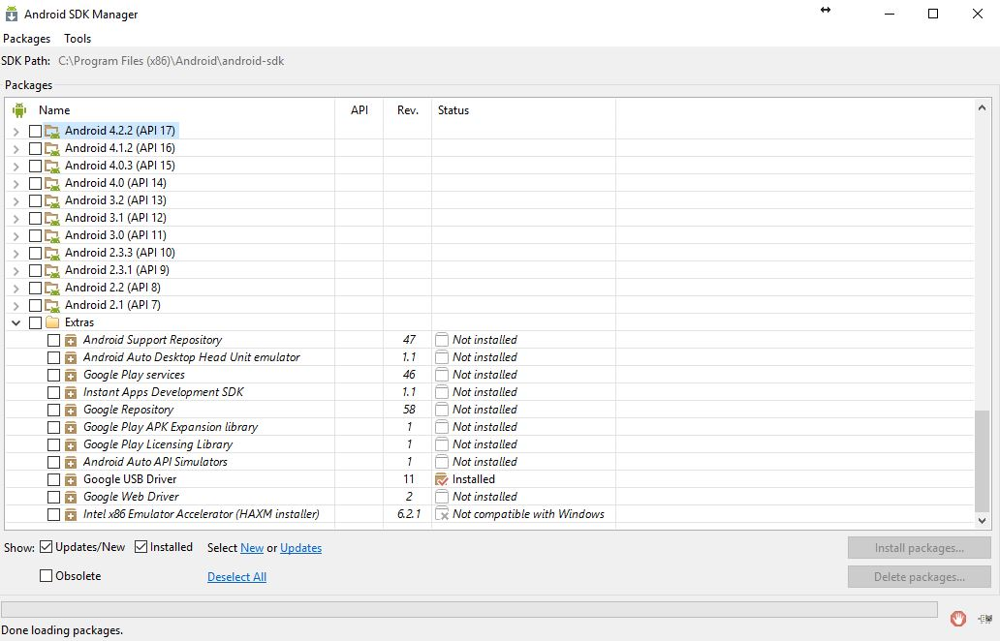
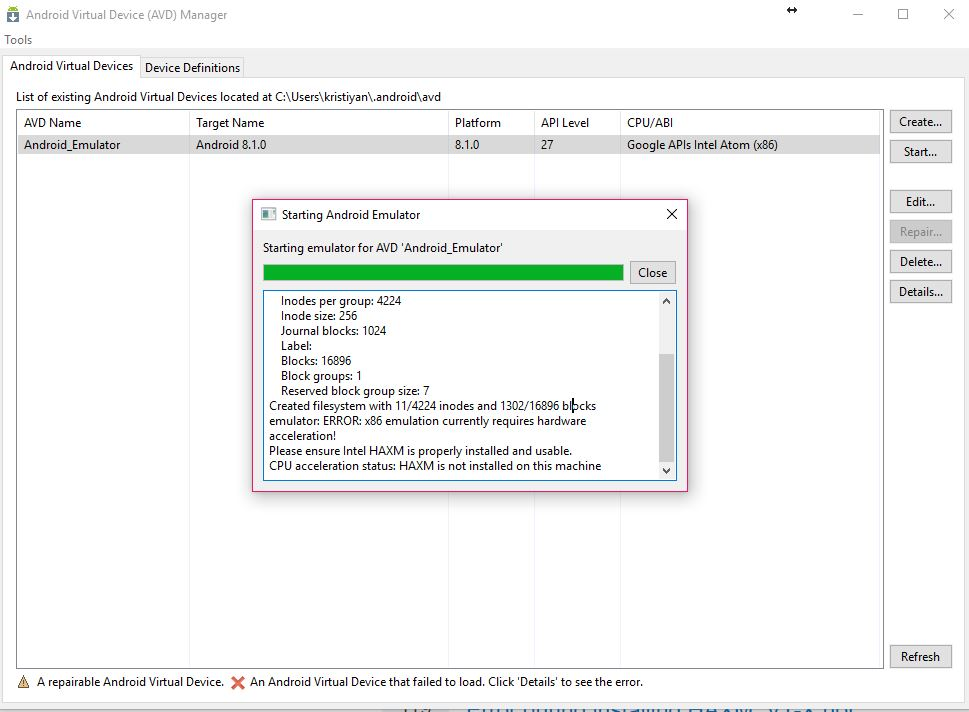
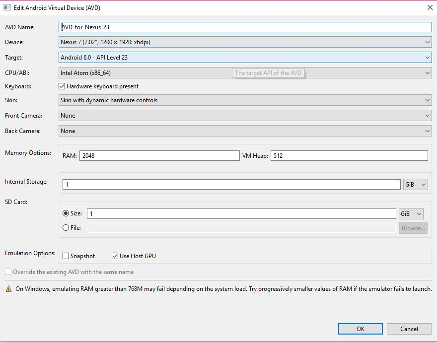
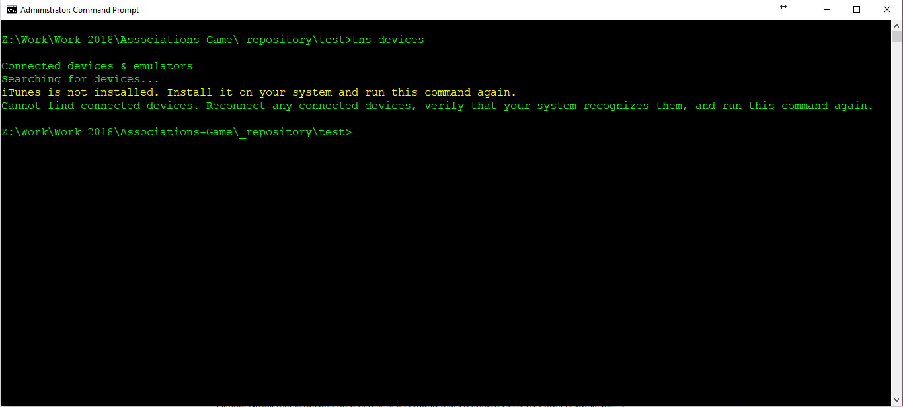
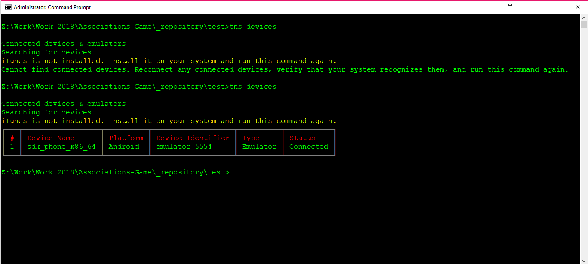
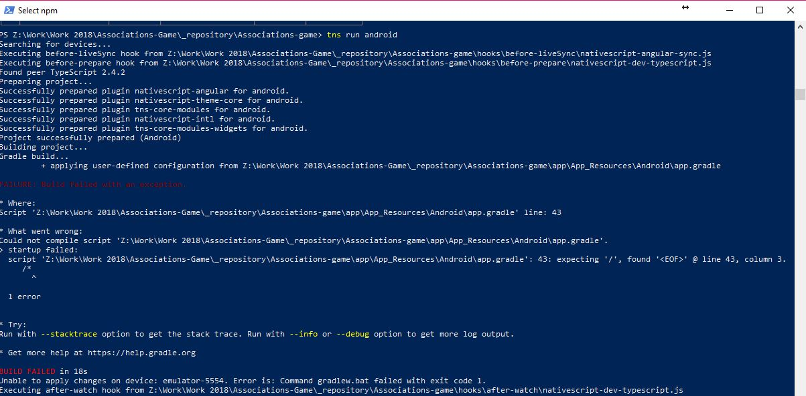
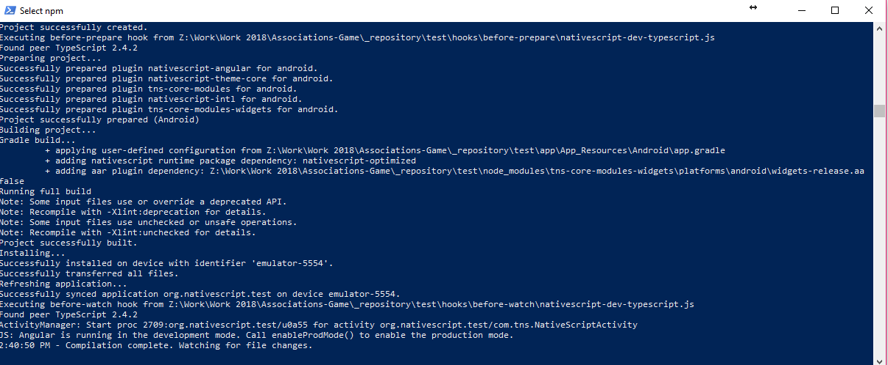
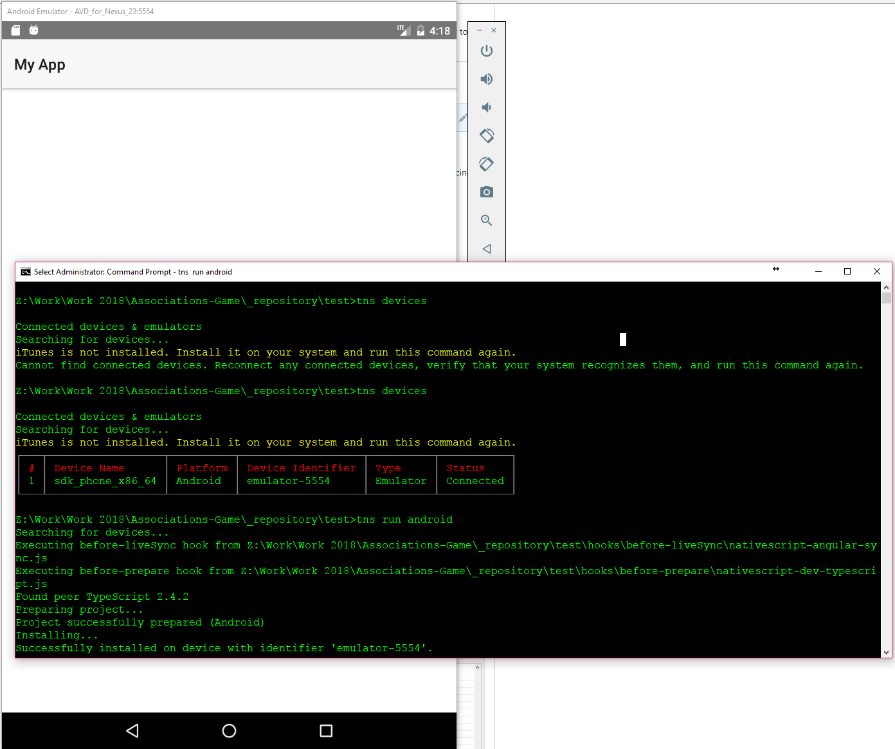

# Troubleshooting

* [Where to get help](#where-to-get-help)
* [Known issues and limitations](#known-issues-and-limitations)

> **Installation Troubles?** Try [NativeScript Sidekick](https://www.nativescript.org/nativescript-sidekick) for a one-click setup experience for macOS, Windows, and Linux. Sidekick installs the NativeScript CLI and required dependencies for macOS and Windows - and offers starter kits, cloud-based builds for iOS and Android, and app store publishing.

## Where to get help

The NativeScript framework has a vibrant community that’s here to help when you run into problems.

If you hit an issue, start by seeing if anyone else has reported the problem on [the NativeScript community forum](http://forum.nativescript.org/). If you can’t find any information, try creating a new forum topic with any details needed to recreate the issue.

If you’ve found an issue with the NativeScript framework itself, please report the problem in the appropriate GitHub repository.

- [NativeScript CLI](https://github.com/nativescript/nativescript-cli/issues)
- [NativeScript modules](https://github.com/nativescript/nativescript/issues)
- [NativeScript documentation](https://github.com/nativescript/docs)
- [NativeScript iOS runtime](https://github.com/nativescript/ios-runtime)
- [NativeScript Android runtime](https://github.com/nativescript/android-runtime)

## Known issues and limitations

There are a few known issues that you might run into as you develop mobile applications with NativeScript. The following is a list of such problems, as well as workarounds you can use to overcome them.

### My app broke after switching git branches

**Problem:** After switching branches your app no longer builds, or does not display new changes.

**Solution:** The NativeScript CLI generates platform-specific native projects for your app in the `platforms/android` and `platforms/ios` folders. When you switch branches you may need to regenerate those native projects for your app to function correctly.

Start by removing the existing platform(s) with the `tns platform remove` command.

```Shell
tns platform remove ios
tns platform remove android
```

Next, add back the platforms and install any new npm dependencies using the `tns install` command.

```Shell
tns install
```

### Error thrown when attempting to run build-related operations for iOS

**Problem**
```Shell
...
Unable to start service com.apple.mobile.installation_proxy. Result code is: ...
```

**Solution:**
Try one of the following approaches: 
 - The `Sync with this iPhone over Wi-Fi` option in iTunes on your machine should be disabled
 - Disable your Wi-Fi and execute `tns device` (when your device is connected and disconnected). It is possible that some other device is connected to the same Wi-Fi and this causes confusion in the way CLI communicates to the devices. You can find more info on the issue [here](https://github.com/NativeScript/nativescript-cli/issues/1398).


**Problem:** Gradle doesn't work with `org.gradle.parallel=true` enabled in `gradle.properties`.

**Solution:** Currently there's no other solution than disabling parallel builds.

### Error claiming "Xcode is not installed or configured properly" when Xcode seems to be installed

**Problem:** NativeScript CLI installation or `tns doctor` complains that Xcode is not configured properly

**Solution:**
Open a shell and run the following:

    $ sudo xcode-select -s /Applications/Xcode.app/Contents/Developer

### Problems with running on simulators/emulators and devices

**Problem:** Running your app on the iOS simulator produces an error like this:
```
Command xcrun with arguments simctl launch CC9DBE24-A540-40E4-A187-E7DE3ECDA254 org.nativescript.groceries failed with exit code 4. Error output: An error was encountered processing the command (domain=FBSOpenApplicationErrorDomain, code=4):
The operation couldn’t be completed. (FBSOpenApplicationErrorDomain error 4.)
```

**Solution:** Try `iOS Simulator -> Reset Contents and Settings`

**Problem:** Running your app on Android produces an error like this:
```
The package manager service found that the device didn't have enough storage space to install the app.
```

**Solution:** Free up more space on your device/emulator.

**Problem:**
* Black screen when running AVD emulator.
* AVD android emulator is laggy when running.
* tns doctor not finding any problems but tns run android --timeout 300 times out with error.
* Command gradlew.bat failed with exit code 1.
* `tns run android` throws Java (javac) error.

**Solution:**

Solution provided by [KristiyanFxy](https://github.com/KristiyanFxy) a member of the NativeScript community. Link to original solution [here.](https://github.com/NativeScript/nativescript-cli/issues/2486#issuecomment-355299977
). The following explanation is a direct quote from his solution:

### 1. Black screen when running AVD emulator

#### Problem & Suspected reason
When I was trying to run an android emulator using AVD Manager, as Administrator, I was getting a back screen. The reason was that I did not have all the necessary Android SDK packets. This might be because I already had Visual Studio & c# Xamarin extension installed that after running `@powershell -NoProfile -ExecutionPolicy Bypass -Command "iex ((new-object net.webclient).DownloadString('https://www.nativescript.org/setup/win'))"` confused the hell out of my Android emulator.

#### Fix
1. Run AVD Manager as Administrator
2. Click on the Tools > Manage SDK...
3. Make sure you have all API version 23 (at least I went for 23) mobile packets > Install the once you don't have.
4. Download and install Intel HAXM (Link to Intel official site: **[here](https://software.intel.com/en-us/articles/intel-hardware-accelerated-execution-manager-intel-haxm)**).
**Note:** You will notice HAXM is an actual option in AVD SDK Manager but it reads "Not Compatible with Windows"... dont worry, just download the executable from Intel's official website.


**Quick caviate:** If you do not install HAXM, you will see the following message when trying to run the emulator: "Please encure Intel HAXM is properly Installed and usable. CPU acceleration status: HAXM is not installed on this machine" 



5. After SDK and HAXM are download and installed, restart AVD Manager (again in Administrator mode).
6. Delete all Android Virtual devices (I did that because TNS will always target the highest available Android version & removed any confusion for further debugging).
7. In the "Device Definitions" tab > find "Nexus 7" > click on "Create AVD"



**Note:** I have plenty of RAM so I left the default RAM amount, but you might need to edit that for your specific system. That being said, I increase VM Heap to 512 because the virtual machine was not loading. 
8. Click on Ok > Start...
9. Profit!

### 2. AVD Android emulator is laggy when running

#### Problem & Suspected reason
My uneducated assumption in my case the problem was forcing my old CPU I5-3750k to calculate polygons which the processor is not very successful at.

#### Fix
1. Run AVD Manager as Administrator
2. Click on your AVD device > Edit...
3. Enable "Use Host GPU" (also shown on the picture above)
4. Click "OK" > Start...
5. Profit!

### 3. `tns doctor` not finding any problems but `tns run android --timeout 300` times out with error.

#### Problem & Suspected reason
This was a tricky one and I have no idea what causes the problem but I have found a workaround (unless that is how NativeScript is intended to be used).

Now for this to work you will need to manually start your emulator and then instruct NativeScript to run your program.

What I noticed is that when the emulator is not running, executing `'tns devices` returns "Cannot find connected devices. Reconnect any connected devices, verify that your system recognizes them, and run this command again."

That being said, after using the workaround mentioned bellow, tns finds the emulator.



#### Fix... Workaround

1. Run AVD Manager as Administrator
2. Run your Emulated Android device
3. Open CMD/PS/Bash... as Administrator > CD \[project directory] > `tns run android --timeout 100`

**Note:** At this point you might find that the NativeScript is running to a **"Build Error"** and it is exiting. Now... that is documented here [#2092](https://github.com/NativeScript/nativescript-cli/issues/2092). I found that creating a fresh TNS project works best than amending package.json, but you are welcome to do either.

4. Profit!



### 4. Command gradlew.bat failed with exit code 1.

#### Problem & Suspected reason
As explained by @Plamen5kov in ticket [#2092](https://github.com/NativeScript/nativescript-cli/issues/2092) the problem is due to conflicting jars.

#### Fix
Easiest fix is to build a new app from scratch and port your scripts. alternatively you can follow the steps from ticket [#2092](https://github.com/NativeScript/nativescript-cli/issues/2092) by @Pip3r4o

1. Open package.json
2. Delete `"tns-android": "^2.2.0"` from Dependencies
3. Delete `node_modules` and the `platforms` directories
4. `tns run android`
5. Profit!

### 5. **`tns run android` throws Java (javac) error.**

#### ## Problem & Suspected reason
This was caused by the installer skipping jdk8 installation because I already had it installed, unfortunately, the current installation was causing problems.

#### Fix
You will need to force install jdk8

1. Run CMD/Bash/PS... as Administrator
2. `choco install jdk8 -y`
**Note:** If you already have JDK installed, you might need to use the --force reserve word
3. `tns run android`
4. Profit!

### **Conclusion**
The problem is with the development environment, that being said I hope my comment will help in the future others.


