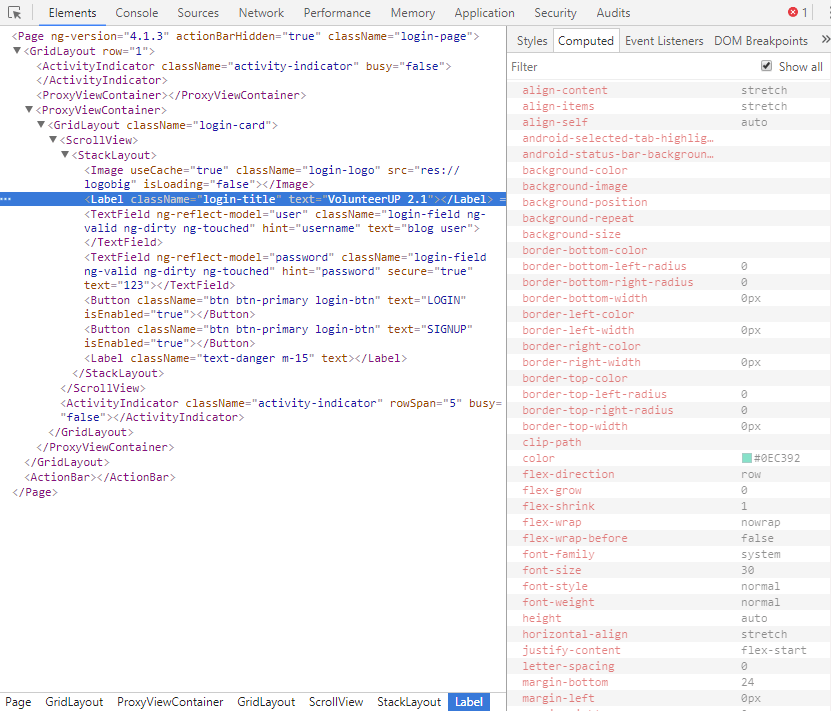

# Chrome DevTools Debugging

The following article is an overview of the features supported in Chrome DevTools when debugging NativeScript applications.

The article will cover the following DevTools features, what they are good for, and how to use them:
-	[Debugger](#debugger)
-   [Console](#console)
-   [Resources](#resources)
-   [Network](#network)
-   [Elements](#elements)
-   [Plugin author's guide](#plugin-authors-guide)

Table of supported features as of NativeScript version **3.3.0**

|                            | Android Chrome DevTools | iOS Safari AppInspector | iOS Chrome DevTools | VSCode Extension |
|----------------------------|-------------------------|-------------------------|---------------------|------------------|
| Debugger                   | ✔ | ✔ | ✔ | ✔ |
| Console                    | ✔ | ✔ | ✔ | ✔ |
| Resources                  | ✔ | ✔ | ✔ | not applicable |
| Network                    | ✔ | ✔ | ✔ | not applicable |
| Elements                   | ✔ | ✘ | ✔ | not applicable |
| Memory Profiling           | ✘ | ✘ | ✘ | not applicable |
| Timeline and CPU Profiling | ✘ | ✔ | ✘ | not applicable |

 > **Note:** To debug on Android: `tns debug android`;  
 To debug on iOS: `tns debug ios --chrome`

-----

## Debugger
Very often you need to reproduce a bug many times to get to the root of the problem. The debugger feature can help you find and diagnose the bugs occurring at runtime using the following techniques:
- [Pause code with breakpoints](https://developers.google.com/web/tools/chrome-devtools/javascript/breakpoints#loc) -  Set a breakpoint so that you can pause your code in the middle of its execution. Once your code is paused (_Figure 1_), you can [step through it (_Figure 2_) to investigate the control flow and property values]( https://developers.google.com/web/tools/chrome-devtools/javascript/reference#stepping)
    
    *Figure 1: A line-of-code breakpoint set on line 29*:
    

    *Figure 2: Stepping over code*:
    

    > **Note:** Sometimes when the code you want to debug executes too early, for example during application initilization, you will have to place a [Line-of-code breakpoint - 'debugger;'](https://developers.google.com/web/tools/chrome-devtools/javascript/breakpoints#debugger) statement in your code and start the debugging process with the `--debug-brk` CLI flag to allow the DevTools enough time to connect and attach before your code is executed.

- [Inspect local and global properties, and variables](https://developers.google.com/web/tools/chrome-devtools/javascript/reference#scope) - While paused on a line of code, use the Scope pane (_Figure 3_) to view and edit the values of properties and variables in the local, closure, and global scopes.  

    *Figure 3: The Scope pane*:
    

    > **Note:** The `Global` object in the context of a NativeScript application is a custom object and contains only a limited subset of the `Window` global object present in a Web application.

- [Watch the values of custom JavaScript expressions](https://developers.google.com/web/tools/chrome-devtools/javascript/reference#watch) - Use the Watch pane (_Figure 4_) to watch the values of custom expressions. You can watch any valid JavaScript expression.

    *Figure 4: The Watch pane*:
    

- [View the current call stack](https://developers.google.com/web/tools/chrome-devtools/javascript/reference#call-stack) - While paused on a line of code, use the Call Stack pane (_Figure 5_) to view the call stack that got you to this point. Click on an entry to jump to the line of code where that function was called. The blue arrow icon represents which function DevTools is currently highlighting.

    *Figure 5: Call stack*:
    

> **Note:** In order to be able to debug code other than JavaScript, the transpiled sources should include [inlined source maps](https://www.typescriptlang.org/docs/handbook/compiler-options.html) for your code (default when developing NativeScript apps with TypeScript).

## Console
The console complements the debugging experience in that it displays messages output from your code, allows you to execute arbitrary JavaScript expressions in the context of the NativeScript runtime, and even save the log to a file. The console feature consists of the following functionalities to make your debugging experience more smooth:
- [Writing to the console](https://developers.google.com/web/tools/chrome-devtools/console/console-write#writing_to_the_console) - Use the `console.log()` method for any basic logging to the console.

- [Autocompleting commands and expressions](https://developers.google.com/web/tools/chrome-devtools/console/console-write#autocomplete) - When you type in the Console, the Console automatically displays an autocomplete dropdown menu (_Figure 6_) of relevant methods that match the text that you have already typed. This includes previous commands that you executed.

    *Figure 6: Console autocomplete:*
    

- [Measure execution times](https://developers.google.com/web/tools/chrome-devtools/console/track-executions#measure_execution_times) - The `time()` method starts a new timer and is very useful to measure how long something took. Pass a string to the method to give the marker a name. When you want to stop the timer, call `timeEnd()` and pass it the same string passed to the initializer. The console then logs the label and time elapsed when the `timeEnd()` method fires.

- Evaluate expressions - Explore the state of any object of your application global scope, or the paused local scope from the Console by evaluating an expression just by typing it.

## Resources
Scripts loaded by the JavaScript Virtual Machine appear in the Sources panel, which you can then debug and place breakpoints in. Besides scripts all other text and image resources found in your application are also listed in the Sources panel, grouped by folder name by default. You can inspect and search inside the contents of xml, html, css, json, and image files. Text and image network responses are also stored there.

## Network
DevTools shows **all*** network requests in the Network panel while the DevTools are open. In the panel you will find information about the requests made, whether they've completed, the response status and data.
- [View a log of requests](https://developers.google.com/web/tools/chrome-devtools/network-performance/reference#requests) - Use the Requests table (_Figure 7_) to view a log of all requests made while DevTools has been open. Clicking or hovering over requests reveals more information about them.

    *Figure 7: The Requests table, outlined in blue*:
    

    > **Note:** Time, Size, and Waterfall metrics may sometimes appear incorrectly or be missing altogether, if a Status Code is available however, that means a response has been received.    

- [View a preview of a response body](https://developers.google.com/web/tools/chrome-devtools/network-performance/reference#preview) - To view a preview of a response body: Click the URL of the request, Under the Name column of the Requests table. Click the Preview tab (_Figure 8_). This tab is mostly useful for viewing images.

    *Figure 8: The Preview tab, outlined in blue*:
    

- [View a response body](https://developers.google.com/web/tools/chrome-devtools/network-performance/reference#response) - To view the response body to a request: Click the URL of the request, under the Name column of the Requests table. Click the Response tab (_Figure 9_).

    *Figure 9: The Response tab, outlined in blue*:
    

- [View HTTP headers](https://developers.google.com/web/tools/chrome-devtools/network-performance/reference#headers) - To view HTTP header data about a request: Click the URL of the request, under the Name column of the Requests table. Click the Headers tab (_Figure 10_).

    *Figure 10: The Headers tab, outlined in blue*:
    

- [View query string parameters](https://developers.google.com/web/tools/chrome-devtools/network-performance/reference#query-string) - To view the query string parameters of a URL in a human-readable format: Open the Headers tab for the request you're interested in. Go to the Query String Parameters section.

 > **Note:** *This is currently available for the built-in [http module](). For third-party modules that do network requests, additional code must be implemented to populate the Network Tab. See [Plugin author's guide](#plugin-authors-guide) for details on how to do it for your plugin.

## Elements
The Elements panel in DevTools displays information about the current view tree, the attributes of each individual child, and its computed styles.
- Inspect the view tree - The DOM tree view (_Figure 11_) shows the current state of the tree; it may not match the XML that was originally loaded for different reasons.

    *Figure 11: The DOM tree view of a NativeScript application*:
    

- View node modifications - Changes made to the view tree through code will be reflected immediately in the Elements panel. Adding, removing child views, navigating to another page, or changing view properties are some of the events that trigger an update.

- Live edit attributes - Examine and add, edit, or remove the current element's attributes. 

    - To add a new attribute: Right-click the element. Select add attribute. Set the attribute as a text: `my-custom-attr="42"`. Press Enter.
    
    - To remove an attribute: Click the element. Double-click the attribute text, select the text value, and press Backspace/Delete.

    - To change the value of an attribute: Click the element. Hover over an attribute and right-click it. Select "Edit attribute", edit accordingly, and press Enter.

- Delete a child node - To delete a DOM node: Open the more (`...` to the left of a selected DOM node) actions menu and select Delete Node, or press the Delete key.

## Plugin author’s guide
Writing plugins is a great way to give back to the community by making application development ever easier by abstracting complex logic through a simple interface. What is even better is when your plugin can integrate almost seamlessly with the expanding arsenal of debugging tools provided by the platform. Following are the optional requirements and interfaces your plugin should comply to, to have your plugin's components/data shown in the respective DevTools panels.
-	Elements panel (UI plugins) - The following content concerns only plugin authors who wrap and expose native Android/iOS views in their work. 
    If you are a plugin author, or plan to be one, you can either:

    - A: start off with a nativescript plugin template, which provides you with an already well-established structure to wrap native UI views in. To get started head over to the official seed's repository and follow the README instructions - https://github.com/NativeScript/nativescript-plugin-seed

    - B: extend the `tns-core-modules`'s [View](http://docs.nativescript.org/api-reference/modules/_ui_core_view_.html) base class. Detailed information and tutorial on doing that coming soon!


-	Network requests in plugins - **Note**: __The following content concerns only plugin authors who wrap and expose **Android** (Network agent in DevTools not yet supported with a public API in the iOS runtime) http functionalities.__
    To make your http functionality debuggable, there are callbacks you need to call at certain times of the lifecycle of the network request, following a [specific protocol](https://chromedevtools.github.io/devtools-protocol/tot/Network/). For your convenience we've exposed callbacks and [TypeScript interfaces](https://github.com/NativeScript/NativeScript/blob/8f621a0df0f5c5660ed784944470e47bd6133825/tns-core-modules/debugger/debugger.ts#L48) to facilitate sending information to the Network agent.

    - Immediatelly before making the request:
        
        Check if the `global.__inspector` object is available, and whether the DevTools are connected:
        ```JavaScript
        if (global.__inspector && global.__inspector.isConnected) { .. }
        ```
        Build a [RequestData-compliant](https://github.com/NativeScript/NativeScript/blob/8f621a0df0f5c5660ed784944470e47bd6133825/tns-core-modules/debugger/debugger.ts#L56) object, as declared in the `debugger module`. `RequestData` contains the minimum subset of properties needed to display request entries in the Network panel.
        Finally call to the runtime-exposed callback:
        ```JavaScript
        global.__inspector.requestWillBeSent(requestData);
        ```
    - When a response is received:

        Check if the `global.__inspector` object is available, and whether the DevTools are connected, as shown above.
        Build a [ResponseData-compliant](https://github.com/NativeScript/NativeScript/blob/8f621a0df0f5c5660ed784944470e47bd6133825/tns-core-modules/debugger/debugger.ts#L74) object, as declared in the `debugger module`. `ResponseData` contains the minimum subset of properties needed to display the response for a completed request.

        Build a [LoadingFinishedData-compliant](https://github.com/NativeScript/NativeScript/blob/8f621a0df0f5c5660ed784944470e47bd6133825/tns-core-modules/debugger/debugger.ts#L87) object, as declared in the `debugger module`. The object notifies the Network agent that a request has completed, as well as the time spent.

        Build a [SuccessfulRequestData-compliant](https://github.com/NativeScript/NativeScript/blob/8f621a0df0f5c5660ed784944470e47bd6133825/tns-core-modules/debugger/debugger.ts#L81) object, as declared in the `debugger module`. The object contains the response data, in a string format, the Id of the original request the response data corresponds to, and information whether the content should be base64-encoded, or not. 

        Finally call the following runtime-exposed callbacks:
        ```JavaScript
        global.__inspector.responseReceived(responseData);
        global.__inspector.loadingFinished({ requestId: requestIdStr, timestamp: getTimeStamp() });
        global.__inspector.dataForRequestId(successfulRequestData);
        ``` 

-	Debugging typescript-transpiled plugins - In order to debug your TypeScript plugin based on the original sources, and not the transpiled JS, it is enough to edit the respective `tsconfig.json` to output sources with inlined maps. That will ensure that the TypeScript sources will also show in the Sources pane, and allow you to debug it. Don't forget to transpile the sources without source maps prior to publishing the plugin.

## Credits
> Portions of this page are modifications based on work created and [shared by Google](https://developers.google.com/terms/site-policies) and used according to terms described in the [Creative Commons 3.0 Attribution License](https://creativecommons.org/licenses/by/3.0/).
 

## See also
 - [Building plugins]()
 - [Debugging NativeScript applications]()
