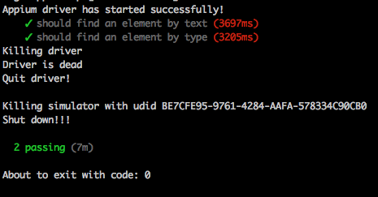
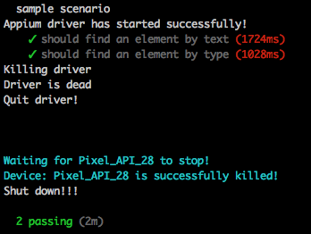

# Getting Started

Before you continue, make sure you have reviewed the [Prerequisites](#prerequisites) and have executed the steps to [setup your environment for testing with Appium](#environment-setup).


The following steps will guide you through the process of setting up your project for e2e testing and running your first test.

## Project Setup

* Add the nativescript-dev-appium plugin as a *devDependency* to your project:

```shell
$ npm install -D nativescript-dev-appium
```

> After completion of the installation, the plugin should have added an `e2e` folder containing predefined configs and samples.

### Folder Structure

After you've setup your project for E2E testing, it should have a structure similar to:

        my-app
        ├── app
        ├── e2e
            ├── config
                ├── appium.capabilities.json
                ├── mocha.opts
            ├── sample.e2e-spec.ts
            ├── setup.ts
            ├── tsconfig.json
        ├── ...
        ├── package.json
        ├── tsconfig.json

> To avoid any incompatibilities between the source of *e2e* tests (ES6) and the source of the application (ES5), we recommend to exclude the *e2e* folder from the application's *tsconfig.json* file: `exclude": [ "e2e" ]`.

Here is more info about the E2E test specific files and configurations:

|File                           |Purpose|
|:-----------------------------|:-------------------|
|config/appium.capabilities.json|Contains predefined configurations for test execution.|
|config/mocha.opts              |A default mocha configuration file.                   |
|sample.e2e-spec.ts             |Contains a predefined ready-to-execute sample tests of the default [hello-world-ts](https://github.com/NativeScript/template-hello-world-ts) template.|
|setup.ts                       |Defines the `before` and `after` test execution hooks responsible to start and stop the [Appium](http://appium.io/) server.|
|tsconfig.json                  |TypeScript compiler configuration file for the `e2e` tests.|

Generated tests are standard [Mocha](http://mochajs.org) tests.

> Note - in case you want to execute image comparision while testing there are two more important folders to have in mind: 
> * `e2e/reports` - it is created during test execution and stores the actual images from comparison
> * `e2e/resources` - this folder aims to store the expected images for comparison

## Running Your First Test

Before running the tests you will have to build your app for the platform you want to run the tests for. In the example below I'll build my app for both platforms. Navigate to your app main folder and run the following commands to build your app for iOS and Android:

```shell
$ tns build android
$ tns build ios
```

The command that will run the tests should specify the targeted capabilities configuration using the `runType` option as shown below. This way a capabilities configuration will be selected from the [capabilities](#custom-appium-capabilities) configuration file.
> Appium capabilities are a JSON object describing how to run your test - what plarform to use, which version, where your app is located, etc. Read more about [capabilities in the official Appium documentaion](http://appium.io/docs/en/writing-running-appium/caps/).

> To understand more about how to create custom capabilities, you can refer to the [Customization section in this documentation]().


```
$ npm run e2e -- --runType <capability-name>
```

where `<capability-name>` is defined in `<your-app-folder>/e2e/config/appium.capabilities.json`. You can choose any of the predefined ones or [create new ones]((#custom-appium-capabilities)) before running the tests. This will asure you that you are executing the tests against the platform and version you want to.

For Android, make sure that the `deviceName` and `avd` match the name of an existing AVD. We recommend using underscrores as separators in the name i.e. `Pixel_API_28`.

For iOS, you also need to make sure that the `deviceName` and `platformVersion` are configured in the Simulator app.

Here is the result of a successful run on iOS:



... and on Android:



## Summary

Let's summarize the steps we executed to create a project, set it up for e2e testing and run a sample test:

```
// Create an app and follow the steps and create a Hello World TypeScript app
$ tns create appium-demo

// Navigate to the app folder
$ cd appium-demo

// Install the nativescript-dev-appium plugin as a dev dependency and configure the project for e2e testing
$ npm install -D nativescript-dev-appium

// Build for iOS and/or Android
$ tns build ios
$ tns build android

// Run the sample tests for Android and/or iOS
// Make sure the used capabilities are defined in `<your-app-folder>/e2e/config/appium.capabilities.json`
$ npm run e2e -- --runType android25
$ npm run e2e -- --runType sim.iPhone8.iOS110

```

## What's Next?

Now that you have a basic idea how to setup your project for e2e testing you're ready to deep dive into more advanced topics. Take a look at the [nativescript-dev-appium features]() available including how to perform different gestures, actions, find elements, etc. in your tests.
