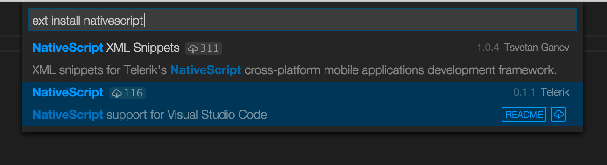
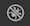
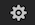
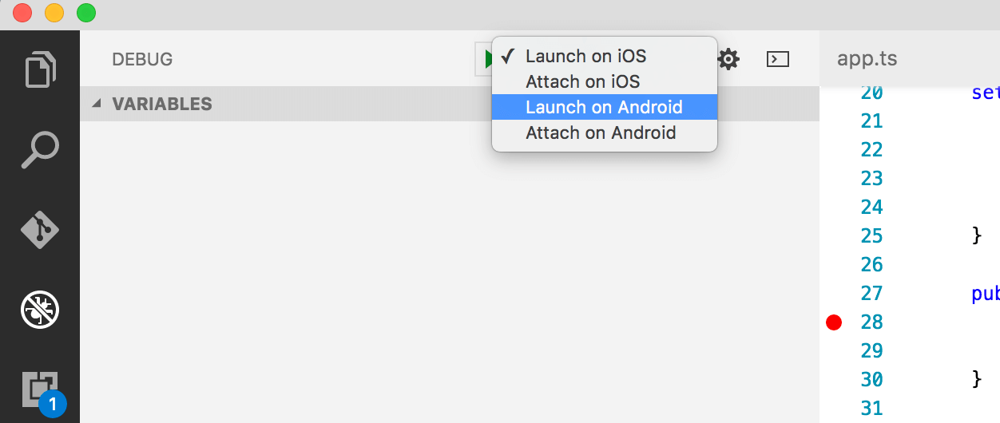
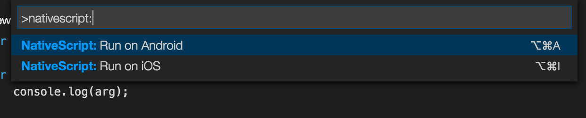
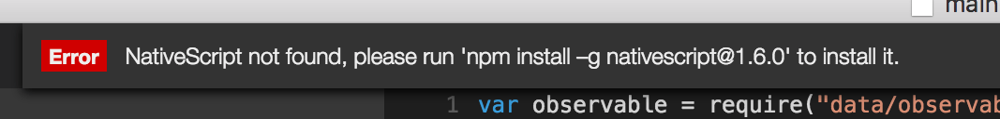

# NativeScript Extension for Visual Studio Code

## Installation

To install the [NativeScript extension for Visual Studio Code](https://marketplace.visualstudio.com/items?itemName=Telerik.nativescript) open the Command Palette (`F1` or `Cmd+Shift+P`) and run `Extensions: Install Extension` command, then search for 'NativeScript' and choose it from the list.

After the installation completes, the extension appears in the list of installed extensions. You can see it if you run `Extensions: Show Installed Extensions` command from the Command Palette.

## Debugging

Open your application root folder, created with `tns create` command, in Visual Studio Code.

### Generate launch configurations

Click the debugging icon  in the View bar, and then click the gear icon  to choose the NativeScript debug environment. A `launch.json` file should be generated in your `.vscode` folder, containing 4 default launch configurations - `Launch on iOS`, `Attach on iOS`, `Launch on Android` and `Attach on Android`. You can always add your own debug configuration or alter the existing ones just by editing the `launch.json` file.

### Launch an application with the debugger

Choose one of the launch configurations (e.g., `Launch on iOS`) and press the `Start Debugging` button next to the menu. This will trigger a NativeScript CLI command which will build, deploy and run your app in an iOS device or emulator and attach the Visual Studio Code debugger. If you want the execution to stop on the first JavaScript/TypeScript statement set the `stopOnEntry` flag to `true` in  your `launch.json` configuration.

Once the debugger is attached you can inspect scope variables, set breakpoints, watch expressions, execute code while the app is paused on a breakpoint etc. You can find more information about the debugging support in Visual Studio Code in the [VS Code Debugging Guide](https://code.visualstudio.com/docs/editor/debugging).

What's more awesome is that the default launch configurations take advantage of the NativeScript CLI watch functionallity. Therefore, while the VS Code debugger is attached, every change to the app's source will trigger a livesync (after saving the altered file) which will update and restart the target application while the VS Code debugger is automatically reattached to the new app instance preserving all breakpoints and watched expressions. The watching feature can be disabled by setting the `watch` flag to `false` in your `launch.json` configurations.

### Attach the debugger to an already running app

If you have an already running NativeScript application in your emulator or device, you can attach the VS Code debugger to it, without even restarting the app. Just select the desired attach configuration through the debug configuration menu and press the start button.

### Debug TypeScript

If you are writing your app in TypeScript, you have fully functional debugging support in Visual Studio Code. To debug TypeScript, make sure the TS compiler is producing source maps by setting `"sourceMap": true"` in your `tsconfig.json`.

> Using the [TypeScript plugin for NativeScript](https://github.com/NativeScript/nativescript-dev-typescript) is strongly recommended instead of manually setting up the TypeScript compiler options and build tasks. The plugin handles the creation of all the configuration settings and guarantees smooth integration with Visual Studio Code.

### Supply additional arguments to the debug command

Under the hood, starting a particular debug configuration executes the `tns debug` command with various arguments. You can append additional arguments by supplying them in the `tnsArgs` property of a debug configuration definition in `launch.json`. For example, if you add `"tnsArgs": "--log=trace"` in the `Launch on iOS` configuration, in the background VS Code will execute the `tns debug ios --no-client --log=trace` command, which will give you more verbose information in the Debug Console.

### Turn on diagnostic logging

If the `diagnosticLogging` flag for a particular debug configuration in `launch.json` file is set to `true` (its default value is `false`), diagnostic messages will be logged on the debugger console after attaching the debugger to the NativeScript application. This is useful for rough debugging of the extension itself, because all sent/received messages that are part of the communication between the frontend and the backend are logged.

## Use NativeScript-specific commands

Type `nativescript` in the Command Palette and you will see all NativeScript-specific commands. Currently there are only two of them but the list will grow in the future.

The `Run on Android/iOS` command is the equivalent of `tns run` in the NativeScript CLI. It lets you build, deploy and run your app on an emulator/device directly from Visual Studio Code.

## NativeScript CLI version detection

The extension depends on a globally installed NativeScript CLI. It will show an error message if it can't find it.

> The extension requires a specific NativeScript CLI version and if you have another version installed, you will see a warning message. The extension is likely to work with the unsupported version but it is recommended to update the NativeScript CLI or the VS Code extension.

## Known issues
 * [The variables pane on Android doesn't work](https://github.com/NativeScript/nativescript-vscode-extension/issues/21).
 * [In order to be able to debug, the opened workspace must be the app root folder.](https://github.com/NativeScript/nativescript-vscode-extension/issues/104)

