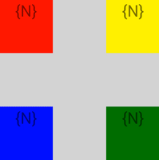

# Animation examples

This article contains examples demonstrating how to animate the animatable view properties. A full list of all animatable properties and a detailed explanation of the animations API is presented [here](./animation.md).

The full source code for all samples is located [here](https://github.com/NativeScript/animation-demo).

## Animated opacity


``` JavaScript
view.animate({
    opacity: 0,
    duration: 3000
});
```
``` TypeScript
view.animate({
    opacity: 0,
    duration: 3000
});
```
``` CSS
.view {
	animation-name: opacity;
	animation-duration: 3;
}
@keyframes opacity {
	from { opacity: 1; }
	to { opacity: 0; }
}
```

[Try this in the NativeScript Playground](https://play.nativescript.org/?template=play-tsc&id=q9nY9l)

## Animate background color


``` JavaScript
view.animate({
    backgroundColor: new colorModule.Color("#3D5AFE"),
    duration: 3000
});
```
``` TypeScript
view.animate({
    backgroundColor: new colorModule.Color("#3D5AFE"),
    duration: 3000
});
```
``` CSS
.view {
	animation-name: backgroundColor;
	animation-duration: 3;
}
@keyframes backgroundColor {
	from { background-color: white; }
	to { background-color: #3D5AFE; }
}
```

[Try this in the NativeScript Playground](https://play.nativescript.org/?template=play-tsc&id=aLjBQg)

## Animate position


``` JavaScript
view.animate({
    translate: { x: 100, y: 100},
    duration: 3000
});
```
``` TypeScript
view.animate({
    translate: { x: 100, y: 100},
    duration: 3000
});
```
``` CSS
.view {
	animation-name: translate;
	animation-duration: 3;
}
@keyframes translate {
	from { transform: translate(0, 0); }
	to { transform: translate(100, 100); }
}
```

[Try this in the NativeScript Playground](https://play.nativescript.org/?template=play-tsc&id=egSanf)

## Animate scale


``` JavaScript
view.animate({
    scale: { x: 2, y: 2},
    duration: 3000
});
```
``` TypeScript
view.animate({
    scale: { x: 2, y: 2},
    duration: 3000
});
```
``` CSS
.view {
	animation-name: scale;
	animation-duration: 3;
}
@keyframes scale {
	from { transform: scale(1, 1); }
	to { transform: scale(2, 2); }
}
```

[Try this in the NativeScript Playground](https://play.nativescript.org/?template=play-tsc&id=4Ni5sU)

## Animate rotate


``` JavaScript
view.animate({
    rotate: 360,
    duration: 3000
});
```
``` TypeScript
view.animate({
    rotate: 360,
    duration: 3000
});
```
``` CSS
.view {
	animation-name: rotate;
	animation-duration: 3;
}
@keyframes rotate {
	from { transform: rotate(0deg); }
	to { transform: rotate(360deg); }
}
```

[Try this in the NativeScript Playground](https://play.nativescript.org/?template=play-tsc&id=2vpfgV)

## Chaining animations with AnimationSet


``` JavaScript
var definitions = new Array();
definitions.push({ target: view1, translate: { x: 200, y: 0 }, duration: 3000 });
definitions.push({ target: view2, translate: { x: 0, y: 200 }, duration: 3000 });
definitions.push({ target: view3, translate: { x: -200, y: 0 }, duration: 3000 });
definitions.push({ target: view4, translate: { x: 0, y: -200 }, duration: 3000 });
var playSequentially = true;
var animationSet = new animationModule.Animation(definitions, playSequentially);
animationSet.play().then(function () {
    console.log("Animation finished");
})
    .catch(function (e) {
    console.log(e.message);
});
```
``` TypeScript
var definitions = new Array<animationModule.AnimationDefinition>();
definitions.push({target: view1, translate: {x: 200, y: 0}, duration: 3000 });
definitions.push({target: view2, translate: {x: 0, y: 200}, duration: 3000 });
definitions.push({target: view3, translate: {x: -200, y: 0}, duration: 3000 });
definitions.push({target: view4, translate: {x: 0, y: -200}, duration: 3000 });
var playSequentially = true;
var animationSet = new animationModule.Animation(definitions, playSequentially);
animationSet.play().then(() => {
    console.log("Animation finished");
})
.catch((e) => {
    console.log(e.message);
});
```

## Animating multiple views



``` JavaScript
var definitions = new Array();
var a1 = {
    target: view1,
    translate: { x: 200, y: 0 },
    duration: 3000
};
definitions.push(a1);
var a2 = {
    target: view2,
    translate: { x: 0, y: 200 },
    duration: 3000
};
definitions.push(a2);
var a3 = {
    target: view3,
    translate: { x: -200, y: 0 },
    duration: 3000
};
definitions.push(a3);
var a4 = {
    target: view4,
    translate: { x: 0, y: -200 },
    duration: 3000
};
definitions.push(a4);
var animationSet = new animationModule.Animation(definitions);
animationSet.play().then(function () {
    console.log("Animation finished");
})
    .catch(function (e) {
    console.log(e.message);
});
```
``` TypeScript
var definitions = new Array<animationModule.AnimationDefinition>();
var a1: animationModule.AnimationDefinition = {
    target: view1,
    translate: {x: 200, y: 0},
    duration: 3000
};
definitions.push(a1);

var a2: animationModule.AnimationDefinition = {
    target: view2,
    translate: {x: 0, y: 200},
    duration: 3000
};
definitions.push(a2);

var a3: animationModule.AnimationDefinition = {
    target: view3,
    translate: {x: -200, y: 0},
    duration: 3000
};
definitions.push(a3);

var a4: animationModule.AnimationDefinition = {
    target: view4,
    translate: {x: 0, y: -200},
    duration: 3000
};
definitions.push(a4);

var animationSet = new animationModule.Animation(definitions);

animationSet.play().then(() => {
    console.log("Animation finished");
})
.catch((e) => {
    console.log(e.message);
});
```

[Try this in the NativeScript Playground](https://play.nativescript.org/?template=play-tsc&id=rgm744)

## Reusing animations


``` JavaScript
var animation1 = view.createAnimation({ opacity: 0 });
var animation2 = view.createAnimation({ opacity: 1 });
animation1.play()
    .then(function () { return animation2.play(); })
    .then(function () { return animation1.play(); })
    .then(function () { return animation2.play(); })
    .then(function () { return animation1.play(); })
    .then(function () { return animation2.play(); })
    .then(function () {
    console.log("Animation finished");
})
    .catch(function (e) {
    console.log(e.message);
});
```
``` TypeScript
var animation1 = view.createAnimation({opacity: 0});
var animation2 = view.createAnimation({opacity: 1});

animation1.play()
.then(()=>animation2.play())
.then(()=>animation1.play())
.then(()=>animation2.play())
.then(()=>animation1.play())
.then(()=>animation2.play())
.then(() => {
    console.log("Animation finished");
})
.catch((e) => {
    console.log(e.message);
});
```

## Slide-in effect


``` JavaScript
var item = new imageModule.Image();
item.src = "~/res/icon_100x100.png";
item.width = 90;
item.height = 90;
item.style.margin = "5,5,5,5";
item.translateX = -300;
item.opacity = 0;
item.on("loaded", function (args) {
    args.object.animate({ translate: { x: 0, y: 0 }, opacity: 1 });
});
wrapLayout.addChild(item);
```
``` TypeScript
var item = new imageModule.Image();
item.src = "~/res/icon_100x100.png";
item.width = 90;
item.height = 90;
item.style.margin = "5,5,5,5";
item.translateX = -300;
item.opacity = 0;
item.on("loaded", (args: observable.EventData) => {
    (<viewModule.View>args.object).animate({translate: { x: 0, y: 0 }, opacity: 1});
});
wrapLayout.addChild(item);
```

## Infinite animations


``` JavaScript
animationSet = new animationModule.Animation([{
        target: view,
        rotate: 360,
        duration: 3000,
        iterations: Number.POSITIVE_INFINITY,
        curve: view.ios ? UIViewAnimationCurve.UIViewAnimationCurveLinear : new android.view.animation.LinearInterpolator
    }]);
animationSet.play().catch(function (e) {
    console.log("Animation stopped!");
});
// Call animationSet.cancel() to stop it;
```
``` TypeScript
animationSet = new animationModule.Animation([{
    target: view,
    rotate: 360,
    duration: 3000,
    iterations: Number.POSITIVE_INFINITY,
    curve: view.ios ? UIViewAnimationCurve.UIViewAnimationCurveLinear : new android.view.animation.LinearInterpolator
}]);
animationSet.play().catch((e) => {
    console.log("Animation stopped!");
});
// Call animationSet.cancel() to stop it;
```

## Rotation using originX and originY
__Example 5: Rotating a view around its center. Center of view is changed via `originX` and `originY` properties.__


``` JavaScript
const view = page.getViewById("myView");

view.originX = 1; // default 0.5 (center), 0 is most left, 1 is most right
view.originY = 0; // default 0.5 (middle), 0 is top, 1 is bottom
view.animate({
	rotate: 360, // will take into account originX and originY
    duration: 1000
}).then(() => {
    view.originX = 0;
    view.originY = 1;
    view.rotate = 0;

    view.animate({
        rotate: -360,
        duration: 1000
    })
})
```
``` TypeScript
const view = page.getViewById("myView");

view.originX = 1; // default 0.5 (center), 0 is most left, 1 is most right
view.originY = 0; // default 0.5 (middle), 0 is top, 1 is bottom
view.animate({
	rotate: 360, // will take into account originX and originY
    duration: 1000
}).then(() => {
    view.originX = 0;
    view.originY = 1;
    view.rotate = 0;

    view.animate({
        rotate: -360,
        duration: 1000
    })
})
```


