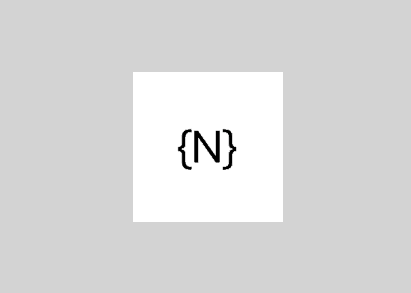

# Animations

One of the ways to improve the attractiveness of your application is by adding animations. NativeScript exposes a simple and easy, but powerful enough API to allow animating almost every native element in your application.

For your convenience, we expose two ways of creating animations:

- [Declarative](./animation-css.md) - you will use the easy and familiar CSS3 animations API
- [Imperative](./animation-code.md) - take full control of any animation by calling animation methods directly with code

[Here](./animation-examples.md) you will find a detailed set of examples demonstrating the different animations that can be achieved with NativeScript.

##Hello world example

In __Example 1__ we will change the background color of a button from "red" to "green". You can use JavaScript or TypeScript code to do the following:

__Example 1: Changing background color animation with code.__



``` JavaScript
// Import color module
var colorModule = require("color");

view.backgroundColor = new colorModule.Color("red");
view.animate({ backgroundColor: new colorModule.Color("green"), duration: 2000 });
```
``` TypeScript
// Import color module
import { Color } from 'color';

view.backgroundColor = new Color("red");
view.animate({ backgroundColor: new Color("green"), duration: 2000 });
```

[Try this animation in the NativeScript Playground](https://play.nativescript.org/?template=play-tsc&id=RE7NqF&v=18)

As _Example 2_ shows, you can express the same animation in CSS with the following definition:

__Example 2: Changing background color animation with CSS.__

``` CSS
@keyframes example {
    from { background-color: red; }
    to { background-color: green; }
}
.view {
    animation-name: example;
    animation-duration: 2s;
    animation-fill-mode: forwards;
}
```
``` XML
<!-- Apply CSS class to element to trigger CSS animation -->
<Label class="view" text="{N}"></Label>
```

> CSS animations apply with lower precedence, like any other CSS settings, so any local values set in your element will cancel the animation.

[Try this animation in the NativeScript Playground](https://play.nativescript.org/?template=play-tsc&id=RE7NqF&v=19)

NativeScript lets you animate the following properties:

- **opacity**
- **backgroundColor**
- **translateX** and **translateY**
- **scaleX** and **scaleY**
- **rotate**

In every animation, you can control the following properties:

- **duration**: The length of the animation.
- **delay**: The amount of time to delay starting the animation.
- **iterations**: Specifies how many times the animation should be played. 
- **timing function**: The speed curve of the animation. Available options are defined below.
- **originX** and **originY**: The X and Y components of the origin point around which the view will be transformed.

## Animation curves

By default, an animation moves with a linear speed without acceleration or deceleration. This might look unnatural and different from the real world where objects need time to reach their top speed and can't stop immediately. The animation curve (sometimes called an easing function) is used to give animations an illusion of inertia. It controls the animation speed by modifying the fraction of the duration. NativeScript comes with a number of predefined animation curves.

- **linear**: The simplest animation curve is linear. It maintains a constant speed while the animation is running:


- **Ease-in**: The ease-in curve causes the animation to begin slowly, and then speed up as it progresses.


- **Ease-out**: An ease-out curve causes the animation to begin quickly, and then slow down as it completes.


- **Ease-in-out**: An ease-in ease-out curve causes the animation to begin slowly, accelerate through the middle of its duration, and then slow again before completing.


- **Spring**: A spring animation curve causes an animation to produce a spring (bounce) effect.


In NativeScript, the animation curve is represented by the AnimationCurve enumeration and can be specified with the curve property of the animation. In CSS, the animation curve is defined by using the animation-timing-function property (see __Example 3__):

__Example 3: How to customize the animation timing function__

``` JavaScript
var enums = require("ui/enums");
view.animate({
	translate: { x: 0, y: 100},    
	duration: 1000,
	curve: enums.AnimationCurve.easeIn
});
```
``` TypeScript
import {AnimationCurve} from "ui/enums";
view.animate({
	translate: { x: 0, y: 100},    
	duration: 1000,
	curve: AnimationCurve.easeIn
});
```
``` CSS
.view {
	animation-name: example;
	animation-duration: 1;
	animation-timing-function: ease-in;
   animation-fill-mode: forwards;
}
@keyframes example {
	from { transform: translate(0, 0); }
	to { transform: translate(0, 100); }
}
```

[Experiment with the different animation timing functions in the NativeScript Playground](https://play.nativescript.org/?template=play-tsc&id=RE7NqF&v=16)

It is easy to create your own animation curve by passing in the X and Y components of two control points of a cubic Bezier curve (as shown in __Example 4__). Using Bezier curves is a common technique to create smooth curves in computer graphics and they are widely used in vector-based drawing tools. The values passed to the cubicBezier method control the curve shape. The animation speed will be adjusted based on the resulting path.

For help finding the `cubicBezier` values you need for your custom animation timing function, use the visual tools on [cubic-bezier.com](http://cubic-bezier.com). Once you find an animation path you like, simply copy and paste the cubic bezier values and paste them in the `AnimationCurve.cubicBezier` function. There should be four numbers (X,Y coordinates for each of the two points in the animation).

__Example 4: How to create own animation curve via cubic Bezier__


``` JavaScript
var enums = require("ui/enums");

view.animate({
    translate: { x: 0, y: 100 },
    duration: 1000,
    curve: enums.AnimationCurve.cubicBezier(0.1, 0.1, 0.1, 1)
});
```
``` TypeScript
import {AnimationCurve} from "ui/enums";
view.animate({
    translate: { x: 0, y: 100 },
    duration: 1000,
    curve: AnimationCurve.cubicBezier(0.1, 0.1, 0.1, 1)
});
```
``` CSS
.view {
	animation-name: example;
	animation-duration: 1;
	animation-timing-function: cubicBezier(0.1, 0.1, 0.1, 1);
	animation-fill-mode: forwards;
}
```


More detailed examples are available on the [Animation Examples](./animation-examples.md) page.

## Rotation using originX and originY

To create more complex animations, we might need to change the origin point around which the selected view will be transformed. This can be achieved using [`originX`](https://docs.nativescript.org/api-reference/classes/_ui_core_view_.view#originx) and [`originY`](https://docs.nativescript.org/api-reference/classes/_ui_core_view_.view#originy) properties of `View`.

__Example 5: Rotating a view around its center. Center of view is changed via `originX` and `originY` properties.__

``` JavaScript
view.originX = 1; // default 0.5 (center), 0 is most left, 1 is most right
view.originY = 0.5; // default 0.5 (middle), 0 is top, 1 is bottom
view.animate({
	rotate: 360, // will take into account originX and originY
    duration: 1000
});
```
``` TypeScript
view.originX = 1; // default 0.5 (center), 0 is most left, 1 is most right
view.originY = 0.5; // default 0.5 (middle), 0 is top, 1 is bottom
view.animate({
	rotate: 360, // will take into account originX and originY
    duration: 1000
});
```

> Note: The properties `originX` and `originY` are JavaScript properties and can be assigned via code-behind only via a given `View` reference. We can still use them along with CSS animations, but the values for `originX` and `originY` must be set in the code-behind logic.
