# User Interface Widget Components

NativeScript ships with a set of user interface [`views`](/api-reference/modules/_ui_core_view_.html) (also known as widgets) which you can use to build the user interface of a mobile application. Most of these views wrap the corresponding native view for each platform while providing a common API for working with it. For example, the `Button` view renders an [`android.widget.Button`](http://developer.android.com/reference/android/widget/Button.html) on Android and [`UIButton`](https://developer.apple.com/library/ios/documentation/UIKit/Reference/UIButton_Class/) on iOS.

Defining the layout of the application is also an important part of the application development. For more information about the different layout containers that are available in NativeScript, see [The NativeScript Layout System]().

> **TIP:** You can access the underlying native widget for each view at runtime using the `nativeView` property:
>
>  `<view>.nativeView`
>
> Accessing the native widgets might be useful when you want to use some platform-specific functionalities of the widget. You can find information about the underlying native component for each view below.

Each component comes with a set of common methods available from the extended `View` class.
Dedicated documentation section covering the different measuring and position methods can be found [here](#view-class-common-methods).

## Button

The [Button]() [Button]() widget provides a standard button widget that reacts to a `tap` event.

**Native Component**

| Android               | iOS      |
|:----------------------|:---------|
| [android.widget.Button](http://developer.android.com/reference/android/widget/Button.html) | [UIButton](https://developer.apple.com/library/ios/documentation/UIKit/Reference/UIButton_Class/) |

## Label

The [Label]() [Label]() widget provides a text label that shows read-only text.

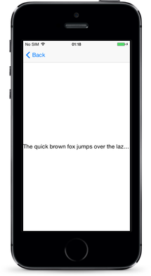

**Native Component**

| Android               | iOS      |
|:----------------------|:---------|
| [android.widget.TextView](http://developer.android.com/reference/android/widget/TextView.html) | [UILabel](https://developer.apple.com/library/ios/documentation/UIKit/Reference/UILabel_Class/) |

## TextField

The [TextField]() [TextField]() widget provides an editable **single-line** text field.

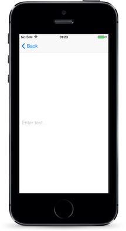

**Native Component**

| Android               | iOS      |
|:----------------------|:---------|
| [android.widget.EditText](http://developer.android.com/reference/android/widget/EditText.html) | [UITextField](https://developer.apple.com/library/ios/documentation/UIKit/Reference/UITextField_Class/) |

## TextView

The [TextView]() [TextView]() widget provides an editable **multi-line** text view.

You can use it to show multi-line text and implement text editing.

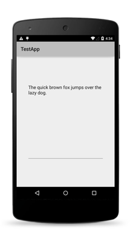

**Native Component**

| Android               | iOS      |
|:----------------------|:---------|
| [android.widget.EditText](http://developer.android.com/reference/android/widget/EditText.html) | [UITextView](https://developer.apple.com/library/ios/documentation/UIKit/Reference/UITextView_Class/) |

## SearchBar

The [SearchBar]() [SearchBar]() widget provides a user interface for entering search queries and submitting requests to the search provider.

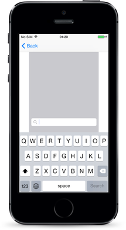

**Native Component**

| Android               | iOS      |
|:----------------------|:---------|
| [android.widget.SearchView](http://developer.android.com/reference/android/widget/SearchView.html) | [UISearchBar](https://developer.apple.com/library/ios/documentation/UIKit/Reference/UISearchBar_Class/) |

## Switch

The [Switch]() [Switch]() widget provides a two-state toggle switch from which you can choose between two options.

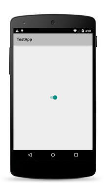

**Native Component**

| Android               | iOS      |
|:----------------------|:---------|
| [android.widget.Switch](http://developer.android.com/reference/android/widget/Switch.html) | [UISwitch](https://developer.apple.com/library/ios/documentation/UIKit/Reference/UISwitch_Class/) |

## Slider

The [Slider]() [Slider]() widget provides a slider that you can use to pick a numeric value within a configurable range.

**Native Component**

| Android                | iOS      |
|:-----------------------|:---------|
| [android.widget.SeekBar](http://developer.android.com/reference/android/widget/SeekBar.html) | [UISlider](https://developer.apple.com/library/ios/documentation/UIKit/Reference/UISlider_Class/) |

## Progress

The [Progress]() [Progress]() widget is a visual bar indicator of a progress in a operation. It shows a bar representing the current progress of the operation.

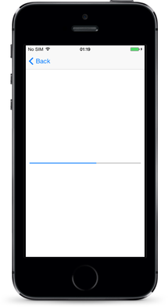

**Native Component**

| Android                | iOS      |
|:-----------------------|:---------|
| [android.widget.ProgressBar](http://developer.android.com/reference/android/widget/ProgressBar.html) (indeterminate = false) | [UIProgressView](https://developer.apple.com/library/ios/documentation/UIKit/Reference/UIProgressView_Class/) |

## ActivityIndicator

The [ActivityIndicator]() [ActivityIndicator]() widget is a visual spinner indicator which shows that a task is in progress.

**Native Component**

| Android                | iOS      |
|:-----------------------|:---------|
| [android.widget.ProgressBar](http://developer.android.com/reference/android/widget/ProgressBar.html) (indeterminate = true) | [UIActivityIndicatorView](https://developer.apple.com/library/ios/documentation/UIKit/Reference/UIActivityIndicatorView_Class/) |

## Image

The [Image]() [Image]() widget shows an image. You can load the image from an [`ImageSource`](/api-reference/modules/_image_source_.html) or from a URL.

**Native Component**

| Android                | iOS      |
|:-----------------------|:---------|
| [android.widget.ImageView](http://developer.android.com/reference/android/widget/ImageView.html) | [UIImageView](https://developer.apple.com/library/ios/documentation/UIKit/Reference/UIImageView_Class/) |

## ListView

The [ListView]() [ListView]() shows items in a vertically scrolling list. You can set an [`itemTemplate`](/api-reference/modules/_ui_list_view_.knowntemplates.html) to specify how each item in the list should be displayed.

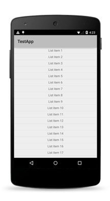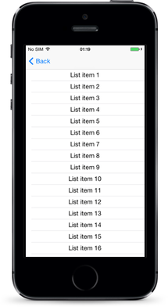

**Native Component**

| Android                | iOS      |
|:-----------------------|:---------|
| [android.widget.ListView](http://developer.android.com/reference/android/widget/ListView.html) | [UITableView](https://developer.apple.com/library/ios/documentation/UIKit/Reference/UITableView_Class/) |

## HtmlView

The [HtmlView]() [HtmlView]() represents a view with HTML content. Use this component instead of WebView when you want to show just static HTML content.

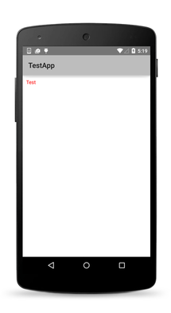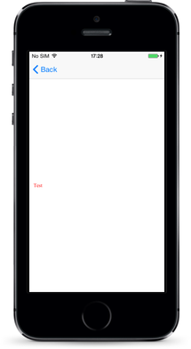

**Native Component**

| Android                | iOS      |
|:-----------------------|:---------|
| [android.widget.TextView](http://developer.android.com/reference/android/widget/TextView.html) | [UITextView](https://developer.apple.com/documentation/uikit/uitextview) |

## WebView

The [WebView]() [WebView]() shows web pages. You can load a page from a URL or by navigating back and forward.

**Native Component**

| Android                | iOS      |
|:-----------------------|:---------|
| [android.webkit.WebView](http://developer.android.com/reference/android/webkit/WebView.html) | [WKWebView](https://developer.apple.com/documentation/webkit/wkwebview) |

## TabView

With the [TabView]() [TabView]() control, you can implement tab navigation.

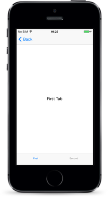

**Native Component**

| Android                | iOS      |
|:-----------------------|:---------|
| [android.support.v4.view.ViewPager](http://developer.android.com/reference/android/support/v4/view/ViewPager.html) | [UITabBarController](https://developer.apple.com/library/ios/documentation/UIKit/Reference/UITabBarController_Class/) |

## SegmentedBar

With the [SegmentedBar]() [SegmentedBar]() control, you can implement discrete selection.

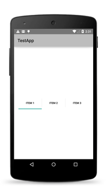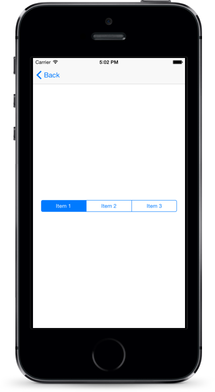

**Native Component**

| Android                | iOS      |
|:-----------------------|:---------|
| [android.widget.TabHost](http://developer.android.com/reference/android/widget/TabHost.html) | [UISegmentedControl](https://developer.apple.com/library/prerelease/ios/documentation/UIKit/Reference/UISegmentedControl_Class/index.html) |

## DatePicker

With the [DatePicker]() [DatePicker]() control, you can pick a date.

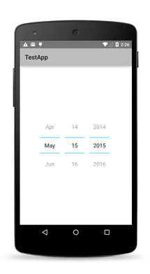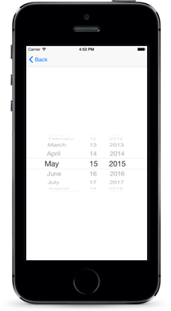

**Native Component**

| Android                | iOS      |
|:-----------------------|:---------|
| [android.widget.DatePicker](http://developer.android.com/reference/android/widget/DatePicker.html) | [UIDatePicker](https://developer.apple.com/library/ios/documentation/UIKit/Reference/UIDatePicker_Class/index.html) |

## TimePicker

With the [TimePicker]() [TimePicker]() widget, you can pick a time.

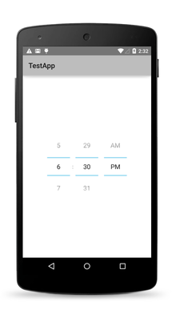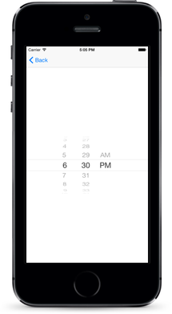

**Native Component**

| Android                | iOS      |
|:-----------------------|:---------|
| [android.widget.TimePicker](http://developer.android.com/reference/android/widget/TimePicker.html) | [UIDatePicker](https://developer.apple.com/library/ios/documentation/UIKit/Reference/UIDatePicker_Class/index.html) |

## ListPicker

With the [ListPicker]() [ListPicker]() widget, you can pick a value from a list.

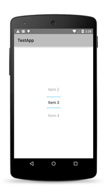

**Native Component**

| Android                | iOS      |
|:-----------------------|:---------|
| [android.widget.NumberPicker](http://developer.android.com/reference/android/widget/NumberPicker.html) | [UIPickerView](https://developer.apple.com/library/prerelease/ios/documentation/UIKit/Reference/UIPickerView_Class/index.html) |

## Dialogs

The [dialogs module]() [dialogs module]() lets you create and show dialog windows.

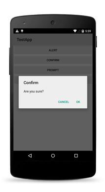

