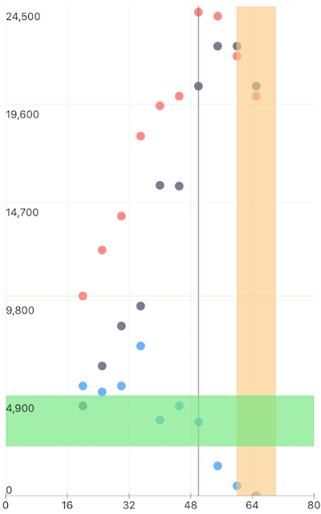

# RadChart Annotations

In this article, you will learn how to use and customize the annotations in **Telerik Chart for NativeScript**.

## Overview

Annotations are visual elements used to highlight certain areas on the plot. They can be used as markers for specific values on the plot. 

**RadChartView** provides support for the following types of annotations:

- : this annotation is visually represented by straight lines across the chart that marks a specific value on the associated .
- : this annotation is visually represented by a band across the chart that marks a specific range on the associated .

You can read from the [Bar Series page]( "Read more about Bar series in chart") how to create a simple chart with BarSeries which we will now extend to include annotations.

## Common Features

Adding annotations to chart can be done through the  property of the chart. Every chart can have any number of annotations. 
 and  have common properties that allows customization of their look.

-  - the id of the axis that this annotation is bound to. This is mandatory property.
-  -  determines if the annotation will be shown or not. Accepts values "true" or "false"
-  - determines if the annotation should be rendered above or bellow the series.
-  - determines the width of the stroked line
-  - determines the color of the annotation
-  - the dash pattern of annotation line.

## Grid Line Annotations

The  represents a vertical or horizontal line that crosses the entire plot area at specific value of the assigned axis. There is a mandatory property **value** that have to be initialized with an appropriate axis value.

### Example
Here is an example that demonstrates how to define three horizontal one vertical grid line annotations assigned to bar series of the chart.  Different set of options determines the visual state and position of annotations and one of the annotations is hidden.

<snippet id='grid-line-annotations'/>

This will produce a page showing a Chart with annotations that will look like:

iOS:

 

Android:

## Plot Band Annotations

The  represents a vertical or horizontal area that crosses the entire plot area. Here is an example that demonstrates how to define a horizontal  in the chart that we have created above. 
There are two additional values that need to be provided along with ,  and  that will determine the range for the annotation. There is one additional property **fillColor** that determines the fill color of the band.

### Example
Here is an example that demonstrates how to define three horizontal one vertical grid line annotations assigned to bar series of the chart.  Different set of options determines the visual state and position of annotations and one of the annotations is hidden.

<snippet id='plot-band-annotations'/>

This will produce a page showing a Chart with annotations that will look like:

iOS:

 

Android:

## References
Want to see this scenario in action?
Check our SDK examples repo on GitHub. You will find this and many other practical examples with NativeScript UI.

* [Annotations Examples](https://github.com/NativeScript/nativescript-ui-samples/tree/master/chart/app/examples/annotations)

