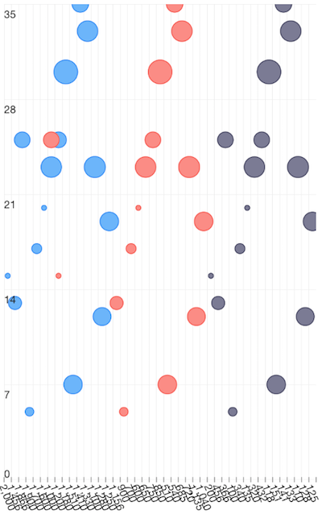

# Chart Bubble Series

**BubbleSeries** are a type of [CategoricalSeries]( "Chart Series Overview") that present categorical data with bubble shapes plot on cartesian coordinates based on the values that they represent. The bubble chart usually shows comparisons among discrete categories but can also be used to visualize a trend in data over intervals of time. They differ from **BarSeries** not only by the shape used, but also that they can visualize a third value (on top of category and value) through the size of the bubbles. If you want to show bubbles for data which is not categorical, you can use [ScatterBubbleSeries]( "Scatter Bubble Series").

* [Setup](#setup)
* [Bubble Scale](#bubble-scale)
* [References](#references)

## Setup

To display a Bubble Chart, you will need to:
- Add **RadCartesianChart** to your page.
- Set the chart's **horizontalAxis** to a category axis (**CategoricalAxis**, **DateTimeCategoricalAxis** or **DateTimeContinuousAxis**).
- Set the chart's **verticalAxis** to a value axis (**LinearAxis** or **LogarithmicAxis**).
- Add at least one instance of **BubbleSeries**  to the chart's **series** property and set its **items** property to a collection of data items, its **categoryProperty** set to the name of the property of the data items that will be used to determine their category, its **valueProperty** to the name of the property used to determine their value and its **bubbleSizeProperty** to the name of the property used to determine the size of the bubble.

To illustrate this setup, let's create an example. First we will create a source with items:
 
#### Example 1: Define a source with data
 
<snippet id='bubble-data-source'/>

We use an instance of this model to assign it as the *bindingContext* of the page we have put our Bubble series on:

#### Example 2: Update bindingContext

<snippet id='binding-context-bubble-series'/>

And finally, in the XML definition of the page we put a , add a  instance to it and bind the series to the source of data:

#### Example 3: Add chart to page's markup

<snippet id='bubble-series'/>

#### Figure 1: Chart with BubbleSeries on Android (left) and iOS (right)

 

## Bubble Scale

Additionally,  expose a  property which can be used to fine-tune the size of the bubbles according to specific application requirements. The way the  property works is by multiplying its value to the radius calculated for each data-point's bubble to determine the bubble's final size.

## References

Want to see this scenario in action?
Check our SDK examples repo on GitHub. You will find this and many other practical examples with NativeScript UI.

Examples used in this article:

* [Bubble Series Example](https://github.com/NativeScript/nativescript-ui-samples/tree/master/chart/app/examples/series/bubble)

Related articles you might find useful:

* [**Bar Series**]()
* [**Line Series**]()
* [**Scatter Bubble Series**]()
