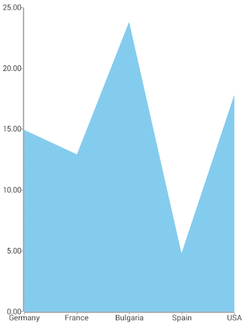
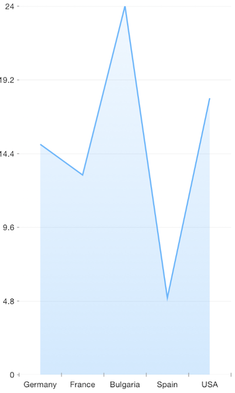

# RadChart Area Series
Area series work pretty much the same way as Line series with the only difference that the area between the categorical axis and the data points is filled with the corresponding color of the line. To use Area series, you need to initialize a , define a  and  and bind the series to a set of data objects.

## Example
The following definition represents the data context that will be used to populate the Area series with data:

<snippet id='categorical-source'/>

We use an instance of this model to assign it as the `bindingContext` of the page we have put our Area series on:

<snippet id='binding-context-area-series'/>

And finally, in the XML definition of the page we put a `RadCartesianChart`, add a AreaSeries instance to it and bind the series to the source of data:

<snippet id='area-series'/>

 

## References
Want to see this scenario in action?
Check our SDK examples repo on GitHub. You will find this and many other practical examples with NativeScript UI.

* [Series Examples](https://github.com/NativeScript/nativescript-ui-samples/tree/master/chart/app/examples/series)

Related articles you might find useful:

* [**Bubble Series**]()
* [**Bar Series**]()
* [**Pie Series**]()
* [**Range-Bar Series**]()
* [**Scatter-Bubble Series**]()
* [**Scatter Series**]()
* [**Spline Series**]()
* [**Line Series**]()
* [**Area Series**]()
* [**Candlestick Series**]()
* [**Ohlc Series**]()