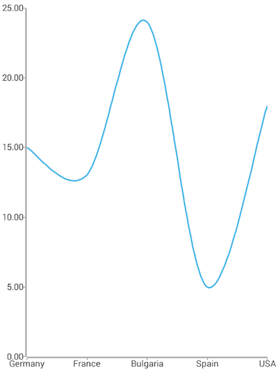
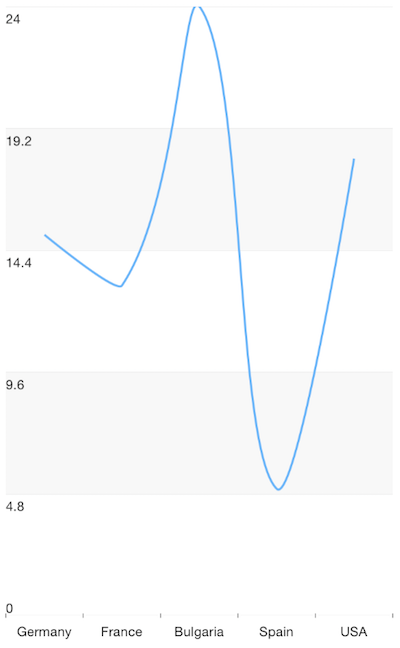

# RadChart Spline Series
 are categorical type of series that visualize the data objects as a series of dots connected with a spline, i.e. a curved line segments. To use Spline series, you need to initialize a , define a  and  and bind the series to a set of data objects.

## Example
The following definition represents the data context that will be used to populate the Spline series with data:

<snippet id='categorical-source-ts'/>

We use an instance of this model to assign it as the `bindingContext` of the page we have put our Spline series on:

<snippet id='spline-series-binding-context'/>

And finally, in the XML definition of the page we put a , add a  instance to it and bind the series to the source of data:

<snippet id='spline-series-xml'/>

 

## References
Want to see this scenario in action?
Check our SDK examples repo on GitHub. You will find this and many other practical examples with NativeScript UI.

* [Series Examples](https://github.com/NativeScript/nativescript-ui-samples/tree/master/chart/app/examples/series)

Related articles you might find useful:

* [**Area Series**]()
* [**Bubble Series**]()
* [**Bar Series**]()
* [**Pie Series**]()
* [**Range-Bar Series**]()
* [**Scatter-Bubble Series**]()
* [**Scatter Series**]()
* [**Line Series**]()
* [**Area Series**]()
* [**Candlestick Series**]()
* [**Ohlc Series**]()