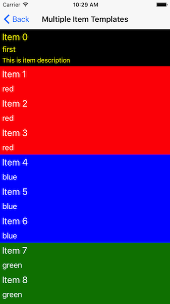
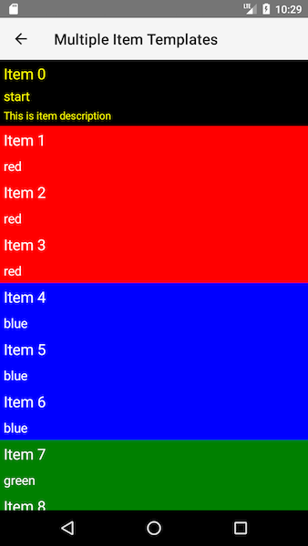

# RadListView Item Templates
By default when using the  in order for the items from its data source to be visualized all that you need to do is declare your own  and set it to the desired UI View. This will make sure that each of the business objects of the passed to the  property are visualized using that template, but there are scenarios where you may want to use different template for specific business objects (different sections, important business objects, more detailed objects etc.). IN such scenarios the the  can be used.

## Using multiple item templates
In order to setup the  to use different templates for its items representation you will need to:
- Create a function or pass a string representation of a "property" by which the template for each business object will be determined. This is done by setting the  property
- Create multiple separate `template`, add them to the  collection property and set their `key` to the desired unique template identifier. The `key` is what will be used to do the comparison in the  

#### Example 1: Setting up `itemTemplateSelector` and `itemTemplates`

In the code snippets bellow we are declaring multiple `<template></template>` instances in the XML and setting them to the `RadListView.itemTemplates`. After that we are creating a function in our `bindingContext` that simply returns the property of the business object that will be used to determine the template of its item representation and finally we are binding that function to the   property:

<snippet id='listview-multiple-templates'/>
<snippet id='listview-multiple-templates-context'/>
<snippet id='listview-multiple-templates-model'/>

#### Figure 1: RadListView with multiple item templates:
  

## References
Want to see this scenario in action?
Check our SDK examples repo on GitHub. You will find this and many other practical examples with NativeScript UI.

* [Multiple Item Templates Example](https://github.com/NativeScript/nativescript-ui-samples/tree/master/listview/app/examples/multiple-templates)

