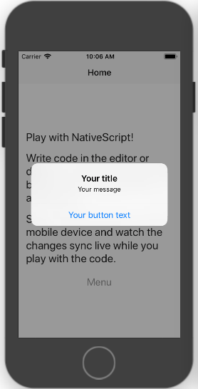
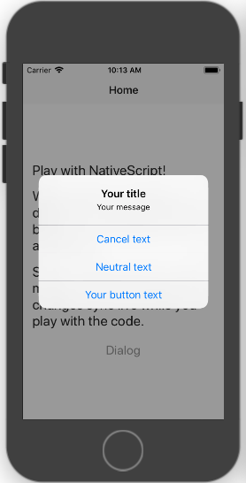
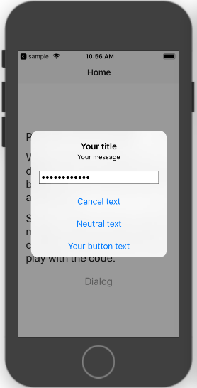
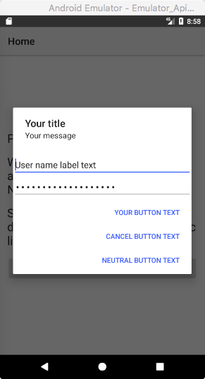
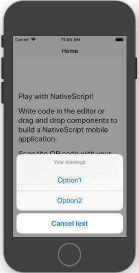

# User Interface Dialogs

NativeScript lets you create dialogs in your app in a manner similar to the web browser. You can create alerts, confirmations, prompts, logins and dialogs that require action.

* [Alert](#alert)
* [Confirm](#confirm)
* [Prompt](#prompt)
* [Login](#login)
* [Action](#action)
* [Custom dialog](#custom-dialog)
  * [Showing custom dialog](#showing-custom-dialog)
  * [Passing parameters](#passing-parameters)
  * [Returning a result](#returning-a-result)


> **NOTE**: You can call dialog functions with parameters similar to the web browser API or the `options` object. All dialog functions return a `Promise` object. **In both iOS and Android, dialogs will not block your code execution!**

> **TIP**: You can try [this NativeScript Playground project](https://play.nativescript.org/?template=play-ng&id=zJ51uY) to see all of this article’s examples in action on your device.

## Alert

**Web browser style**

```JavaScript
var dialogs = require("tns-core-modules/ui/dialogs");
dialogs.alert("Your message").then(function() {
    console.log("Dialog closed!");
});
```
```TypeScript
import * as dialogs from "tns-core-modules/ui/dialogs";
dialogs.alert("Your message").then(()=> {
    console.log("Dialog closed!");
});
```

**Using an options object**

```JavaScript
var dialogs = require("tns-core-modules/ui/dialogs");
dialogs.alert({
    title: "Your title",
    message: "Your message",
    okButtonText: "Your button text"
}).then(function () {
    console.log("Dialog closed!");
});
```
```TypeScript
import * as dialogs from "tns-core-modules/ui/dialogs";
dialogs.alert({
    title: "Your title",
    message: "Your message",
    okButtonText: "Your button text"
}).then(() => {
    console.log("Dialog closed!");
});
```




## Confirm

**Web browser style**

```JavaScript
var dialogs = require("tns-core-modules/ui/dialogs");
dialogs.confirm("Your message").then(function (result) {
    console.log("Dialog result: " + result);
});
```
```TypeScript
import * as dialogs from "tns-core-modules/ui/dialogs";
dialogs.confirm("Your message").then(result => {
    console.log("Dialog result: " + result);
});
```

**Using an options object**

```JavaScript
var dialogs = require("tns-core-modules/ui/dialogs");
dialogs.confirm({
    title: "Your title",
    message: "Your message",
    okButtonText: "Your button text",
    cancelButtonText: "Cancel text",
    neutralButtonText: "Neutral text"
}).then(function (result) {
    // result argument is boolean
    console.log("Dialog result: " + result);
});
```
```TypeScript
import * as dialogs from "tns-core-modules/ui/dialogs";
dialogs.confirm({
    title: "Your title",
    message: "Your message",
    okButtonText: "Your button text",
    cancelButtonText: "Cancel text",
    neutralButtonText: "Neutral text"
}).then(result => {
    // result argument is boolean
    console.log("Dialog result: " + result);
});
```

> The dialog result argument is Boolean. The result is __true__ if the dialog is closed with the OK button. The result is __false__ if closed with the Cancel button. The result is undefined if closed with a neutral button.




## Prompt

**Web browser style**

```JavaScript
var dialogs = require("tns-core-modules/ui/dialogs");
// Second argument is optional.
dialogs.prompt("Your message", "Default text").then(function (r) {
    console.log("Dialog result: " + r.result + ", text: " + r.text);
});
```
```TypeScript
import * as dialogs from "tns-core-modules/ui/dialogs";
// Second argument is optional.
dialogs.prompt("Your message", "Default text").then(r => {
    console.log("Dialog result: " + r.result + ", text: " + r.text);
});
```

**Using an options object**

```JavaScript
var dialogs = require("tns-core-modules/ui/dialogs");
// inputType property can be dialogs.inputType.password, dialogs.inputType.text, or dialogs.inputType.email.
dialogs.prompt({
    title: "Your title",
    message: "Your message",
    okButtonText: "Your button text",
    cancelButtonText: "Cancel text",
    neutralButtonText: "Neutral text",
    defaultText: "Default text",
    inputType: dialogs.inputType.password
}).then(function (r) {
    console.log("Dialog result: " + r.result + ", text: " + r.text);
});
```
```TypeScript
import * as dialogs from "tns-core-modules/ui/dialogs";
// inputType property can be dialogs.inputType.password, dialogs.inputType.text, or dialogs.inputType.email.
dialogs.prompt({
    title: "Your title",
    message: "Your message",
    okButtonText: "Your button text",
    cancelButtonText: "Cancel text",
    neutralButtonText: "Neutral text",
    defaultText: "Default text",
    inputType: dialogs.inputType.password
}).then(r => {
    console.log("Dialog result: " + r.result + ", text: " + r.text);
});
```
> The dialog result argument is an object with two properties: result and text (entered text). The result property is __true__ if the dialog is closed with the OK button, __false__ if closed with the Cancel button or undefined if closed with a neutral button.




## Login

**Web browser style**

```JavaScript
var dialogs = require("tns-core-modules/ui/dialogs");
// User name and password arguments are optional.
dialogs.login("Your message", "User name label text", "Password label text").then(function (r) {
    console.log("Dialog result: " + r.result + ", user: " + r.userName + ", pwd: " + r.password);
});
```
```TypeScript
import * as dialogs from "tns-core-modules/ui/dialogs";
// User name and password arguments are optional.
dialogs.login("Your message", "User name label text", "Password label text").then(r => {
    console.log("Dialog result: " + r.result + ", user: " + r.userName + ", pwd: " + r.password);
});
```

**Using an options object**

```JavaScript
var dialogs = require("tns-core-modules/ui/dialogs");
dialogs.login({
    title: "Your title",
    message: "Your message",
    okButtonText: "Your button text",
    cancelButtonText: "Cancel button text",
    neutralButtonText: "Neutral button text",
    userName: "User name label text",
    password: "Password label text"
}).then(function (r) {
    console.log("Dialog result: " + r.result + ", user: " + r.userName + ", pwd: " + r.password);
});
```
```TypeScript
import * as dialogs from "tns-core-modules/ui/dialogs";
dialogs.login({
    title: "Your title",
    message: "Your message",
    okButtonText: "Your button text",
    cancelButtonText: "Cancel button text",
    neutralButtonText: "Neutral button text",
    userName: "User name label text",
    password: "Password label text"
}).then(r => {
    console.log("Dialog result: " + r.result + ", user: " + r.userName + ", pwd: " + r.password);
});
```

> The dialog result argument is an object with three properties: result, userName and password (entered user name and password). The result property is __true__ if the dialog is closed with the OK button, __false__ if closed with the Cancel button or undefined if closed with a neutral button.




## Action

**Web browser style**

```JavaScript
var dialogs = require("tns-core-modules/ui/dialogs");
dialogs.action("Your message", "Cancel button text", ["Option1", "Option2"]).then(function (result) {
    console.log("Dialog result: " + result);
    if(result == "Options1"){
        //Do action1
    }else if(result == "Option2"){
        //Do action2
    }
});
```
```TypeScript
import * as dialogs from "tns-core-modules/ui/dialogs";
dialogs.action("Your message", "Cancel button text", ["Option1", "Option2"]).then(result => {
    console.log("Dialog result: " + result);
    if(result == "Options1"){
        //Do action1
    }else if(result == "Option2"){
        //Do action2
    }
});
```

**Using an options object**

```JavaScript
var dialogs = require("tns-core-modules/ui/dialogs");
dialogs.action({
    message: "Your message",
    cancelButtonText: "Cancel text",
    actions: ["Option1", "Option2"]
}).then(function (result) {
    console.log("Dialog result: " + result);
    if(result == "Options1"){
        //Do action1
    }else if(result == "Option2"){
        //Do action2
    }
});
```
```TypeScript
import * as dialogs from "tns-core-modules/ui/dialogs";
dialogs.action({
    message: "Your message",
    cancelButtonText: "Cancel text",
    actions: ["Option1", "Option2"]
}).then(result => {
    console.log("Dialog result: " + result);
    if(result == "Option1"){
        //Do action1
    }else if(result == "Option2"){
        //Do action2
    }
});
```
> The dialog result argument is a string (the text of the clicked option or the text of the cancel button).





## Custom dialog

You can also create dialogs with custom content. All the needed types live inside the `nativescript-angular/modal-dialog` module.

### Showing custom dialog

Start by injecting `ModalDialogService` into the components constructor (this service is exported by the `NativeScriptModule` so there is no need to declare it explicitly).

We are also injecting the `ViewContainerRef` of this component — we are going to need it when showing the dialog.

``` TypeScript
import { Component, ViewContainerRef } from "@angular/core";
import { ModalDialogService, ModalDialogOptions } from "nativescript-angular/modal-dialog";

@Component({
  template: `
        <StackLayout>
            <Button text="show" (tap)="show()"></Button>
            <Label [text]="'RESULT: ' + result"></Label>
        </StackLayout>
    `
})
export class CustomDialogTest {
    public result: string;

    constructor(
        private modalService: ModalDialogService,
        private viewContainerRef: ViewContainerRef) { }
    ...
}
```

Ignore the `result` field for now &mdash; we will use it later on.

Call the `showModal` method of the dialog service passing the type of the component that should be loaded in the dialog. We are also passing the `viewContainerRef` in the modal dialog options to tell angular where (in the component tree) to load the dialog component.

``` TypeScript
public show() {
    let options: ModalDialogOptions = {
        viewContainerRef: this.viewContainerRef
    };

    this.modalService.showModal(DialogContent, options);
}
```

### Passing parameters

You can pass parameters to the dialog component when calling the `showModal` method. These are specified in the `context` field of the options.

You can also specify if the dialog should be shown `fullscreen`.

``` TypeScript
let options: ModalDialogOptions = {
    context: { promptMsg: "This is the prompt message!" },
    fullscreen: true,
    viewContainerRef: this.viewContainerRef
};

this.modalService.showModal(DialogContent, options)
```

> **TIP:** By design on iPhone, a modal page appears only in full screen.

Inside the `DialogContent` component, you can get the parameters by injecting a `ModalDialogParams`:

``` Typescript
import { Component } from "@angular/core";
import { ModalDialogParams } from "nativescript-angular/modal-dialog";

@Component({
    selector: "modal-content",
    template: `
    <StackLayout margin="24" horizontalAlignment="center" verticalAlignment="center">
        <Label [text]="prompt"></Label>
        <StackLayout orientation="horizontal" marginTop="12">
        <Button text="ok" (tap)="close('OK')"></Button>
        <Button text="cancel" (tap)="close('Cancel')"></Button>
        </StackLayout>
    </StackLayout>
  `
})
export class DialogContent {
    public prompt: string;
    constructor(private params: ModalDialogParams) {
        this.prompt = params.context.promptMsg;
    }

    public close(result: string) {
        this.params.closeCallback(result);
  }
}
```

The `params.context` is the same object as `options.context` passed to the `showModal` method.

> **NOTE:** The component used for the modal content(`DialogContent` from the example) should be added in both the `declarations` and `entryComponents` in your `NgModule` definition:
> ``` Typescript
> @NgModule({
>     declarations: [CustomDialogTest, DialogContent],
>     entryComponents: [DialogContent],
>     imports: [NativeScriptModule],
>     bootstrap: [CustomDialogTest],
> })
> class AppModule { }
> ```

### Returning a result

To close the dialog, call the `closeCallback` function of the dialog params.

``` TypeScript
public close(result: string) {
    this.params.closeCallback(result);
}
```

Note that the `showModal` function actually returns a promise that is resolved when the dialog closes. The value you pass to the `closeCallback` will be the value returned by the promise.
Let's modify the `show` function in the main component so that it shows the result when the dialog closes:

``` TypeScript
public show(fullscreen: boolean) {
    let options: ModalDialogOptions = {
        context: { promptMsg: "This is the prompt message!" },
        fullscreen: true,
        viewContainerRef: this.viewContainerRef
    };

    this.modalService.showModal(DialogContent, options)
        .then((dialogResult: string) => this.result = dialogResult)
}
```

