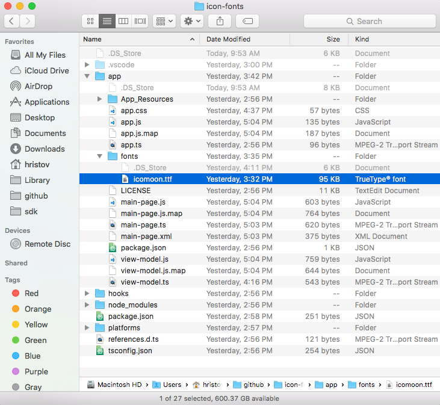

# User Interface Icon Fonts

While bitmap images are great, they present challenges in designing mobile applications. Images increase the size of the application if they are embedded in it. If not, they require additional http requests to be fetched. Images consume memory. Furthermore, bitmap images do not scale well. If scaled up, they lose quality. If scaled down, they waste space. On the other hand, fonts scale well, do not require additional http requests for each glyph and do not increase memory usage significantly. Icon fonts contain icons instead of alphabet characters and can be used instead of images in mobile applications.

## Using Icon Fonts in NativeScript

1. Choose or generate an icon font that best matches your needs. Two popular icon fonts are [IcoMoon](https://icomoon.io/) and [Font Awesome](https://fontawesome.com/how-to-use/on-the-web/setup/hosting-font-awesome-yourself).
2. Once you have downloaded the icon font to your machine, locate the [TrueType](https://en.wikipedia.org/wiki/TrueType) font file with extension **.ttf**.
3. In your NativeScript application **app** folder (for Angular 6+ **src** folder), create a folder called **fonts** and place the **.ttf** there.
4. Follow the instructions on the icon font webpage to determine the hex codes of each font glyph, i.e., icon. Add a **Label** component to your NativeScript app and bind the Label's **text** property to a one-letter string generated from the character code of the icon you want to show, i.e., `String.fromCharCode(0xe903)`.

> **Note:** While this documentation article is focused on icon fonts, the above workflow is a hundred percent applicable for both **text fonts** and **icon fonts**.


## Platform Specific Font Recognition

There is a conceptual difference in how **.ttf** fonts are recognized on iOS and Android. On Android, the font is recognized by its **file name** while on iOS it is recognized by its **font name**. This means that fonts that are created with a font name which is different from the file name has to be registered with both names in your CSS rule.

```CSS
.fa-brands {
    font-family: "Font Awesome 5 Brands", "fa-brands-400";
}
```

In the above example, the `fa-brands-400.ttf` (as downloaded from the FontAwesome site) has a font name `Font Awesome 5 Brands`. With the above CSS, the font is recognized on both iOS (by the font name `Font Awesome 5 Brands`) and Android (by the file name `fa-brands-400`).

> **Note:** There are specific scenarios where the creators of the fonts might have released two differently named `ttf` files but with the same **font** name (see the example below).

|file name    | font name     |
|-----------|---------------|
|**fa-solid-900** | Font Awesome 5 Free
|**fa-regular-400** | Font Awesome 5 Free

Notice that in the above example the **file** names are different, but the registered **font** name is the same (use the **Font Book** application on Mac or the **Control Panel Fonts** section on Windows to see the actual font name). While this is no issue on Android, it renders the second font unusable on iOS. To handle similar cases, manually change the font name (e.g., via a third-party tool like [FontForge](http://fontforge.github.io/).


## Icon Fonts via XML

```HTML
<!-- FontAwesome cheatsheet glyph https://fontawesome.com/cheatsheet -->
<Label text="&#xf108;" class="fa"></Label>
```
```CSS
.fa {
    font-family: "Font Awesome 5 Free", "fa-regular-400";
}
```



## Icon Fonts via HTML

```HTML
<!-- FontAwesome cheatsheet glyph https://fontawesome.com/cheatsheet -->
<Label text="&#xf108;" class="fa"></Label>
```
```CSS
.fa {
    font-family: "Font Awesome 5 Free", "fa-regular-400";
    font-weight: 400;
}
```


## Icon Fonts via Code-Behind

``` CSS
.icon {
   font-family: 'icomoon';
   font-size: 48;
}

/* only for reference, is NOT working in this example (wrong codes) 
.fa {
   font-family: 'FontAwesome', 'fontawesome-webfont';
   font-size: 48;
}
*/
```
``` XML
<Page xmlns="http://schemas.nativescript.org/tns.xsd" loaded="pageLoaded">
  <ListView items="{{ glyphs }}">
        <ListView.itemTemplate>
            <StackLayout orientation="horizontal">
                <Label text="{{ icon }}" class="icon"/>
                <Label text="{{ code }}" />
            </StackLayout>
        </ListView.itemTemplate>
    </ListView>
</Page>
```
``` JavaScript
"use strict";
const Observable = require("tns-core-modules/data/observable").Observable;
function pageLoaded(args) {
    const page = args.object;
    const viewModel = new Observable();

    let glyphs = new Array();
    let charCode = 0xe903;
    for (; charCode <= 0xeaea; charCode++) {
        var glyph = new Observable();
        glyph.set("icon", String.fromCharCode(charCode));
        glyph.set("code", charCode.toString(16));
        glyphs.push(glyph);
    }
    viewModel.set("glyphs", glyphs);

    page.bindingContext = viewModel;
}
exports.pageLoaded = pageLoaded;
//# sourceMappingURL=main-page.js.map
```
``` TypeScript
import { EventData, Observable } from "tns-core-modules/data/observable";
import { Page } from "tns-core-modules/ui/page";

export function pageLoaded(args: EventData) {
    const page = <Page>args.object;
    const viewModel = new Observable();

    let glyphs = new Array<Observable>();
    let charCode = 0xe903;
    for(; charCode <= 0xeaea; charCode++){
        let glyph = new Observable();
        glyph.set("icon", String.fromCharCode(charCode));
        glyph.set("code", charCode.toString(16));
        glyphs.push(glyph);
    }
    viewModel.set("glyphs", glyphs)

    page.bindingContext = viewModel;
}
```






And the result is:


Example for icon font glyphs:


Example for icon font folder location:




Here you can find the complete sample: [Icon Font Sample Application](https://github.com/NativeScript/icon-fonts)

