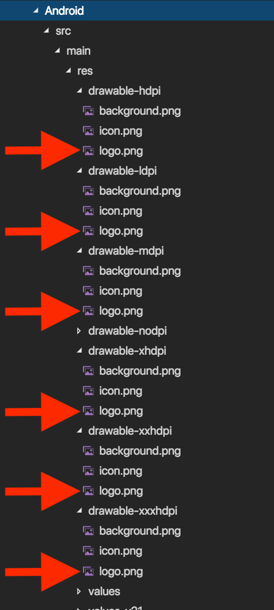
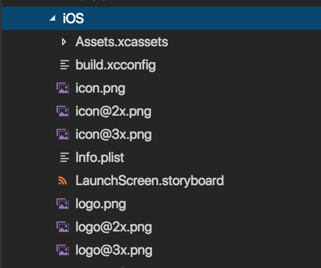

# Working with Images from resource folders
In this article, we will look at the specifics of adding Images in the App_Resources folder for both platforms. 

> **Note:** NativeScript supports images encoded as `PNG` or `JPG` files.

> **Note:**  Loading an image from the resource folders requires using the `res://` prefix. This is the suggested approach, as it uses the native methods for loading the best image for the current device screen density. The file extension is not included when referencing resource images.

## Generating the icons via CLI 

In the latest NativeScript versions we can use the CLI for generating all icons for Android and iOS based on the specified image and adding them automatically in the `App_Resources\Android\src\main\res\drawable-XXX` for Android and `App_Resources\iOS`  for iOS. For achieving this, we use the `tns resources generate icons <path to image>` command. 

## Generating the icon manually

Another way to achieve this is to generate the icons via [NativeScript Image Builder](http://nsimage.brosteins.com/) or some other tool, which can be used for image edit. After we created the images for the required device screen densities, we should add them in the required folders, described below.

### Adding Android resources
Android resources should be added to the corresponding `drawable-XXX` folders inside the `App_Resources\Android\src\main\res` folder in your app:



The content of this directory will be copied inside the `platforms\android\res` when the app is prepared by the NativeScript CLI. More information about how to use drawable resources in Android can be found [here](http://developer.android.com/guide/practices/screens_support.html#DesigningResources).

### Adding iOS resources
IOS resources should be added inside the `App_Resources\ios` folder in your app. You can use `@1x`, `@2x` and `@3x` suffixes to target devices with a specific screen scale. Here is a list of devices for each scale factor:

* **@1x** - iPad 2 and iPad mini (1st Generation)
* **@2x** - iPhone 6, iPhone Xr, iPad (retina)
* **@3x** - iPhone 6 Plus, iPhone X, iPhone Xs



For more information, see [Icon and Image Sizes](https://developer.apple.com/library/ios/documentation/UserExperience/Conceptual/MobileHIG/IconMatrix.html#//apple_ref/doc/uid/TP40006556-CH27-SW1) in the iOS Developer Library.

Once the NativeScript project is prepared (`tns prepare ios`) all the images will be copied to the `platforms\ios\<project-name>\Resources`.

## Load images from a resource



```XML
<Image src="res://logo" stretch="none" /> 
```


```HTML
<Image src="res://logo" stretch="none" ></Image> 
```


You can manually create an [ImageSource instance from resource]().

## Loading icons in the TabView from the resources


```XML
<TabView id="tabViewContainer" iosIconRenderingMode="alwaysOriginal">
    <TabView.items>
        <TabViewItem title="Tab 1" iconSource="res://icon">
            <TabViewItem.view>
                <Label text="This is Label in Tab 1" />
            </TabViewItem.view>
        </TabViewItem>
        <TabViewItem title="Tab 2" iconSource="res://icon">
            <TabViewItem.view>
                <Label text="This is Label in Tab 2" />
            </TabViewItem.view>
        </TabViewItem>
    </TabView.items>
</TabView>
```


```HTML
<TabView iosIconRenderingMode="alwaysOriginal">
    <StackLayout *tabItem="{title: 'Tab 1', iconSource: 'res://icon'}">
        <StackLayout>
            <Label text="This is Label in Tab 1" ></Label>
        </StackLayout>
    </StackLayout>
    <StackLayout *tabItem="{title: 'Tab 2', iconSource: 'res://icon'}">
        <StackLayout>
            <Label text="This is Label in Tab 2" ></Label>
        </StackLayout>
    </StackLayout>
</TabView>
```

