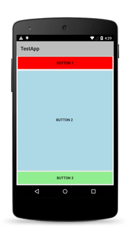
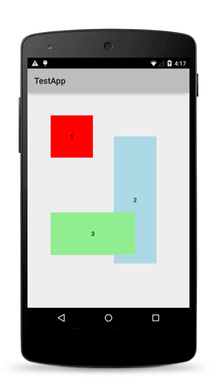
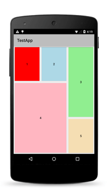
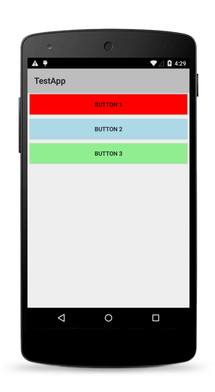
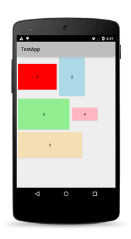

# User Interface Layouts

NativeScript provides a recursive layout system that sizes and positions [views][views] on the screen.

* [Layout Process](#layout-process)
	* [Measure Pass](#measure-pass)
	* [Layout Pass](#layout-pass)
	* [Alignment](#alignment)
	* [Margins](#margins)
* [Layouts](#layouts)
	* [Layout Paddings](#layout-paddings)
	* [Predefined Layouts](#predefined-layouts)
* [Percent Support](#percentage-support)

## Layout Process

Layout is the process of measuring and positioning the child views of a [Layout][Layout] container. Layout is an intensive process whose speed and performance depend on the count of the children and the complexity of the layout container. For example, a simple layout container such as [AbsoluteLayout][AbsoluteLayout] might perform better than a more complex layout container, such as [GridLayout][GridLayout].

Layout completes in two passes&mdash;a measure pass and a layout pass. Every layout container provides its own `onMeasure()` and `onLayout()` methods to achieve its own specific layout.

### Measure Pass

During the measure pass, each [view][view] is measured to retrieve its desired size. The measure pass evaluates the following properties:

* width
* height
* minWidth
* minHeight
* visibility
* marginTop
* marginRight
* marginBottom
* marginLeft

### Layout Pass

During the layout pass, each [view][view] is placed in a specific layout slot. This slot is determined by the desired size of the view (retrieved from the measure pass) and the following properties:

- marginTop
- marginRight
- marginBottom
- marginLeft
- horizontalAlignment
- verticalAlignment

### Alignment

Layout applies horizontal and vertical alignment only when an element is allocated more size than it needs.

The following table shows the valid values of `horizontalAlignment`.

| Member  | Description   |
| ------- | ------------- |
| left    | The view is aligned to the left of the layout slot of the parent element. |
| center  | The view is aligned to the center of the layout slot of the parent element. |
| right   | The view is aligned to the right of the layout slot of the parent element. |
| stretch | The view is stretched to fill the layout slot of the parent element; `width` takes precedence, if set. |

The following table shows the valid values of `verticalAlignment`.

| Member  | Description |
| ------- | ----------- |
| top     | The view is aligned to the top of the layout slot of the parent element. |
| center  | The view is aligned to the center of the layout slot of the parent element. |
| bottom  | The view is aligned to the bottom of the layout slot of the parent element. |
| stretch | The view is stretched to fill the layout slot of the parent element; `height` takes precedence, if set. |

### Margins

The four margin properties (`marginTop`, `marginRight`, `marginBottom` and `marginLeft`) describe the distance between a view and its parent.

When you set margins through XML, you can choose between the following approaches.

* **Set one value**: Provide a single value that will be applied on all sides of the view.
* **Set two values**: Provide two values. The first value is applied to the top side, the second value is applied to the right side. Next, the first value is applied to the bottom and the second value to the left side (in that order).
* **Set four values**: Provide four values for each margin. The first value is applied to the top, the second value is applied to the right, the third value is applied to the bottom and the fourth value is applied to the left side (in that order).

## Layouts

`Layout` is the base class for all views that provide positioning of child elements.

You can use the various layout containers to position elements. They evaluate the base properties of [view][view] such as `width`, `height`, `minWidth` and alignments, and expose additional properties for positioning child views (such as the four paddings).

### Layout Paddings

The four padding properties (`paddingTop`, `paddingRight`, `paddingBottom` and `paddingLeft`) describe the distance between the layout container and its children.

When you set paddings through XML, you can choose between the following approaches.

* **Set one value**: Provide a single value that will be applied on all sides of the view.
* **Set two values**: Provide two values. The first value is applied to the top side, the second value is applied to the right side. Next, the first value is applied to the bottom and the second value to the left side (in that order).
* **Set four values**: Provide four values for each padding. The first value is applied to the top, the second value is applied to the right, the third value is applied to the bottom and the fourth value is applied to the left side (in that order).

### Predefined Layouts

The following table shows predefined layouts that NativeScript provides.

| Layouts  | Description  | Screenshot |
| -------- | ------------ | ---------- |
| [FlexboxLayout][FlexboxLayout] | This layout is a non-conforming implementation of the [CSS Flexible Box Layout](https://www.w3.org/TR/css-flexbox-1/) | |
| [AbsoluteLayout][AbsoluteLayout] | This layout lets you set exact locations (left/top coordinates) for its children. | |
| [DockLayout][DockLayout] | This layout arranges its children at its outer edges and allows its last child to take up the remaining space. | |
| [GridLayout][GridLayout] | This layout defines a rectangular layout area that consists of columns and rows. | |
| [StackLayout][StackLayout] | This layout arranges its children horizontally or vertically. The direction is set with the orientation property. | |
| [WrapLayout][WrapLayout] | This layout positions its children in rows or columns, based on the orientation property, until the space is filled and then wraps them on a new row or column. | |

[views]: 
[View]: /api-reference/classes/_ui_core_view_.view.html
[Layout]: /api-reference/classes/_ui_layouts_layout_.layout.html
[FlexboxLayout]: 
[AbsoluteLayout]: 
[DockLayout]: 
[GridLayout]: 
[StackLayout]: 
[WrapLayout]: 

### Percentage Support

NativeScript supports percentage values for `width`, `height` and `margins`.
When a layout pass begins, first the percent values are calculated based on parent available size. This means that on vertical `StackLayout` if you place two `Buttons` with `height='50%'` they will get all the available height (e.g., they will fill the `StackLayout` vertically.).
The same applies for margin properties. For example, if you set `marginLeft='5%'`, the element will have a margin that corresponds to 5% of the parent's available width.
