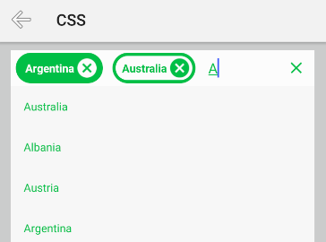
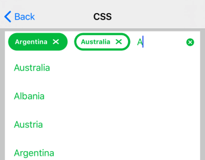

# RadAutoCompleteTextView Getting Started

In this article, you will learn how to initialize **RadAutoCompleteTextView** and use it with its basic configuration inside an NativeScript + Angular applications. The code snippets from this section are available as [a standalone demo application](https://github.com/NativeScript/nativescript-ui-samples-angular).

## Installation
**RadAutoCompleteTextView** is distributed through the `nativescript-ui-autocomplete` package, so before using it, you need to run the following command to add the plugin to your application:

```
tns plugin add nativescript-ui-autocomplete
```

## Initialization
Before proceeding, make sure that the  from the *nativescript-ui-autocomplete* plugin has been imported in an `ngModule` in your app. For example:

```TypeScript
import { NativeScriptUIAutoCompleteTextViewModule } from "nativescript-ui-autocomplete/angular";
@NgModule({
    schemas: [NO_ERRORS_SCHEMA],
    imports: [
        ....
        NativeScriptUIAutoCompleteTextViewModule,
        ....
    ],
    declarations: [
        ....
    ]
})
export class AutoCompleteExamplesModule { }

....
```

[Demo](https://github.com/NativeScript/nativescript-ui-samples-angular/blob/master/autocomplete/app/examples/autocomplete-examples.module.ts).

To create a **RadAutoCompleteTextView** you should use the RadAutoCompleteTextView tag in your .html file.
Once you have added the tag you should specify value for the `items` property of the control.

<snippet id='angular-autocomplete-getting-started-html'/>

In order to provide suggestions that will be used by **RadAutoCompleteTextView** you need to provide a collection of items of type `TokenModel`:

<snippet id='angular-autocomplete-getting-started'/>

If necessarily, you can also use **RadAutoCompleteTextView**'s `hint` property to provide a text that will be displayed when there is no input; the `text` property that allows you to change the text or get the current user input or the `noResultsText` property to change the text displayed when no suggestions are found.

## Customize the Suggestions
When you start typing the input field, you will see the default suggestion view displayed below the input field. If you want, you can add a custom suggestion view and change its template (through a ng-template with the `tkSuggestionItemTemplate` directive) and/or fix its height (through the `suggestionViewHeight` property). Here's an example:

<snippet id='angular-autocomplete-plain-mode-html'/>

## Customize the TokenModel
If you need, you can extend the `TokenModel` with an id to track more easily the selected items or any other information that you need that is missing from the default model. Here's an example:

<snippet id='angular-autocomplete-custom-token-model-ts'/>

Then you can use the new type to populate the list of items that will be bound to  **RadAutoCompleteTextView**'s `items` property:

<snippet id='angular-autocomplete-custom-tokens-items-ts'/>

You can also display the properties added to your custom model in the template of the suggestions:

<snippet id='angular-autocomplete-custom-tokens-template-html'/>

## Apply CSS
**RadAutoCompleteTextView** can be customized through [CSS](https://docs.nativescript.org/angular/ui/styling). You can use the following type selectors to define the styles for the different elements:

* **RadAutoCompleteTextView**: Can be used to apply styles for the whole component.
* **SuggestionView**: Can be used to apply styles for the SuggestionView that displays below the input field.
* **Token**: Can be used to apply styles for the Tokens that get added to the input field when they are selected from the suggestions.
* **ClearButton**: Can be used to apply styles for the 'X' used to clear the current input
* **TokenClearButton**: Can be used to apply styles for the 'X' inside a Token, that is used to remove that Token from the input field.
* **NoResultsLabel**: Can be used to apply styles for the text that is displayed when no suggestions are found for the current input.

Each of these selectors supports a subset of properties that can be applied:

* **RadAutoCompleteTextView** supports: **color**, **padding**, **margin**, **background**-related properties (background, background-color, etc.), **border**-related properties (border-color, border-width, etc.), **font**-related properties (font-size, font-weight, etc.); these can also be applied for RadAutoCompleteTextView when its state is **focus**
* **SuggestionView** supports: **color**, **margin**, **background**-related properties (background, background-color, etc.), **border**-related properties (border-color, border-width, etc.), **font**-related properties (font-size, font-weight, etc.)
* **Token** supports: **color**, **padding**, **margin**, **background**-related properties (background, background-color, etc.), **border**-related properties (border-color, border-width, etc.), **font**-related properties (font-size, font-weight, etc.); these can also be applied for Token when its state is **selected**
* **ClearButton** and **TokenClearButton** support: **color** and **background-image**. The color can be used to tint the image used by default, while background-image can be used to use a custom image.
* **NoResultsLabel** supports: **color** and **font**-related properties (font-size, font-weight, etc.)

Here's an example CSS:

#### Example 1: Applying css to RadAutoCompleteTextView instances with class ac3
```
RadAutoCompleteTextView.ac3 {
margin: 5 10;
padding: 0 6;
color: #00C147;
background: white;
token-item-spacing: 12;
display-mode: tokens;
layout-mode: horizontal;
}

RadAutoCompleteTextView.ac3 Token {
color: #00C147;
background: white;
border-radius: 20;
border-color: #00C147;
border-width: 4;
font-weight: bold;
}

RadAutoCompleteTextView.ac3 Token:selected {
color: white;
background: #00C147;
}

RadAutoCompleteTextView.ac3 Token TokenClearButton {
color: #00C147;
}

RadAutoCompleteTextView.ac3 Token:selected TokenClearButton {
color: white;
}


RadAutoCompleteTextView.ac3 ClearButton {
color: #00C147;
}
```

And here's how RadAutoCompleteTextView looks when the above CSS is applied:

#### Figure 1: RadAutoCompleteTextView with applied css on Android (left) and iOS (right)

 

## References
Want to see this scenario in action?
Check our SDK examples repo on GitHub. You will find this and many other practical examples with NativeScript UI.

* [RadAutoCompleteTextView Examples](https://github.com/NativeScript/nativescript-ui-samples-angular/tree/master/autocomplete/app/examples/getting-started)

