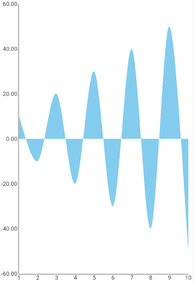
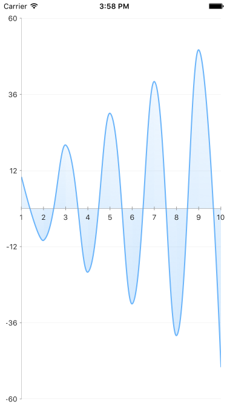

# RadChart Negative Values

By default the  supports the use of negative values. You can set the  minimum and/or the  to negative values

#### Example

<snippet id='chart-angular-axes-negative-values'/>

This is how the chart will look like with negative values on the Y axis:

 
