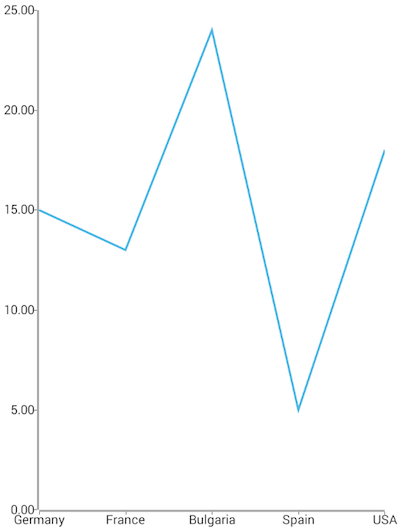
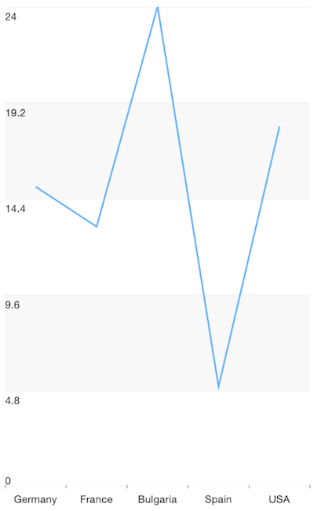

# Chart Line Series

**LineSeries** are a type of [CategoricalSeries]( "Chart Series Overview") that present categorical data as points connected with a line. The line chart usually visualizes a trend in data over intervals of time, but can also be used to show comparisons among discrete categories.

* [Setup](#setup)
* [References](#references)

## Setup

To display a Line Chart, you will need to:
- Add a **RadCartesianChart** to your component.
- Add a category axis (**CategoricalAxis**, **DateTimeCategoricalAxis** or **DateTimeContinuousAxis**) with the **tkCartesianHorizontalAxis** directive.
- Add a value axis (**LinearAxis** or **LogarithmicAxis**) with the **tkCartesianVerticalAxis** directive.
- Add at least one instance of **LineSeries** with the **tkCartesianSeries** directive and set its **items** property to a collection of data items, its **categoryProperty** to the name of the property of the data items that will be used to determine their category and its **valueProperty** to the name of the property used to determine their value.

To illustrate this setup, let's create an example. Just like with all angular 'pages' let's start with the `Component` in which we will place our  instance. We create a basic angular `Component` that contains a collection of objects provided by an custom service, which will be used by the chart to provide intuitive data visualization. The service is a simple 'mock' of an backend call that will return an array of objects:

 #### Example 1: Define a data service
 
<snippet id='chart-angular-data-service'/>

Inside that service we have a single function which returns an array:

#### Example 2: Define a source with data

<snippet id='chart-angular-categorical-source'/>

<snippet id='chart-angular-country'/>

#### Example 3: Add chart to component's template

<snippet id='chart-angular-line-series-component'/>
<snippet id='chart-angular-line-series'/>

Here's how your Line chart should look like:

#### Figure 1: Chart with LineSeries on Android (left) and iOS (right)

 

## References

Want to see this scenario in action?
Check our SDK examples repo on GitHub. You will find this and many other practical examples with NativeScript UI.

Examples used in this article:

* [Line Series Example](https://github.com/NativeScript/nativescript-ui-samples-angular/tree/master/chart/app/examples/series/line)

Related articles you might find useful:

* [**Area Series**]()
* [**Bar Series**]()
* [**Spline Series**]()
