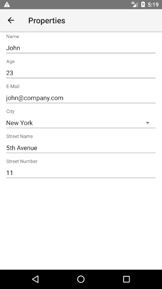
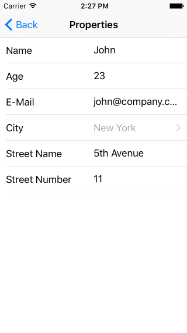

# RadDataForm - Describe the Properties

If you followed the article about [providing the source]( "RadDataForm providing the source"), you now know how to edit the source object's properties with the default editors in `RadDataForm` for NativeScript. This article will explain how you can customize these editors and optionally change their type.

* [Entity Property](#entity-property)
* [Adjust Editors with XML](#adjust-editors-with-xml)
* [Adjust Editors with Code-Behind](#adjust-editors-with-code-behind)
* [Adjust Editors with JSON](#adjust-editors-with-json)
* [References](#references)

#### Figure 1: How RadDataForm can look if we describe the editors that will be used on Android (left) and iOS (right)

 

## Entity Property

The  is a helper class that allows you to describe each of the properties of the edited source object. This way you can change the type of the editor that will be used, the name of the label that will be displayed with the editor, etc. When you set the  property of `RadDataForm` an `EntityProperty` will be created for each of the properties of the source object. Here's a list with the adjustment options provided by the  class:

* : This is the name of the property of your source object that will be described with this entity property.
* : The text of the header/label of the editor.
* : A number used to sort the editors.
* : A number used to sort the editors which are on the same row when using grid [layout]( "Group Layouts in RadDataForm for NativeScript").
* : A boolean value indicating whether the editor for this property should be hidden.
* : A boolean value indicating whether the editor for this property will be in read only mode or it will allow editing.
* : A boolean value specifying whether the current property is required for the entity to be saved (for example email in a registration form).
* : A text that will be shown inside the editor when the its value is `null`.
* : A list with values that are acceptable for values of the editor of this property. More information in [this article]( "ValueProviders in RadDataForm for NativeScript").
* : A  implementation that can be used to convert the values visible in the editor to the values stored in the source object and vice versa.
* : A  that allows you to specify the type of the editor that will be used and its style. More information in the [article about editors]( "Editors in RadDataForm for NativeScript").
* : A list of validators that will be used to validate the value of the editor before saving it in the source object. More information in the [section about validation]( "Validation in RadDataForm for NativeScript").
* : The name of an image resource that will be used as a label of the editor. More information in the [article about image labels]( "Image Labels in RadDataForm for NativeScript").

## Adjust Editors with HTML

One way to use the  class to adjust the editors is to declare a `TKEntityProperty` HTML tag and set the `tkDataFormProperty` inline directive in it for each property of your source object in the html and set the desired values. Here's an example:

#### Example 1: Use EntityProperty in HTML

<snippet id='angular-dataform-adjustment-html'/>

In this example, we have listed all properties of our data object and specified their  (the header text for the editor) and their  (in order to ensure that they will be presented in a desired order). Also we have picked an editor for some of the properties. The `Picker` editor allows user to pick one of the values presented as a . More information about the editors, you can find [here]( "Editors in RadDataForm for NativeScript").

Now if you run the application, you should get a result like in the image shown in the beginning.

## Adjust Editors with Component's Code

Another way to make changes of each  is through component's [code](https://docs.nativescript.org/angular/tutorial/ng-chapter-3.html#33-structuring-your-app). You can access the  instance for each property of your source object by passing its name to the  method. Then you can change the value of each of its properties except from  which is used to correctly link the `EntityProperty` objects with the properties of the source object:

#### Example 2: Use EntityProperty in component's code

<snippet id='angular-dataform-editors-code'/>

## Adjust Editors with JSON

You can also use json with a list of property annotations which will be used to setup the `EntityProperty` for each property. Here's an example content of a json file which can be used to achieve the same look of `RadDataForm` from the image in the beginning of the article:

#### Example 3: Sample JSON metadata for RadDataForm

```JSON
{
    "isReadOnly": false,
    "commitMode": "Immediate",
    "validationMode": "Immediate",
    "propertyAnnotations":
    [
        {
            "name": "name",
            "displayName": "Name",
            "index": 0
        },
        {
            "name": "age",
            "displayName": "Age",
            "index": 1,
            "editor": "Number"
        },
        {
            "name": "email",
            "displayName": "E-Mail",
            "index": 2,
            "editor": "Email"
        },
        {
            "name": "city",
            "displayName": "City",
            "index": 3,
            "editor": "Picker",
            "valuesProvider": ["New York", "Washington", "Los Angeles"]
        },
        {
            "name": "street",
            "displayName": "Street Name",
            "index": 4
        },
        {
            "name": "streetNumber",
            "displayName": "Street Number",
            "index": 5,
            "editor": "Number"
        }
    ]
}
```

The parsed content of the file is then passed to `RadDataForm` through its  property:

#### Example 4: Set RadDataForm's metadata property

<snippet id='angular-dataform-metadata-html'/>

The format of the JSON is self-explanatory but still here are some remarks. The first key-value pairs set values of the properties of the `RadDataForm` itself. Here are these properties:

* **isReadOnly**: Boolean value that indicates whether the form is in [read only mode]( "ReadOnly mode in Data Form for NS").
* **commitMode**: String value representing the commit mode of the form. The acceptable values are: "Immediate", "OnLostFocus" and "Manual". You can read more about the commit modes [here]( "Commit modes in Data Form for NS").
* **validationMode**: String value representing the validation mode of the form. The acceptable values are: "Immediate", "OnLostFocus" and "Manual". You can read more about the validation modes [here]( "Validation modes in Data Form for NS").
* **propertyAnnotations**: An array that contains annotations for each of the properties.

The `propertyAnnotations` array contains an annotation for each property of the source object which will be taken into consideration when creating the corresponding `EntityProperty`.
Here's a list with the acceptable keys inside the `propertyAnnotations` array:

* **name**: This is the name of the property of your source object that will be described with this annotation.
* **displayName**: The text of the header/label of the editor.
* **groupName**: A text used to specify the name of the group where this property has to be included.
* **index**: A number used to sort the editors.
* **ignore**: A boolean value indicating whether the editor for this property should be hidden.
* **readOnly**: A boolean value indicating whether the editor for this property will be in read only mode or it will allow editing.
* **required**: A boolean value specifying whether the current property is required for the entity to be saved (for example email in a registration form).
* **hintText**: A text that will be shown inside the editor when the its value is `null`.
* **valuesProvider**: A comma-separated list with values that are acceptable for values of the editor of this property. 
* **editor**: A  that allows you to specify the type of the editor that will be used for this property. More information in the [article about editors]( "Editors in Data Form for NS").
* **editorParams**: A list of key-value pairs that allows you to setup the editor that is used. The acceptable keys are `step` (used when the editor is of type ), `min` and `max` (used when the editor is of type  or ).

Our next step is to determine the values of the source object reflecting the changes made through the editors. [Here]()'s how.

## References

Want to see these scenarios in action?
Check our [SDK Examples for Angular](https://github.com/NativeScript/nativescript-ui-samples-angular) repo on GitHub. You will find these and many other practical examples with NativeScript UI.

* [Properties Example](https://github.com/NativeScript/nativescript-ui-samples-angular/tree/master/dataform/app/examples/adjustment)
* [Runtime Updates Example](https://github.com/NativeScript/nativescript-ui-samples-angular/tree/master/dataform/app/examples/runtime-updates)
* [Properties JSON Example](https://github.com/NativeScript/nativescript-ui-samples-angular/tree/master/dataform/app/examples/properties-json)

Related articles you might find useful:

* [Get the Result]()
* [Styling]()
