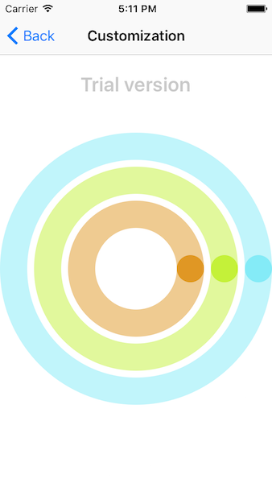
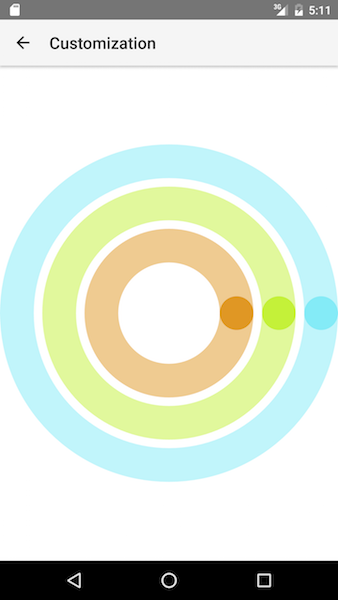
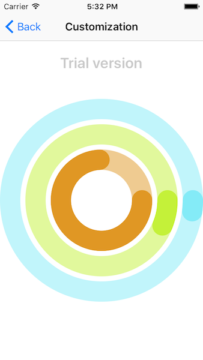
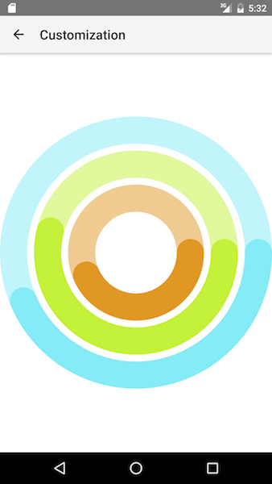
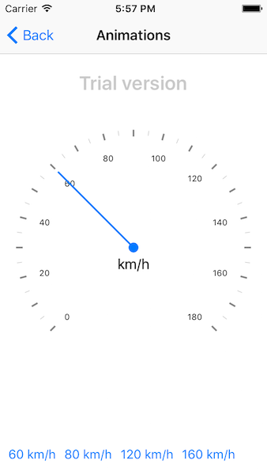
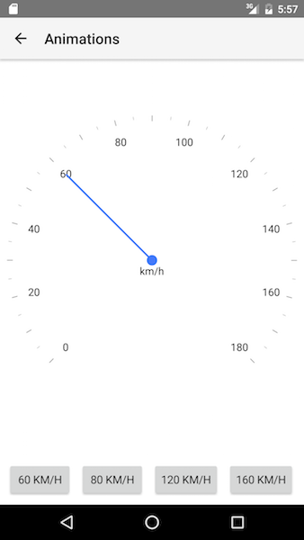

# RadGauge Indicators

Indicators in  are visual elements that point to value or visualize a range of values on a . They should be added to a scale and their values are aligned to the scale the indicators belong to. Currently `RadGauge` supports bar and needle indicators.

## Bar Indicators

Bar indicators are used to visualize a range of values on a scale. Customization of the bars is trivial. Changing their range, color, position and width is achieved by just setting a property. Bar indicators in  have a default animation that animates their maximum value. Below is an example how to create several  objects and add them to . The example shows how to create and add the indicators in xml and then animate them when we navigate to the page. Note that the indicator's width and location are normalized values. They are calculated based on the size of the gauge.

#### Example 1. Add bar indicators to a scale
First you will need to setup the RadRadialGauge as described in the [**Indicators**]() after that in order to add the  objects you will need to:

- Declare the `<RadialBarIndicator></RadialBarIndicator>` and set the custom `tkRadialScaleIndicators` inline directive to it. That inline directive is making the 'link' between the  object and the 

<snippet id='gauges-customization-angular-html' />
<snippet id='gauges-customization-angular' />
<snippet id='gauges-customization-angular-css' />

This is what you should see if you run the example now:
#### Figure 1. Radial gauge with bar indicators
 

#### Example 2. Animating the bar indicators
In order to animate the opaque indicators we have set the  property to `true`. The last thing to do is is to set their  value in the `ngAfterViewInit` handler and the indicators will animate to their new maximum value.

#### Figure 2. Bar indicators after animation
 

## Needle Indicator

The needle indicator is used to point to a specific value. You can easily customize its length, top and bottom width. It is also possible to change the radius of the needle's circle or to offset the needle by just setting the corresponding properties. The length of the needle is again value between 0 and 1. The needle also supports animations when its value is changed. Adding a needle indicator to a scale is the same like adding a bar indicator.

#### Example 3. Add needle to a scale
<snippet id='gauges-animations-angular-html' />
<snippet id='gauges-animations-angular' />
<snippet id='gauges-animations-angular-css' />

#### Example 4. Animated the needle on button tap

After the needle is added to a scale and we have set its  property to `true` we can animate it changing its value when a button is tapped.

The example looks like this:
#### Figure 3. Needle indicator
 

## References
Want to see this scenario in action?
Check our SDK examples repo on GitHub. You will find this and many other practical examples with NativeScript UI.

* [Indicators Example](https://github.com/NativeScript/nativescript-ui-samples-angular/tree/master/gauge/app/examples/scales)

Related articles you might find useful:

* [**Scales**]()

