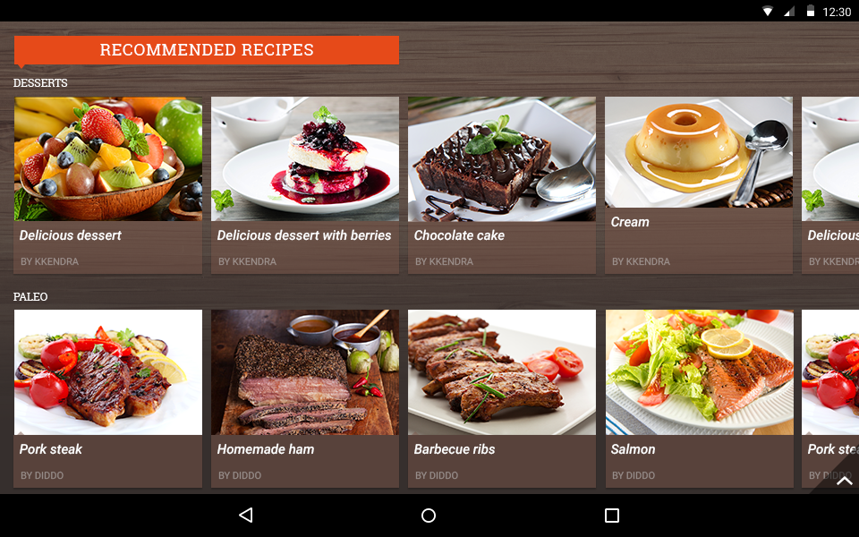

# RadListView Overview
 for NativeScript is a virtualizing list component that provides the most popular features associated with scenarios where a list of items is used. All these features are embedded in one control with the idea to save developer time and provide better experience. The control's main features include:
- item animations
- different layouts and orientations
- smart defaults for many gestures - select on long press, execution of special action on swipe, reorder of items on long press and drag, refreshing the list on swipe or loading more items only when needed.

 

## Features

### Different layouts

 supports three different item layout strategies that are commonly used on mobile apps:

- **list** - items are stacked - either horizontally or vertically, depending on the scrolling orientation
- **grid** - items are arranged in columns or rows - depending on the scrolling orientation
- **staggered grid** - items are ordered in a staggered grid formation - either in rows or columns, depending on the scrolling orientation

All layouts are virtualized and optimized for the mobile environment.

### Selection
 for NativeScript exposes API allowing you to enable item selection and track selection changes. You can choose between single and multiple selection, as well as track selection events. More information about selection can be found here: [**ListView: Item selection**]()

### Item animations
 for NativeScript supports animations for items that are added or removed from the list. There are several predefined animations available for your convenience. You can find more about Item Animations by reading the corresponding article: [**ListView: Item animations**]()

### Load on demand
**Load on demand** is a behavior in which items from the source are loaded on demand depending on the scrolling position of the RadListView. This feature is particularly useful in situations where data is downloaded and visualized from a service in portions upon request from your end users. Consider a list of apps in a mobile app store where new items are continuously added when scrolling down the list. Read more about load-on-demand here: [**ListView: Item Load on Demand**]()

### Pull to refresh
**Pull to refresh** allows the end users to request more data by pulling the list once they reach the end. By default, a progress indicator is shown and an event is fired which you can use to make a new data request. Read more about pull-to-refresh here: [**ListView: Pull to refresh**]()

### Swipe to execute
**Swipe to execute** is a popular UX pattern that allows you to perform an arbitrary action on a RadListView item when the end user swipes it to the right or to the left. For example, popular Mail client mobile applications implement this pattern allowing the user to mark messages as read or to delete them. Read more about swipe-to-execute here: [**ListView: Swipe to execute**]()

### Item reorder
 for NativeScript supports reordering an item by holding and dragging it. By default, an event is fired which informs you about a reorder action thus allowing you to also modify the source collection. Read more about this feature here: [**ListView: Item reorder**]()

### Observable Array support
 for NativeScript supports the core **ObservableArray** module part of the core NativeScript modules collection. Using an **ObservableArray** instance as a source for RadListView will ensure that changes in the source collection will be automatically taken care of by the control.

## Angular directives

When using the  with Angular you are going to work with multiple custom angular RadListView specific directives. In short these directives are used by the angular framework to enable 'linking' between separate HTML tags into one 'complex' element.

Here is a full list of the available custom Angular  directives and components:

### Components
Represent the major elements:

| Selector          | Class (more details)                                  |
|-------------------|-------------------------------------------------------|
| RadListView |  |

### Directives
Represent the smaller elements that are visualized in :

| Selector          | Class (more details)                                  |
|-------------------|-------------------------------------------------------|
| ListViewLinearLayout |  |
| ListViewGridLayout |  |
| ListViewStaggeredLayout |  |
| ReorderHandle |  |

### Inline Directives
Represent the 'link' mechanism of the smaller with the major elements

| Selector          | Class (more details)                                  |
|-------------------|-------------------------------------------------------|
| tkListItemTemplate |  |
| tkListViewHeader |  |
| tkListViewFooter |  |
| tkListItemSwipeTemplate |  |
| tkListLoadOnDemandTemplate |  |
| tkListViewLayout |  |
