# User Interface Widget Components

NativeScript ships with a set of user interface [`views`](/api-reference/modules/_ui_core_view_.html) (also known as widgets) which you can use to build the user interface of a mobile application. Most of these views wrap the corresponding native view for each platform while providing a common API for working with it. For example, the `Button` view renders an [`android.widget.Button`](http://developer.android.com/reference/android/widget/Button.html) on Android and [`UIButton`](https://developer.apple.com/library/ios/documentation/UIKit/Reference/UIButton_Class/) on iOS.

Defining the layout of the application is also an important part of the application development. For more information about the different layout containers that are available in NativeScript, see [The NativeScript Layout System]().

> **TIP:** You can access the underlying native widget for each view at runtime using the `nativeView` property:
>
>  `<view>.nativeView`
>
> Accessing the native widgets might be useful when you want to use some platform-specific functionalities of the widget. You can find information about the underlying native component for each view below.

Each component comes with a set of common methods available from the extended `View` class.
Dedicated documentation section covering the different measuring and position methods can be found [here](#view-class-common-methods).

## Button

The [Button]() [Button]() widget provides a standard button widget that reacts to a `tap` event.

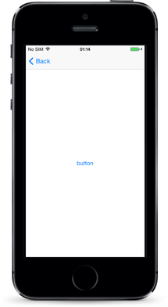

**Native Component**

| Android               | iOS      |
|:----------------------|:---------|
| [android.widget.Button](http://developer.android.com/reference/android/widget/Button.html) | [UIButton](https://developer.apple.com/library/ios/documentation/UIKit/Reference/UIButton_Class/) |

## Label

The [Label]() [Label]() widget provides a text label that shows read-only text.

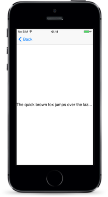

**Native Component**

| Android               | iOS      |
|:----------------------|:---------|
| [android.widget.TextView](http://developer.android.com/reference/android/widget/TextView.html) | [UILabel](https://developer.apple.com/library/ios/documentation/UIKit/Reference/UILabel_Class/) |

## TextField

The [TextField]() [TextField]() widget provides an editable **single-line** text field.

**Native Component**

| Android               | iOS      |
|:----------------------|:---------|
| [android.widget.EditText](http://developer.android.com/reference/android/widget/EditText.html) | [UITextField](https://developer.apple.com/library/ios/documentation/UIKit/Reference/UITextField_Class/) |

## TextView

The [TextView]() [TextView]() widget provides an editable **multi-line** text view.

You can use it to show multi-line text and implement text editing.

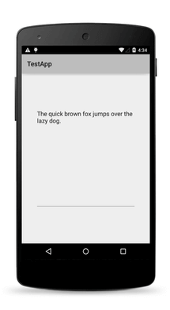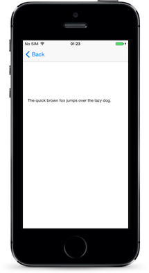

**Native Component**

| Android               | iOS      |
|:----------------------|:---------|
| [android.widget.EditText](http://developer.android.com/reference/android/widget/EditText.html) | [UITextView](https://developer.apple.com/library/ios/documentation/UIKit/Reference/UITextView_Class/) |

## SearchBar

The [SearchBar]() [SearchBar]() widget provides a user interface for entering search queries and submitting requests to the search provider.

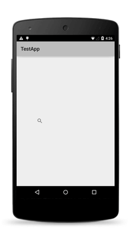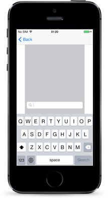

**Native Component**

| Android               | iOS      |
|:----------------------|:---------|
| [android.widget.SearchView](http://developer.android.com/reference/android/widget/SearchView.html) | [UISearchBar](https://developer.apple.com/library/ios/documentation/UIKit/Reference/UISearchBar_Class/) |

## Switch

The [Switch]() [Switch]() widget provides a two-state toggle switch from which you can choose between two options.

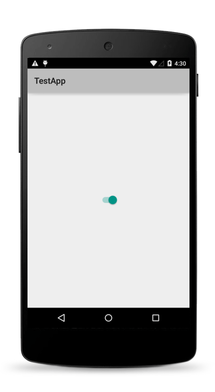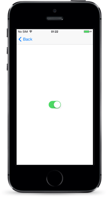

**Native Component**

| Android               | iOS      |
|:----------------------|:---------|
| [android.widget.Switch](http://developer.android.com/reference/android/widget/Switch.html) | [UISwitch](https://developer.apple.com/library/ios/documentation/UIKit/Reference/UISwitch_Class/) |

## Slider

The [Slider]() [Slider]() widget provides a slider that you can use to pick a numeric value within a configurable range.

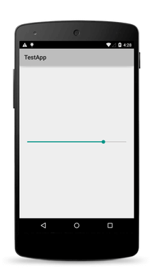

**Native Component**

| Android                | iOS      |
|:-----------------------|:---------|
| [android.widget.SeekBar](http://developer.android.com/reference/android/widget/SeekBar.html) | [UISlider](https://developer.apple.com/library/ios/documentation/UIKit/Reference/UISlider_Class/) |

## Progress

The [Progress]() [Progress]() widget is a visual bar indicator of a progress in a operation. It shows a bar representing the current progress of the operation.

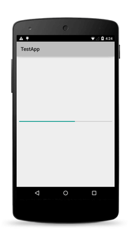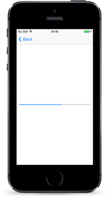

**Native Component**

| Android                | iOS      |
|:-----------------------|:---------|
| [android.widget.ProgressBar](http://developer.android.com/reference/android/widget/ProgressBar.html) (indeterminate = false) | [UIProgressView](https://developer.apple.com/library/ios/documentation/UIKit/Reference/UIProgressView_Class/) |

## ActivityIndicator

The [ActivityIndicator]() [ActivityIndicator]() widget is a visual spinner indicator which shows that a task is in progress.

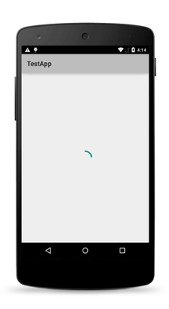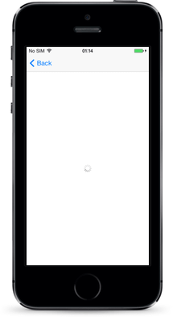

**Native Component**

| Android                | iOS      |
|:-----------------------|:---------|
| [android.widget.ProgressBar](http://developer.android.com/reference/android/widget/ProgressBar.html) (indeterminate = true) | [UIActivityIndicatorView](https://developer.apple.com/library/ios/documentation/UIKit/Reference/UIActivityIndicatorView_Class/) |

## Image

The [Image]() [Image]() widget shows an image. You can load the image from an [`ImageSource`](/api-reference/modules/_image_source_.html) or from a URL.

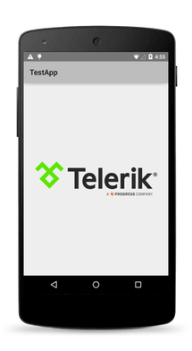

**Native Component**

| Android                | iOS      |
|:-----------------------|:---------|
| [android.widget.ImageView](http://developer.android.com/reference/android/widget/ImageView.html) | [UIImageView](https://developer.apple.com/library/ios/documentation/UIKit/Reference/UIImageView_Class/) |

## ListView

The [ListView]() [ListView]() shows items in a vertically scrolling list. You can set an [`itemTemplate`](/api-reference/modules/_ui_list_view_.knowntemplates.html) to specify how each item in the list should be displayed.

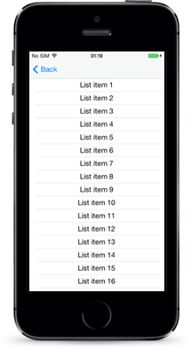

**Native Component**

| Android                | iOS      |
|:-----------------------|:---------|
| [android.widget.ListView](http://developer.android.com/reference/android/widget/ListView.html) | [UITableView](https://developer.apple.com/library/ios/documentation/UIKit/Reference/UITableView_Class/) |

## HtmlView

The [HtmlView]() [HtmlView]() represents a view with HTML content. Use this component instead of WebView when you want to show just static HTML content.

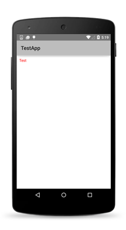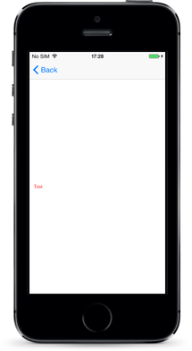

**Native Component**

| Android                | iOS      |
|:-----------------------|:---------|
| [android.widget.TextView](http://developer.android.com/reference/android/widget/TextView.html) | [UITextView](https://developer.apple.com/documentation/uikit/uitextview) |

## WebView

The [WebView]() [WebView]() shows web pages. You can load a page from a URL or by navigating back and forward.

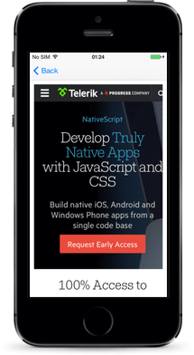

**Native Component**

| Android                | iOS      |
|:-----------------------|:---------|
| [android.webkit.WebView](http://developer.android.com/reference/android/webkit/WebView.html) | [WKWebView](https://developer.apple.com/documentation/webkit/wkwebview) |

## TabView

With the [TabView]() [TabView]() control, you can implement tab navigation.

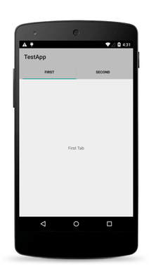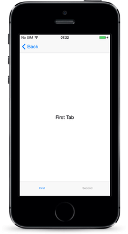

**Native Component**

| Android                | iOS      |
|:-----------------------|:---------|
| [androidx.viewpager.widget.ViewPager](https://developer.android.com/reference/kotlin/androidx/viewpager/widget/ViewPager) | [UITabBarController](https://developer.apple.com/library/ios/documentation/UIKit/Reference/UITabBarController_Class/) |

## SegmentedBar

With the [SegmentedBar]() [SegmentedBar]() control, you can implement discrete selection.

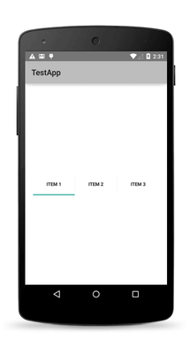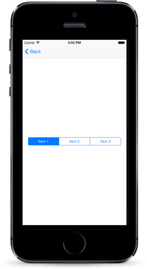

**Native Component**

| Android                | iOS      |
|:-----------------------|:---------|
| [android.widget.TabHost](http://developer.android.com/reference/android/widget/TabHost.html) | [UISegmentedControl](https://developer.apple.com/library/prerelease/ios/documentation/UIKit/Reference/UISegmentedControl_Class/index.html) |

## DatePicker

With the [DatePicker]() [DatePicker]() control, you can pick a date.

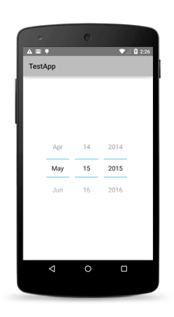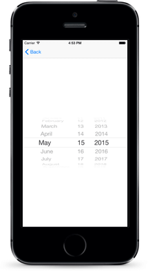

**Native Component**

| Android                | iOS      |
|:-----------------------|:---------|
| [android.widget.DatePicker](http://developer.android.com/reference/android/widget/DatePicker.html) | [UIDatePicker](https://developer.apple.com/library/ios/documentation/UIKit/Reference/UIDatePicker_Class/index.html) |

## TimePicker

With the [TimePicker]() [TimePicker]() widget, you can pick a time.

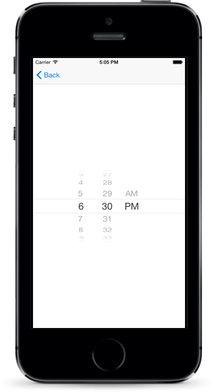

**Native Component**

| Android                | iOS      |
|:-----------------------|:---------|
| [android.widget.TimePicker](http://developer.android.com/reference/android/widget/TimePicker.html) | [UIDatePicker](https://developer.apple.com/library/ios/documentation/UIKit/Reference/UIDatePicker_Class/index.html) |

## ListPicker

With the [ListPicker]() [ListPicker]() widget, you can pick a value from a list.

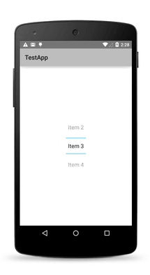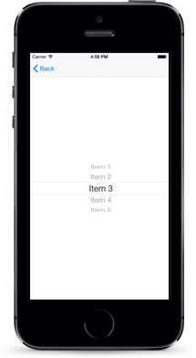

**Native Component**

| Android                | iOS      |
|:-----------------------|:---------|
| [android.widget.NumberPicker](http://developer.android.com/reference/android/widget/NumberPicker.html) | [UIPickerView](https://developer.apple.com/library/prerelease/ios/documentation/UIKit/Reference/UIPickerView_Class/index.html) |

## Dialogs

The [dialogs module]() [dialogs module]() lets you create and show dialog windows.

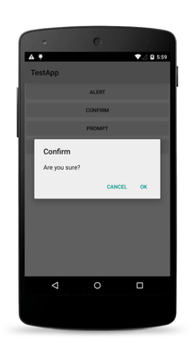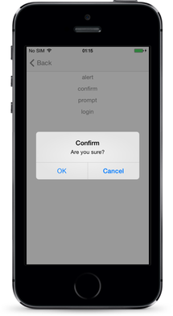

# NativeScript UI Overview

NativeScript UI is a set of free* components that enable implementing rich-ui applications for iOS and Android by using [NativeScript](https://www.nativescript.org). **Progress NativeScript UI** is built on top of natively implemented components targeting iOS and Android. Each of the components is available for download on npmjs.com as a separate package.

> *Although the components are free, they are not open-source and their code is proprietary. [Read the components' license for details](https://github.com/NativeScript/nativescript-ui-feedback/blob/master/LICENSE.md). 

> In case you're interested in contributing to the code base, [read the contributing options available](https://github.com/NativeScript/nativescript-ui-feedback#contributing-to-nativescript-ui).

Continue reading about each component below or take them for a spin with the [NativeScript UI sample app on GitHub](https://github.com/NativeScript/nativescript-ui-samples)[NativeScript UI sample app on GitHub](https://github.com/NativeScript/nativescript-ui-samples-angular).

## Components

### RadSideDrawer

[[Documentation]()[Documentation]()] [[Sample Code](https://github.com/NativeScript/nativescript-ui-samples/tree/master/sidedrawer)[Sample Code](https://github.com/NativeScript/nativescript-ui-samples-angular/tree/master/sidedrawer)][[Download from npm](https://www.npmjs.com/package/nativescript-ui-sidedrawer)]

The SideDrawer component (known as RadSideDrawer in code and distributed through the `nativescript-ui-sidedrawer` package) allows you to follow a popular application pattern and show a hidden view which contains navigation UI or common settings. With SideDrawer you may:

* Embed any content inside the sliding panel from text and icons, to sliders and filters;
* Set the control to slide in from any of the four sides of the screen;
* Pick from a large set of polished out-of-the-box transition modes;
* Achieve programmatic control over the state of the side drawer;
* Choose to cover the navigation or action bar.

 

### RadListView

[[Documentation]()[Documentation]()] [[Sample Code](https://github.com/NativeScript/nativescript-ui-samples/tree/master/listview)[Sample Code](https://github.com/NativeScript/nativescript-ui-samples-angular/tree/master/listview)][[Download from npm](https://www.npmjs.com/package/nativescript-ui-listview)]

> **NOTE**: The professional ListView component is different from the ListView built in to the core NativeScript modules. Use the professional ListView if you need to take advantage of the advanced functionality listed below.

The ListView component (known as RadListView in code and distributed through the `nativescript-ui-listview` package) is a virtualizing list component that provides the most needed features associated with scenarios where a list of items is used. Features include:

* Pull to refresh;
* Load on demand;
* Swipe to execute;
* Header and footer;
* Item animation when the user scrolls, and four out-of-the-box effects to choose from;
*  `Linear`, `Grid`, and `Staggered` layout modes, allowing horizontal and vertical scrolling direction;
* Single and multiple selection modes;
* Smart defaults for many gestures: select on long press, execution of special action on swipe, reorder of items on long press and drag, refreshing the list on swipe, and loading more items only when needed.

 

### RadCalendar

[[Documentation]()[Documentation]()] [[Sample Code](https://github.com/NativeScript/nativescript-ui-samples/tree/master/calendar)[Sample Code](https://github.com/NativeScript/nativescript-ui-samples-angular/tree/master/calendar)][[Download from npm](https://www.npmjs.com/package/nativescript-ui-calendar)]

The Calendar component (known as RadCalendar in code and distributed through the `nativescript-ui-calendar` package) is a highly customizable native calendar abstraction that exposes a unified API, covering:

* Four different view modes - `Week`, `Month`, `MonthNames`, and `Year`;
* `Single`, `Multiple`, and `Range` date selection;
* Inline and popover events;
* Vast control over styling and cell customization options.

 

### RadChart

[[Documentation]()[Documentation]()] [[Sample Code](https://github.com/NativeScript/nativescript-ui-samples/tree/master/chart)[Sample Code](https://github.com/NativeScript/nativescript-ui-samples-angular/tree/master/chart)][[Download from npm](https://www.npmjs.com/package/nativescript-ui-chart)]

The Chart component includes two types of charts: cartesian (known as RadCartesianChart in code) and pie (known as RadPieChart in code) and is distributed through the `nativescript-ui-chart` package. It can be used to visualize data in a human-readable way through lines, areas, bars, pies, and more. Some features include:

* Wide array of accepted data types: numerical, string or `DateTime` data depending on the chart you want to visualize;
* Smooth interaction and zooming;
* Various chart series options:

	* Show trends with `Line`, `Area`, and `Spline Area` charts;
	* Compare sets of data with `Bar` charts;
	* Illustrate proportions with `Pie` and `Donut` charts - and use `Spline` and `Spline Area` charts to plot data that require the use of curve fittings;
	* Show relationships among values using `Scatter` and `Bubble` series, even use `Financial` series and indicators.
* Annotations, tooltips, and trackball;
* Support for multiple axes.

 

### RadAutoCompleteTextView

[[Documentation]()[Documentation]()] [[Sample Code](https://github.com/NativeScript/nativescript-ui-samples/tree/master/autocomplete)[Sample Code](https://github.com/NativeScript/nativescript-ui-samples-angular/tree/master/autocomplete)][[Download from npm](https://www.npmjs.com/package/nativescript-ui-autocomplete)]

The AutoComplete component (known as RadAutoCompleteTextView in code and distributed through the `nativescript-ui-autocomplete` package) offers suggested options to your users based on characters they type. It provides multiple means for easy customization and data management, including:

*  Suggest modes - you can choose to show suggestions in a drop-down list, one suggestion at a time in the text input, or a combination of both;
*  `StartsWith` and `Contains` completion modes;
*  Two distinct display modes: `Plain` in which only one item can be selected, and `Tokens` allowing multiple selection of suggestions (each displayed as a token);
* Token Layout modes - Wrap and Horizontal.

 

### RadDataForm

[[Documentation]()[Documentation]()] [[Sample Code](https://github.com/NativeScript/nativescript-ui-samples/tree/master/dataform)[Sample Code](https://github.com/NativeScript/nativescript-ui-samples-angular/tree/master/dataform)][[Download from npm](https://www.npmjs.com/package/nativescript-ui-dataform)]

The DataForm component (known as RadDataForm in code and distributed through the `nativescript-ui-dataform` package) provides an easy and versatile approach for building mobile forms based on a provided data object's public members. Use DataForm to:

* Bind a form to a data object with a single line of code;
* Take advantage of more than **15** built-in editors (or provide your own custom editor);
* Create groups of editors, allow them to be collapsed and style them;
* Display a form in `ReadOnly` mode;
* Take control over collected data with built-in data validation - use a provided validator or create a custom one.

 

### RadGauge

[[Documentation]()[Documentation]()] [[Sample Code](https://github.com/NativeScript/nativescript-ui-samples/tree/master/gauge)[Sample Code](https://github.com/NativeScript/nativescript-ui-samples-angular/tree/master/gauge)][[Download from npm](https://www.npmjs.com/package/nativescript-ui-gauge)]

The Gauge component (known as RadRadialGauge in code and distributed through the `nativescript-ui-gauge` package) allows you to display the current status of a value within a range of upper and lower bounds, illustrate progress towards a goal, or a summary of a fluctuating metric. With the gauges component you may:

* Add one or more `RadialScale` instances to your gauge;
* Use `Bar` indicators to visualize a range of values or a `Needle` indicator to point to a specific value;
* Include ready-to-use animations for smooth transition effects.

 

## Further resources

### SDK samples app

You can explore the Progress NativeScript UI getting started application, which is [publicly available on GitHub](https://www.github.com/NativeScript/nativescript-ui-samples)(https://www.github.com/NativeScript/nativescript-ui-samples-angular). It contains various examples of the usage of the components. More information about how to run the application is available in its README.

## Feedback
Your feedback will be highly appreciated and will directly influence the development of **Progress NativeScript UI**.

You can submit issues and feedback to the [dedicated feedback GitHub repository](https://github.com/NativeScript/nativescript-ui-feedback).

