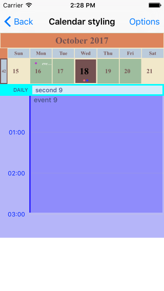
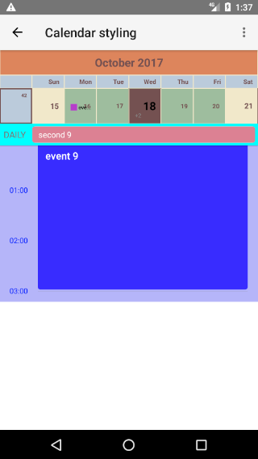

# RadCalendar Day View Styling

In order to apply custom style for this mode, you need to initialize the `dayViewStyle` property of `RadCalendar` with instance of `CalendarDayViewStyle`.
To apply custom style to the cells that are displayed at the top you can use the same properties as in the [styling of the month view]( "Read more about styling in Month view mode"). Additionally the `CalendarDayViewStyle` has `dayEventsViewStyle` and `allDayEventsViewStyle` .

The `dayEventsViewStyle` should be used with a  `DayEventsViewStyle` instance which has properties for the following styling options:

- `backgroundColor` -  defines the background color for the view with the events
- `timeLabelFormat` -  defines the format used to display the time labels in the timeline
- `timeLabelTextColor` -  defines the text color used to display the time labels in the timeline
- `timeLabelTextSize` -  defines the text size used to display the time labels in the timeline

The `allDayEventsViewStyle` should be used with a  `AllDayEventsViewStyle` instance which has properties for the following styling options:

- `backgroundColor` - defines the background color for the area where all day events are presented
- `allDayText` - defines the text that notifies that the top area contains all day events
- `allDayTextIsVisible` - defines wether the text that notifies that the top area contains all day events should be visible

## Example
Here's an example of using the properties mentioned above:

<snippet id='calendar-dayview-styling'/>

This is how the calendar looks like in that case:

      

## References
Want to see this scenario in action?
Check our SDK examples repo on GitHub. You will find this and many other practical examples with NativeScript UI.

* [Styling Example](https://github.com/telerik/nativescript-ui-samples/tree/master/calendar/app/calendar/cell-styling)

Related articles you might find useful:

* [**Styling Inline Events**]()
* [**Styling Month Name**]()
* [**Styling Week View**]()
* [**Styling Month View**]()
* [**Styling Year View**]()
