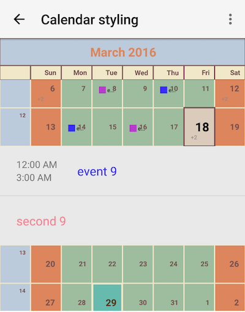
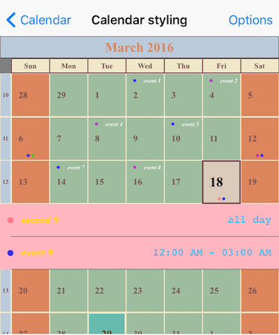

# RadCalendar Inline Events Styling
When working with Inline events, specifying a color for the event's cell indicator (i.e. the color is used for the shape that visualizes the event in the corresponding day cell) is done by using the `eventColor` property of `CalendarEvent` class. If `CalendarEventsViewMode.Inline` is chosen for events view mode, you can apply additional styling options to the cells of the table view shown for inline events.

Since events are available for Month and Week views you should initialize the `inlineEventCellStyle` member of `CalendarMonthViewStyle` or `CalendarWeekViewStyle` with instance of `InlineEventCellStyle` class.

`InlineEventCellStyle` class has the following properties:

- `cellBackgroundColor` - defines the background color of inline events cell.
- `eventTextColor` - defines the color for inline event text.
- `eventFontName` - defines the font name for inline event text.
- `eventFontStyle` - defines the font style for inline event text.
- `eventTextSize` - defines the text size for inline event text.
- `timeTextColor` - defines the color for time shown for inline event.
- `timeFontName` - defines the font name for time shown for inline event.
- `timeFontStyle` - Gets or sets the font style for time shown for inline event.
- `timeTextSize` - defines the text size for time shown for inline event.

## Example
Here's an example of using the styling properties mentioned above:

<snippet id='calendar-inlineevents-styling'/>

and the visual result:

      

## References
Want to see this scenario in action?
Check our SDK examples repo on GitHub. You will find this and many other practical examples with NativeScript UI.

* [Styling Example](https://github.com/telerik/nativescript-ui-samples/tree/master/calendar/app/calendar/cell-styling)

Related articles you might find useful:

* [**Styling Month Name**]()
* [**Styling Year View**]()
* [**Styling Week View**]()
* [**Styling Month View**]()