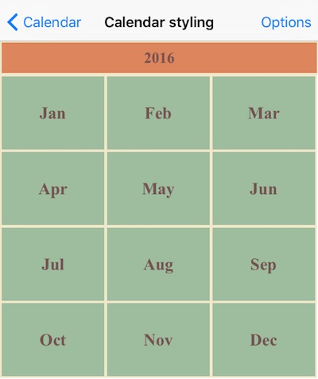
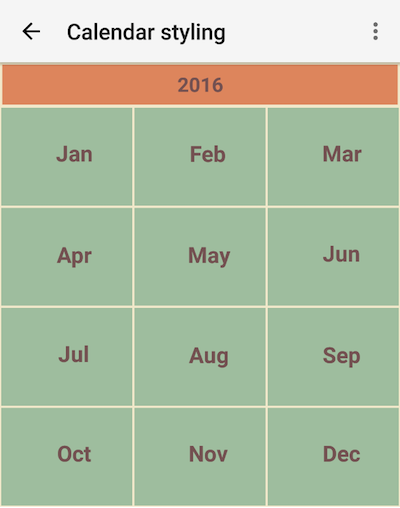

# RadCalendar MonthNames View Mode Styling

In order to apply custom style for this mode, you need to initialize the `monthNamesViewStyle` property of `RadCalendar` with instance of `CalendarMonthNamesViewStyle`.
In this view we have two cell types that can be customized: the title bar cell and the month name cell. To apply custom style to title you need to initialize the `titleCellStyle` with instance of `CellStyle` class. To apply custom style to title you need to initialize the `monthNameCellStyle` with instance of `CellStyle` class.

All properties of `CellStyle` class are applicable to these two cells:

## Example

<snippet id='calendar-monthnamesview-styling'/>

This is how the calendar looks like now:

      

## References
Want to see this scenario in action?
Check our SDK examples repo on GitHub. You will find this and many other practical examples with NativeScript UI.

* [Styling Example](https://github.com/telerik/nativescript-ui-samples/tree/master/calendar/app/calendar/cell-styling)

Related articles you might find useful:

* [**Styling Inline Events**]()
* [**Styling Year View**]()
* [**Styling Week View**]()
* [**Styling Month View**]()